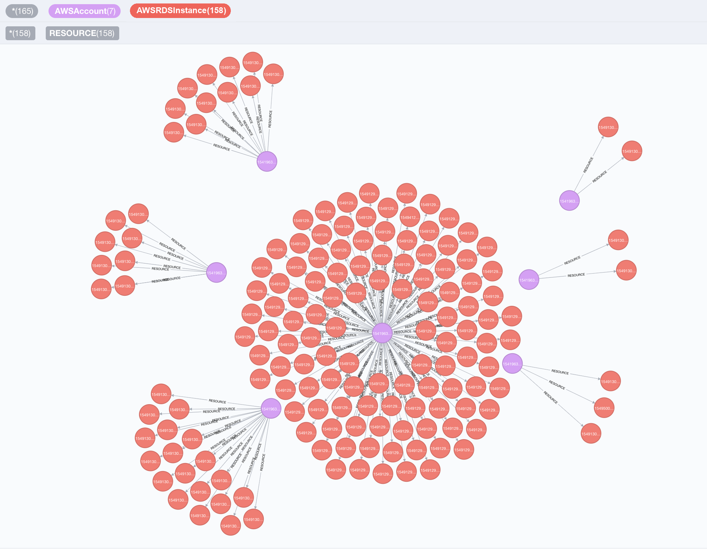

<div align="center">

[](https://scorecard.dev/viewer/?uri=github.com/cartography-cncf/cartography)
[](https://www.bestpractices.dev/projects/9637)


[Documentation](https://docs.cartography.dev/)
</div>

Cartography is a Python tool that pulls infrastructure assets and their relationships into a [Neo4j](https://www.neo4j.com) graph database.

**What it connects:** AWS, GCP, Azure, Kubernetes, GitHub, Okta, Entra ID, CrowdStrike, and [30+ more platforms](#supported-platforms).

**Questions it answers:**
- Which identities have access to which datastores? How about across multiple tenants, or providers?
- Am I affected by any critical vulnerabilities or compromised software packages?
- What are the network paths in and out of my environment?
- Which compute instances are exposed to the internet?
- What AI agents are running in production, and what permissions do they have?



## Quick Start

### Install Cartography

```bash
pip install cartography
```

### Start Neo4j database

```bash
docker run -d --publish=7474:7474 --publish=7687:7687 -v data:/data --env=NEO4J_AUTH=none neo4j:5-community
```

Confirm that http://localhost:7474 is up.

### Sync your first data source (AWS example)

Ensure your AWS credentials and default region are configured (e.g. via `AWS_PROFILE`, `AWS_DEFAULT_REGION`, or `~/.aws/config`). See [AWS credentials docs](https://docs.aws.amazon.com/boto3/latest/guide/credentials.html#configuring-credentials) for reference.

Run Cartography:

```bash
cartography --neo4j-uri bolt://localhost:7687 --selected-modules aws
```

See the [full install guide](https://docs.cartography.dev/install.html) for other platforms.

### Query the graph

Open http://localhost:7474 and try:

```cypher
// Find unencrypted RDS instances by account
MATCH (a:AWSAccount)-[:RESOURCE]->(rds:AWSRDSInstance{storage_encrypted:false})
RETURN a.name, rds.id
```

```cypher
// Find EC2 instances exposed to the internet
MATCH (instance:AWSEC2Instance{exposed_internet: true})
RETURN instance.instanceid, instance.publicdnsname
```

See the [querying tutorial](https://docs.cartography.dev/usage/tutorial.html) and [data schema](https://docs.cartography.dev/usage/schema.html) for more use-cases.

### Run security rules

Once Cartography has populated the reachable Neo4j graph, list, inspect, and run
security rules. This quickstart uses the no-auth Neo4j container started above,
so no password is required:

```bash
cartography-rules list
cartography-rules list object_storage_public
cartography-rules run object_storage_public
```

For authenticated Neo4j, set `NEO4J_PASSWORD` or use one of the other secure
password options in [the rules docs](https://docs.cartography.dev/usage/rules.html).

## Supported platforms

<details>
<summary>Click to expand full list of 30+ supported platforms</summary>

- [Airbyte](https://docs.cartography.dev/modules/airbyte/index.html) - Organization, Workspace, User, Source, Destination, Connection, Tag, Stream
- [Amazon Web Services](https://docs.cartography.dev/modules/aws/index.html) - ACM, API Gateway, Bedrock, CloudWatch, CodeBuild, Config, Cognito, EC2, ECS, ECR (including multi-arch images, image layers, and attestations), EFS, Elasticsearch, Elastic Kubernetes Service (EKS), DynamoDB, Glue,  GuardDuty, IAM, Inspector, KMS, Lambda, RDS, Redshift, Route53, S3, SageMaker, Secrets Manager(Secret Versions), Security Hub, SNS, SQS, SSM, STS, Tags
- [AIBOM](https://docs.cartography.dev/modules/aibom/index.html) - AI component detections linked to ECR images
- [Anthropic](https://docs.cartography.dev/modules/anthropic/index.html) - Organization, ApiKey, User, Workspace
- [BigFix](https://docs.cartography.dev/modules/bigfix/index.html) - Computers
- [Cloudflare](https://docs.cartography.dev/modules/cloudflare/index.html) - Account, Role, Member, Zone, DNSRecord
- [Crowdstrike Falcon](https://docs.cartography.dev/modules/crowdstrike/index.html) - Hosts, Spotlight vulnerabilities, CVEs
- [DigitalOcean](https://docs.cartography.dev/modules/digitalocean/index.html)
- [Duo](https://docs.cartography.dev/modules/duo/index.html) - Users, Groups, Endpoints
- [GitHub](https://docs.cartography.dev/modules/github/index.html) - repos, branches, users, teams, dependency graph manifests, dependencies
- [Google Cloud Platform](https://docs.cartography.dev/modules/gcp/index.html) - Artifact Registry, Bigtable, Cloud Functions, Cloud Resource Manager, Cloud Run, Cloud SQL, Compute, DNS, IAM, KMS, Secret Manager, Storage, Google Kubernetes Engine, Vertex AI
- [Google Workspace](https://docs.cartography.dev/modules/googleworkspace/index.html) - users, groups, devices, OAuth apps
- [Jumpcloud](https://docs.cartography.dev/modules/jumpcloud/index.html)
- [Kandji](https://docs.cartography.dev/modules/kandji/index.html) - Devices
- [Keycloak](https://docs.cartography.dev/modules/keycloak/index.html) - Realms, Users, Groups, Roles, Scopes, Clients, IdentityProviders, Authentication Flows, Authentication Executions, Organizations, Organization Domains
- [Kubernetes](https://docs.cartography.dev/modules/kubernetes/index.html) - Cluster, Namespace, Service, Pod, Container, ServiceAccount, Role, RoleBinding, ClusterRole, ClusterRoleBinding, OIDCProvider
- [Lastpass](https://docs.cartography.dev/modules/lastpass/index.html) - users
- [Microsoft Azure](https://docs.cartography.dev/modules/azure/index.html) - App Service, Container Instance, CosmosDB, Data Factory, Event Grid, Firewall, Firewall Policy, Functions, Key Vault, Azure Kubernetes Service (AKS), Load Balancer, Logic Apps, Management Groups, Resource Group, SQL, Storage, Virtual Machine, Virtual Networks
- [Microsoft Entra ID](https://docs.cartography.dev/modules/entra/index.html) -  Users, Groups, Applications, OUs, App Roles, federation to AWS Identity Center, Intune Managed Devices, Intune Detected Apps, Intune Compliance Policies
- [CVE Metadata](https://docs.cartography.dev/modules/cve_metadata/index.html) - CVE enrichment with CVSS, EPSS scores, and CISA KEV data from NVD and FIRST.org
- [NIST CVE](https://docs.cartography.dev/modules/cve/index.html) - Common Vulnerabilities and Exposures (CVE) data from NIST database (deprecated - use CVE Metadata instead)
- [Okta](https://docs.cartography.dev/modules/okta/index.html) - users, groups, organizations, roles, applications, factors, trusted origins, reply URIs, federation to AWS roles, federation to AWS Identity Center
- [OpenAI](https://docs.cartography.dev/modules/openai/index.html) - Organization, AdminApiKey, User, Project, ServiceAccount, ApiKey
- [Oracle Cloud Infrastructure](https://docs.cartography.dev/modules/oci/index.html) - IAM
- [PagerDuty](https://docs.cartography.dev/modules/pagerduty/index.html) - Users, teams, services, schedules, escalation policies, integrations, vendors
- [Scaleway](https://docs.cartography.dev/modules/scaleway/index.html) - Projects, IAM, Local Storage, Instances
- [SentinelOne](https://docs.cartography.dev/modules/sentinelone/index.html) - Accounts, Agents, Applications, Application Versions, CVEs
- [Slack](https://docs.cartography.dev/modules/slack/index.html) - Teams, Users, UserGroups, Channels
- [SnipeIT](https://docs.cartography.dev/modules/snipeit/index.html) - Users, Assets
- [Socket.dev](https://docs.cartography.dev/modules/socketdev/index.html) - Organizations, Repositories, Dependencies, Security Alerts (CVE, malware, supply chain risks), Fixes
- [Spacelift](https://docs.cartography.dev/modules/spacelift/index.html) - Accounts, Spaces,Users, Stacks, WorkerPools, Workers, Runs, GitCommits
- [SubImage](https://docs.cartography.dev/modules/subimage/index.html) - Tenant, TeamMember, APIKey, Neo4jUser, Module, Framework
- [Tailscale](https://docs.cartography.dev/modules/tailscale/index.html) - Tailnet, Users, Devices, Groups, Tags, PostureIntegrations, DevicePostures, DevicePostureConditions, device posture compliance relationships
- [Trivy Scanner](https://docs.cartography.dev/modules/trivy/index.html) - AWS ECR Images

</details>


## Community

- Join us on Slack: [CNCF Slack](https://communityinviter.com/apps/cloud-native/cncf) in the `#cartography` channel.
- [Monthly community meeting](https://zoom-lfx.platform.linuxfoundation.org/meetings/cartography?view=week) — [minutes](https://docs.google.com/document/d/1VyRKmB0dpX185I15BmNJZpfAJ_Ooobwz0U1WIhjDxvw) · [past recordings](https://www.youtube.com/playlist?list=PLMga2YJvAGzidUWJB_fnG7EHI4wsDDsE1)


## Contributing

Thank you for considering contributing to Cartography!

All contributors and participants must follow the [CNCF Code of Conduct](https://github.com/cncf/foundation/blob/main/code-of-conduct.md).

Submit a GitHub issue to report a bug or request a new feature. Larger discussions happen in [GitHub Discussions](https://github.com/cartography-cncf/cartography/discussions).

Get started with our [developer documentation](https://docs.cartography.dev/dev/developer-guide.html).


## Who uses Cartography?

1. [Lyft](https://www.lyft.com)
1. [Thought Machine](https://thoughtmachine.net/)
1. [MessageBird](https://messagebird.com)
1. [Cloudanix](https://www.cloudanix.com/)
1. [Corelight](https://www.corelight.com/)
1. [SubImage](https://subimage.io)
1. [Superhuman](https://superhuman.com/)
1. {Your company here} :-)

If your organization uses Cartography, please file a PR and update this list. Say hi on Slack too!


## License

This project is licensed under the [Apache 2.0 License](LICENSE).

---

Cartography is a [Cloud Native Computing Foundation](https://www.cncf.io/) sandbox project.<br>
<div style="background-color: white; display: inline-block; padding: 10px;">
  
</div>
