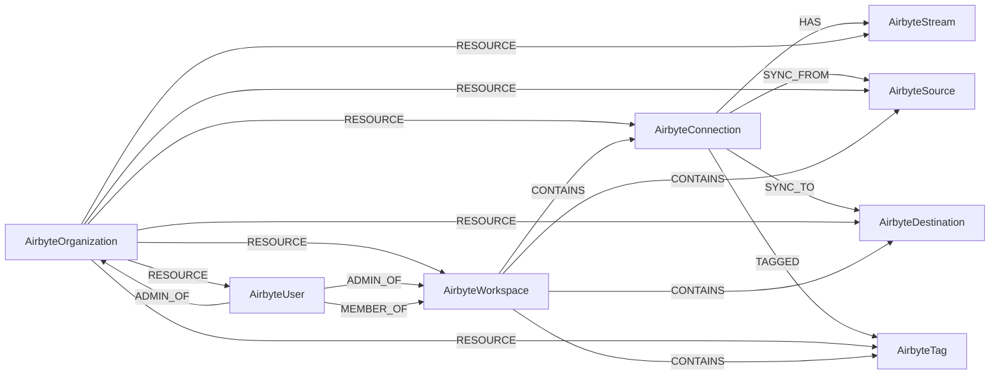

<!-- Generated from the data model. Do not edit manually. -->

## Airbyte Schema

### AirbyteConnection

An Airbyte connection that synchronizes source data to a destination.

#### Properties

| Field | Index | Description |
|-------|-------|-------------|
| id | Yes | Connection UUID. |
| firstseen |  | Timestamp when a sync job first created this node. |
| lastupdated | Yes | Timestamp of the last sync that observed this node. |
| data_residency |  | Geographic location where connection data resides. |
| name |  | Connection name. |
| namespace_definition |  | Method used to define the destination namespace. |
| namespace_format |  | Format used for destination namespaces. |
| non_breaking_schema_updates_behavior |  | Behavior when a non-breaking source schema change is detected. |
| prefix |  | Prefix added to destination stream names. |
| status |  | Connection status. |

#### Relationships

- `(:AirbyteConnection)-[:HAS]->(:AirbyteStream)`: Links a connection to a stream it synchronizes.

- `(:AirbyteConnection)-[:SYNC_FROM]->(:AirbyteSource)`: Links a connection to the source it synchronizes from.

- `(:AirbyteConnection)-[:SYNC_TO]->(:AirbyteDestination)`: Links a connection to the destination it synchronizes to.

- `(:AirbyteConnection)-[:TAGGED]->(:AirbyteTag)`: Links a connection to each tag applied to it.

- `(:AirbyteOrganization)-[:RESOURCE]->(:AirbyteConnection)`: Links an organization to a connection it owns.

- `(:AirbyteWorkspace)-[:CONTAINS]->(:AirbyteConnection)`: Links a workspace to a connection it contains.

### AirbyteDestination

A data destination configured in Airbyte.

#### Properties

| Field | Index | Description |
|-------|-------|-------------|
| id | Yes | Destination UUID. |
| firstseen |  | Timestamp when a sync job first created this node. |
| lastupdated | Yes | Timestamp of the last sync that observed this node. |
| config_account |  | Configured destination account. |
| config_endpoint |  | Configured destination endpoint. |
| config_host |  | Configured destination host. |
| config_name |  | Configured destination resource name. |
| config_port |  | Configured destination port. |
| config_region |  | Configured destination region. |
| name |  | Destination name. |
| type |  | Destination connector type. |

#### Relationships

- `(:AirbyteConnection)-[:SYNC_TO]->(:AirbyteDestination)`: Links a connection to the destination it synchronizes to.

- `(:AirbyteOrganization)-[:RESOURCE]->(:AirbyteDestination)`: Links an organization to a destination it owns.

- `(:AirbyteWorkspace)-[:CONTAINS]->(:AirbyteDestination)`: Links a workspace to a destination it contains.

### AirbyteOrganization

An Airbyte organization with the Tenant label.

> **Ontology Mapping**: This node uses the ontology label [`Tenant`](#ontology-tenant).

#### Properties

Ontology-generated fields are shown in *italics*.

| Field | Index | Description |
|-------|-------|-------------|
| id | Yes | Organization UUID. |
| firstseen |  | Timestamp when a sync job first created this node. |
| lastupdated | Yes | Timestamp of the last sync that observed this node. |
| email |  | Organization contact email address. |
| name |  | Organization name. |
| *_ont_name* | Yes | Normalized field sourced from `name`. |
| *_ont_source* |  | Module that populated this node's ontology fields. |

#### Relationships

- `(:AirbyteOrganization)-[:RESOURCE]->(:AirbyteConnection)`: Links an organization to a connection it owns.

- `(:AirbyteOrganization)-[:RESOURCE]->(:AirbyteDestination)`: Links an organization to a destination it owns.

- `(:AirbyteOrganization)-[:RESOURCE]->(:AirbyteSource)`: Links an organization to a source it owns.

- `(:AirbyteOrganization)-[:RESOURCE]->(:AirbyteStream)`: Links an organization to a stream it owns.

- `(:AirbyteOrganization)-[:RESOURCE]->(:AirbyteTag)`: Links an organization to a tag it owns.

- `(:AirbyteOrganization)-[:RESOURCE]->(:AirbyteUser)`: Links an organization to one of its users.

- `(:AirbyteOrganization)-[:RESOURCE]->(:AirbyteWorkspace)`: Links an organization to a workspace it owns.

- `(:AirbyteUser)-[:ADMIN_OF]->(:AirbyteOrganization)`: Links a user to an organization they administer.

### AirbyteSource

A data source configured in Airbyte.

#### Properties

| Field | Index | Description |
|-------|-------|-------------|
| id | Yes | Source UUID. |
| firstseen |  | Timestamp when a sync job first created this node. |
| lastupdated | Yes | Timestamp of the last sync that observed this node. |
| config_account |  | Configured source account. |
| config_endpoint |  | Configured source endpoint. |
| config_host |  | Configured source host. |
| config_name |  | Configured source resource name. |
| config_port |  | Configured source port. |
| config_region |  | Configured source region. |
| name |  | Source name. |
| type |  | Source connector type. |

#### Relationships

- `(:AirbyteConnection)-[:SYNC_FROM]->(:AirbyteSource)`: Links a connection to the source it synchronizes from.

- `(:AirbyteOrganization)-[:RESOURCE]->(:AirbyteSource)`: Links an organization to a source it owns.

- `(:AirbyteWorkspace)-[:CONTAINS]->(:AirbyteSource)`: Links a workspace to a source it contains.

### AirbyteStream

A data stream synchronized by an Airbyte connection.

#### Properties

| Field | Index | Description |
|-------|-------|-------------|
| id | Yes | Stream identifier. |
| firstseen |  | Timestamp when a sync job first created this node. |
| lastupdated | Yes | Timestamp of the last sync that observed this node. |
| cursor_field |  | Field used as the synchronization cursor. |
| include_files |  | Whether blob synchronization includes raw files. |
| mappers |  | Custom mappers configured for the stream. |
| name |  | Stream name. |
| primary_key |  | Primary key fields for the stream. |
| selected_fields |  | Fields selected for synchronization. |
| sync_mode |  | Synchronization mode for the stream. |

#### Relationships

- `(:AirbyteConnection)-[:HAS]->(:AirbyteStream)`: Links a connection to a stream it synchronizes.

- `(:AirbyteOrganization)-[:RESOURCE]->(:AirbyteStream)`: Links an organization to a stream it owns.

### AirbyteTag

A tag used to categorize Airbyte resources.

#### Properties

| Field | Index | Description |
|-------|-------|-------------|
| id | Yes | Tag UUID. |
| firstseen |  | Timestamp when a sync job first created this node. |
| lastupdated | Yes | Timestamp of the last sync that observed this node. |
| color |  | Tag color in hexadecimal. |
| name |  | Tag name. |

#### Relationships

- `(:AirbyteConnection)-[:TAGGED]->(:AirbyteTag)`: Links a connection to each tag applied to it.

- `(:AirbyteOrganization)-[:RESOURCE]->(:AirbyteTag)`: Links an organization to a tag it owns.

- `(:AirbyteWorkspace)-[:CONTAINS]->(:AirbyteTag)`: Links a workspace to a tag it contains.

### AirbyteUser

An Airbyte user account with the UserAccount label.

> **Ontology Mapping**: This node uses the ontology label [`UserAccount`](#ontology-useraccount).

#### Properties

Ontology-generated fields are shown in *italics*.

| Field | Index | Description |
|-------|-------|-------------|
| id | Yes | Airbyte user ID. |
| firstseen |  | Timestamp when a sync job first created this node. |
| lastupdated | Yes | Timestamp of the last sync that observed this node. |
| email | Yes | User email address. |
| name |  | User name. |
| *_ont_email* | Yes | Normalized field sourced from `email`. |
| *_ont_fullname* | Yes | Normalized field sourced from `name`. |
| *_ont_source* |  | Module that populated this node's ontology fields. |

#### Relationships

- `(:AirbyteOrganization)-[:RESOURCE]->(:AirbyteUser)`: Links an organization to one of its users.

- `(:AirbyteUser)-[:ADMIN_OF]->(:AirbyteOrganization)`: Links a user to an organization they administer.

- `(:AirbyteUser)-[:ADMIN_OF]->(:AirbyteWorkspace)`: Links a user to a workspace they administer.

- `(:AirbyteUser)-[:MEMBER_OF]->(:AirbyteWorkspace)`: Links a user to a workspace where they are a member.

- `(:User)-[:HAS_ACCOUNT]->(:UserAccount)`

### AirbyteWorkspace

An Airbyte workspace within an organization.

#### Properties

| Field | Index | Description |
|-------|-------|-------------|
| id | Yes | Workspace UUID. |
| firstseen |  | Timestamp when a sync job first created this node. |
| lastupdated | Yes | Timestamp of the last sync that observed this node. |
| data_residency |  | Geographic location where workspace data resides. |
| name |  | Workspace name. |

#### Relationships

- `(:AirbyteOrganization)-[:RESOURCE]->(:AirbyteWorkspace)`: Links an organization to a workspace it owns.

- `(:AirbyteUser)-[:ADMIN_OF]->(:AirbyteWorkspace)`: Links a user to a workspace they administer.

- `(:AirbyteUser)-[:MEMBER_OF]->(:AirbyteWorkspace)`: Links a user to a workspace where they are a member.

- `(:AirbyteWorkspace)-[:CONTAINS]->(:AirbyteConnection)`: Links a workspace to a connection it contains.

- `(:AirbyteWorkspace)-[:CONTAINS]->(:AirbyteDestination)`: Links a workspace to a destination it contains.

- `(:AirbyteWorkspace)-[:CONTAINS]->(:AirbyteSource)`: Links a workspace to a source it contains.

- `(:AirbyteWorkspace)-[:CONTAINS]->(:AirbyteTag)`: Links a workspace to a tag it contains.
