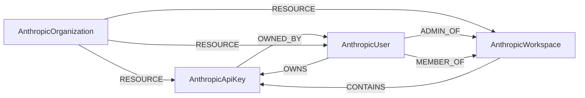

<!-- Generated from the data model. Do not edit manually. -->

## Anthropic Schema

### AnthropicApiKey

An API key in an Anthropic workspace.

> **Ontology Mapping**: This node uses the ontology label [`APIKey`](#ontology-apikey).

#### Properties

Ontology-generated fields are shown in *italics*.

| Field | Index | Description |
|-------|-------|-------------|
| id | Yes | Anthropic API key ID. |
| firstseen |  | Timestamp when a sync job first created this node. |
| lastupdated | Yes | Timestamp of the last sync that observed this node. |
| created_at |  | RFC 3339 timestamp when the API key was created. |
| name |  | API key name. |
| status |  | API key status: active, inactive, or archived. |
| *_ont_created_at* | Yes | Normalized field sourced from `created_at`. |
| *_ont_name* | Yes | Normalized field sourced from `name`. |
| *_ont_source* |  | Module that populated this node's ontology fields. |

#### Relationships

- `(:AnthropicApiKey)-[:OWNED_BY]->(:AnthropicUser)`: An API key is owned by a user account.

- `(:AnthropicOrganization)-[:RESOURCE]->(:AnthropicApiKey)`: The organization contains the API key.

- `(:AnthropicUser)-[:OWNS]->(:AnthropicApiKey)`: Deprecated compatibility edge for a user that owns an API key.

- `(:AnthropicWorkspace)-[:CONTAINS]->(:AnthropicApiKey)`: A workspace contains the API key.

- `(:User)-[:OWNS]->(:APIKey)`: generated by analysis job `Ontology - User OWNS APIKey linking`.

### AnthropicOrganization

An Anthropic organization containing users, workspaces, and API keys.

> **Ontology Mapping**: This node uses the ontology label [`Tenant`](#ontology-tenant).

#### Properties

| Field | Index | Description |
|-------|-------|-------------|
| id | Yes | Anthropic organization ID. |
| firstseen |  | Timestamp when a sync job first created this node. |
| lastupdated | Yes | Timestamp of the last sync that observed this node. |

#### Relationships

- `(:AnthropicOrganization)-[:RESOURCE]->(:AnthropicApiKey)`: The organization contains the API key.

- `(:AnthropicOrganization)-[:RESOURCE]->(:AnthropicUser)`: The organization contains the user.

- `(:AnthropicOrganization)-[:RESOURCE]->(:AnthropicWorkspace)`: The organization contains the workspace.

### AnthropicUser

A user account in an Anthropic organization.

> **Ontology Mapping**: This node uses the ontology label [`UserAccount`](#ontology-useraccount).

#### Properties

Ontology-generated fields are shown in *italics*.

| Field | Index | Description |
|-------|-------|-------------|
| id | Yes | Anthropic user ID. |
| firstseen |  | Timestamp when a sync job first created this node. |
| lastupdated | Yes | Timestamp of the last sync that observed this node. |
| added_at |  | RFC 3339 timestamp when the user was added. |
| email | Yes | User email address. |
| name |  | User name. |
| role |  | Organization role: admin or user. |
| *_ont_email* | Yes | Normalized field sourced from `email`. |
| *_ont_fullname* | Yes | Normalized field sourced from `name`. |
| *_ont_source* |  | Module that populated this node's ontology fields. |

#### Relationships

- `(:AnthropicApiKey)-[:OWNED_BY]->(:AnthropicUser)`: An API key is owned by a user account.

- `(:AnthropicOrganization)-[:RESOURCE]->(:AnthropicUser)`: The organization contains the user.

- `(:AnthropicUser)-[:ADMIN_OF]->(:AnthropicWorkspace)`: A user administers the workspace.

- `(:AnthropicUser)-[:MEMBER_OF]->(:AnthropicWorkspace)`: A user is a member of the workspace.

- `(:AnthropicUser)-[:OWNS]->(:AnthropicApiKey)`: Deprecated compatibility edge for a user that owns an API key.

- `(:User)-[:HAS_ACCOUNT]->(:UserAccount)`

### AnthropicWorkspace

A workspace in an Anthropic organization.

#### Properties

| Field | Index | Description |
|-------|-------|-------------|
| id | Yes | Anthropic workspace ID. |
| firstseen |  | Timestamp when a sync job first created this node. |
| lastupdated | Yes | Timestamp of the last sync that observed this node. |
| archived_at |  | RFC 3339 timestamp when the workspace was archived. |
| created_at |  | RFC 3339 timestamp when the workspace was created. |
| display_color |  | Hex color representing the workspace in the Anthropic Console. |
| name |  | Workspace name displayed in reporting. |

#### Relationships

- `(:AnthropicOrganization)-[:RESOURCE]->(:AnthropicWorkspace)`: The organization contains the workspace.

- `(:AnthropicUser)-[:ADMIN_OF]->(:AnthropicWorkspace)`: A user administers the workspace.

- `(:AnthropicUser)-[:MEMBER_OF]->(:AnthropicWorkspace)`: A user is a member of the workspace.

- `(:AnthropicWorkspace)-[:CONTAINS]->(:AnthropicApiKey)`: A workspace contains the API key.
