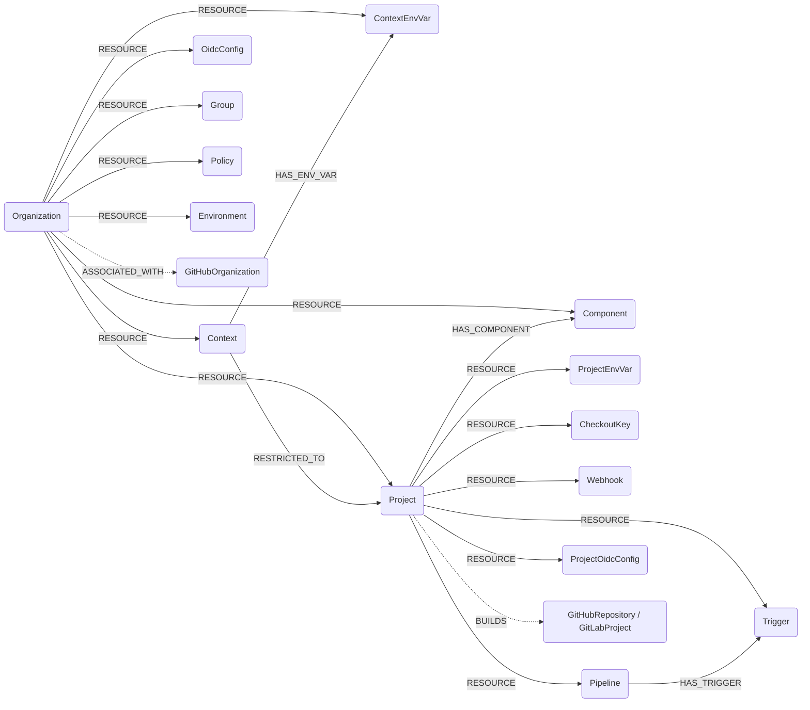

## CircleCI Schema



Dotted edges are best-effort cross-module links (created only when the GitHub/GitLab node already exists in the graph).

Project-scoped nodes (Project and everything below it) are synced for projects discovered from each org's pipeline feed, plus any extra slugs passed via `--circleci-project-slugs` (CircleCI API v2 cannot enumerate an organization's projects directly).

### CircleCIOrganization

Represents a CircleCI organization (a VCS org the token owner collaborates with), from `GET /me/collaborations`.

> **Ontology Mapping**: This node has the extra label `Tenant` to enable cross-platform queries for organizational tenants across different systems (e.g., OktaOrganization, AzureTenant, GCPOrganization).

#### Relationships
- A GitHub-backed org is associated with its GitHubOrganization (best-effort, joined on login).
    ```
    (:CircleCIOrganization)-[:ASSOCIATED_WITH]->(:GitHubOrganization)
    ```

| Field | Description |
|-------|-------------|
| **id** | Organization ID. |
| firstseen | Timestamp of when a sync job first created this node. |
| lastupdated | Timestamp of the last time the node was updated. |
| name | Organization display name. |
| **slug** | Organization slug (e.g. `gh/my-org`). |
| vcs_type | Version control system (`github`, `bitbucket`, ...). |
| avatar_url | URL of the organization avatar. |

### CircleCIContext

Represents a CircleCI context, a named bundle of shared environment variables/secrets available to projects in the organization.

| Field | Description |
|-------|-------------|
| **id** | Context ID. |
| firstseen | Timestamp of when a sync job first created this node. |
| lastupdated | Timestamp of the last time the node was updated. |
| **name** | Context name. |
| created_at | Context creation timestamp. |

#### Relationships
- A context belongs to an organization.
    ```
    (:CircleCIOrganization)-[:RESOURCE]->(:CircleCIContext)
    ```

### CircleCIContextEnvVar

Represents an environment variable defined within a context. Only the variable **name** and metadata are stored; CircleCI never exposes the value.

| Field | Description |
|-------|-------------|
| **id** | Synthesized id, `{context_id}:{variable}`. |
| firstseen | Timestamp of when a sync job first created this node. |
| lastupdated | Timestamp of the last time the node was updated. |
| **variable** | Environment variable name. |
| context_id | ID of the owning context. |
| created_at | Variable creation timestamp. |
| updated_at | Variable last-update timestamp. |

#### Relationships
- A context environment variable belongs to an organization and to a context.
    ```
    (:CircleCIOrganization)-[:RESOURCE]->(:CircleCIContextEnvVar)
    (:CircleCIContext)-[:HAS_ENV_VAR]->(:CircleCIContextEnvVar)
    ```

### CircleCIOidcConfig

Represents an organization's OIDC custom-claims configuration (`GET /org/{orgID}/oidc-custom-claims`). The `audience` list shows which cloud audiences trust CircleCI's OIDC tokens.

| Field | Description |
|-------|-------------|
| **id** | The organization ID (one org-level config per org). |
| firstseen | Timestamp of when a sync job first created this node. |
| lastupdated | Timestamp of the last time the node was updated. |
| scope | `organization` (project-level claims are not yet synced). |
| audience | List of trusted OIDC audiences. |
| audience_updated_at | When the audience was last changed. |
| ttl | Token time-to-live. |
| ttl_updated_at | When the TTL was last changed. |
| org_id | Owning organization ID. |
| project_id | Owning project ID (null for org-level). |

#### Relationships
- An OIDC config belongs to an organization.
    ```
    (:CircleCIOrganization)-[:RESOURCE]->(:CircleCIOidcConfig)
    ```

### CircleCIGroup

Represents an organization group (`GET /organizations/{org_id}/groups`).

> **Ontology Mapping**: This node has the extra label `UserGroup` for cross-platform group queries (e.g. GitLabGroup, EntraGroup, GoogleWorkspaceGroup).

| Field | Description |
|-------|-------------|
| **id** | Group ID. |
| firstseen | Timestamp of when a sync job first created this node. |
| lastupdated | Timestamp of the last time the node was updated. |
| **name** | Group name. |
| description | Group description. |

#### Relationships
- A group belongs to an organization.
    ```
    (:CircleCIOrganization)-[:RESOURCE]->(:CircleCIGroup)
    ```

### CircleCIPolicy

Represents a config policy in the organization's policy bundle (`GET /owner/{orgID}/context/config/policy-bundle`). Only the `config` policy context is queried.

| Field | Description |
|-------|-------------|
| **id** | Synthesized id, `{org_id}:{context}:{name}`. |
| firstseen | Timestamp of when a sync job first created this node. |
| lastupdated | Timestamp of the last time the node was updated. |
| **name** | Policy name. |
| context | Policy context (`config`). |
| content | Policy source (Rego). |
| created_at | Policy creation timestamp. |
| created_by | Who created the policy. |
| decision_enabled | Whether policy decisions are enabled for this context (from the decision settings). |

#### Relationships
- A policy belongs to an organization.
    ```
    (:CircleCIOrganization)-[:RESOURCE]->(:CircleCIPolicy)
    ```

### CircleCIEnvironment

Represents a deploy environment (`GET /deploy/environments`).

| Field | Description |
|-------|-------------|
| **id** | Environment ID. |
| firstseen | Timestamp of when a sync job first created this node. |
| lastupdated | Timestamp of the last time the node was updated. |
| **name** | Environment name. |
| description | Environment description. |
| labels | List of labels. |
| created_at | Creation timestamp. |
| updated_at | Last-update timestamp. |

#### Relationships
- An environment belongs to an organization.
    ```
    (:CircleCIOrganization)-[:RESOURCE]->(:CircleCIEnvironment)
    ```

### CircleCIComponent

Represents a deploy component (`GET /deploy/components`).

| Field | Description |
|-------|-------------|
| **id** | Component ID. |
| firstseen | Timestamp of when a sync job first created this node. |
| lastupdated | Timestamp of the last time the node was updated. |
| **name** | Component name. |
| project_id | ID of the associated project. |
| labels | List of labels. |
| release_count | Number of releases. |
| created_at | Creation timestamp. |
| updated_at | Last-update timestamp. |

#### Relationships
- A component belongs to an organization and (when known) to a project.
    ```
    (:CircleCIOrganization)-[:RESOURCE]->(:CircleCIComponent)
    (:CircleCIProject)-[:HAS_COMPONENT]->(:CircleCIComponent)
    ```

### CircleCIProject

Represents a CircleCI project (`GET /project/{project-slug}`). Synced for projects discovered from each org's pipeline feed plus any extra slugs passed via `--circleci-project-slugs`. Upserted only, never auto-deleted (see config docs).

| Field | Description |
|-------|-------------|
| **id** | Opaque project ID. |
| firstseen | Timestamp of when a sync job first created this node. |
| lastupdated | Timestamp of the last time the node was updated. |
| **slug** | Project slug (e.g. `gh/acme/web`). |
| name | Project (repository) name. |
| organization_name | Owning organization name. |
| organization_slug | Owning organization slug. |
| organization_id | Owning organization ID. |
| vcs_url | Repository URL. |
| vcs_provider | VCS provider (e.g. `GitHub`). |
| default_branch | Default branch name. |

#### Relationships
- A project belongs to an organization.
    ```
    (:CircleCIOrganization)-[:RESOURCE]->(:CircleCIProject)
    ```
- A project builds a VCS repository (best-effort cross-module link, joined on the repo URL).
    ```
    (:CircleCIProject)-[:BUILDS]->(:GitHubRepository)
    (:CircleCIProject)-[:BUILDS]->(:GitLabProject)
    ```
- A context can be restricted to specific projects (from context restrictions).
    ```
    (:CircleCIContext)-[:RESTRICTED_TO]->(:CircleCIProject)
    ```

### CircleCIProjectEnvVar

Represents a project-level environment variable. Only the **name** is stored; CircleCI returns a masked value.

| Field | Description |
|-------|-------------|
| **id** | Synthesized id, `{project_slug}:{name}`. |
| firstseen | Timestamp of when a sync job first created this node. |
| lastupdated | Timestamp of the last time the node was updated. |
| **name** | Environment variable name. |
| project_slug | Slug of the owning project. |
| value | Masked value (`xxxx` + last 4 chars); the real secret is never exposed by the API. |

#### Relationships
- A project environment variable belongs to a project.
    ```
    (:CircleCIProject)-[:RESOURCE]->(:CircleCIProjectEnvVar)
    ```

### CircleCICheckoutKey

Represents a project checkout/deploy key (`GET /project/{slug}/checkout-key`). Only the public key is stored.

| Field | Description |
|-------|-------------|
| **id** | Synthesized id, `{project_slug}:{fingerprint}`. |
| firstseen | Timestamp of when a sync job first created this node. |
| lastupdated | Timestamp of the last time the node was updated. |
| **fingerprint** | Key fingerprint. |
| type | Key type (`deploy-key`, `github-user-key`, ...). |
| preferred | Whether this is the preferred key. |
| public_key | The SSH public key. |
| created_at | Key creation timestamp. |
| project_slug | Slug of the owning project. |

#### Relationships
- A checkout key belongs to a project.
    ```
    (:CircleCIProject)-[:RESOURCE]->(:CircleCICheckoutKey)
    ```

### CircleCIWebhook

Represents an outbound webhook scoped to a project (`GET /webhook`).

| Field | Description |
|-------|-------------|
| **id** | Webhook ID. |
| firstseen | Timestamp of when a sync job first created this node. |
| lastupdated | Timestamp of the last time the node was updated. |
| **name** | Webhook name. |
| url | Destination URL. |
| verify_tls | Whether TLS verification is enabled. |
| has_signing_secret | Whether a signing secret is configured (the value itself is never stored). |
| events | List of subscribed event types. |

#### Relationships
- A webhook belongs to a project.
    ```
    (:CircleCIProject)-[:RESOURCE]->(:CircleCIWebhook)
    ```

### CircleCIPipeline

Represents a pipeline: the config/source binding (`GET /projects/{project_id}/pipeline-definitions`). Pipeline **runs** (executions) are intentionally not ingested - they are high-volume, ephemeral telemetry rather than inventory.

> **Ontology Mapping**: This node has the extra label `CICDPipeline` for cross-platform CI/CD queries alongside GitHubWorkflow, GitLab CI, AWS CodeBuild, and Spacelift stacks.

| Field | Description |
|-------|-------------|
| **id** | Pipeline ID. |
| firstseen | Timestamp of when a sync job first created this node. |
| lastupdated | Timestamp of the last time the node was updated. |
| **name** | Pipeline name. |
| description | Pipeline description. |
| created_at | Creation timestamp. |
| config_source_provider | Provider of the config source (e.g. `github_app`). |
| config_source_repo_full_name | Full name of the repository holding the config. |
| config_source_repo_external_id | VCS external id of the config repository. |
| config_source_file_path | Path to the config file. |
| checkout_source_provider | Provider of the checkout source. |
| checkout_source_repo_full_name | Full name of the repository checked out. |
| checkout_source_repo_external_id | VCS external id of the checkout repository. |

#### Relationships
- A pipeline belongs to a project.
    ```
    (:CircleCIProject)-[:RESOURCE]->(:CircleCIPipeline)
    ```

### CircleCITrigger

Represents a trigger attached to a pipeline (`GET /projects/{id}/pipeline-definitions/{pipeline_id}/triggers`).

| Field | Description |
|-------|-------------|
| **id** | Trigger ID. |
| firstseen | Timestamp of when a sync job first created this node. |
| lastupdated | Timestamp of the last time the node was updated. |
| **event_name** | Event the trigger fires on (e.g. `push`). |
| description | Trigger description. |
| event_preset | Event preset. |
| event_source_provider | Provider of the event source (`github_app`, `schedule`, ...). |
| cron_expression | Cron schedule when the trigger is a scheduled trigger (`provider == schedule`); this is how scheduled pipeline runs are modelled. |
| checkout_ref | Ref to check out. |
| config_ref | Ref to read config from. |
| disabled | Whether the trigger is disabled. |
| pipeline_id | ID of the owning pipeline. |

#### Relationships
- A trigger belongs to a project and to a pipeline.
    ```
    (:CircleCIProject)-[:RESOURCE]->(:CircleCITrigger)
    (:CircleCIPipeline)-[:HAS_TRIGGER]->(:CircleCITrigger)
    ```

### CircleCIProjectOidcConfig

Represents a project's OIDC custom-claims configuration (`GET /org/{orgID}/project/{projectID}/oidc-custom-claims`). Same shape as the org-level config, scoped to a project.

| Field | Description |
|-------|-------------|
| **id** | The project ID (one project-level config per project). |
| firstseen | Timestamp of when a sync job first created this node. |
| lastupdated | Timestamp of the last time the node was updated. |
| scope | `project`. |
| audience | List of trusted OIDC audiences. |
| audience_updated_at | When the audience was last changed. |
| ttl | Token time-to-live. |
| ttl_updated_at | When the TTL was last changed. |
| org_id | Owning organization ID. |
| project_id | Owning project ID. |

#### Relationships
- A project OIDC config belongs to a project.
    ```
    (:CircleCIProject)-[:RESOURCE]->(:CircleCIProjectOidcConfig)
    ```
