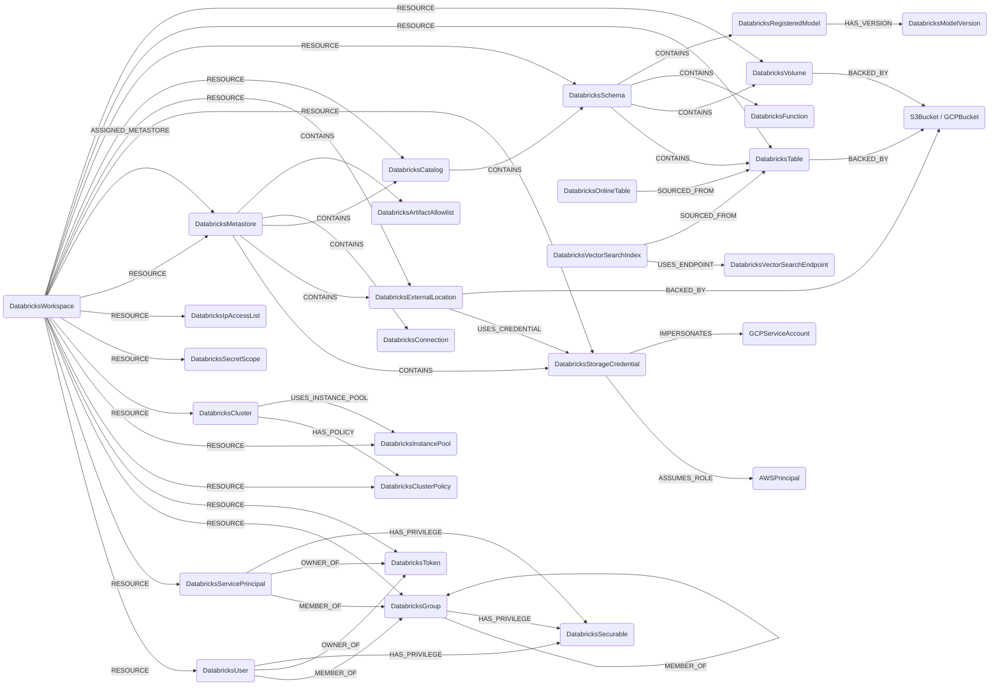

## Databricks Schema



Grantable Unity Catalog nodes (`DatabricksMetastore`, `DatabricksCatalog`,
`DatabricksSchema`, `DatabricksTable`, `DatabricksVolume`, `DatabricksFunction`,
`DatabricksConnection`, `DatabricksStorageCredential`,
`DatabricksExternalLocation`, `DatabricksRegisteredModel`) also carry the shared
`DatabricksSecurable` label so UC grants can point a principal at any grantable
object with one relationship type.

### DatabricksWorkspace

A Databricks workspace, scoped by host URL.

> **Ontology Mapping**: This node has the extra label `Tenant` to enable cross-platform queries for organizational tenants across different systems.

| Field | Description |
|-------|-------------|
| **id** | Workspace host (e.g. `dbc-xxxx.cloud.databricks.com`) |
| **host** | Full workspace URL (indexed) |
| tokens_enabled | Whether PATs are enabled in the workspace |
| max_token_lifetime_days | Max PAT lifetime in days from the workspace token management settings, or null when the workspace is on the Databricks default policy (the API encodes that as the string `"0"`) |
| firstseen | Timestamp of when a sync job first created this node |
| lastupdated | Timestamp of the last time the node was updated |

#### Relationships

- `DatabricksUser`, `DatabricksServicePrincipal`, `DatabricksGroup`, `DatabricksToken`, `DatabricksClusterPolicy`, `DatabricksInstancePool`, `DatabricksCluster`, `DatabricksSecretScope`, `DatabricksIpAccessList` belong to a `DatabricksWorkspace`.
    ```
    (:DatabricksWorkspace)-[:RESOURCE]->(
        :DatabricksUser,
        :DatabricksServicePrincipal,
        :DatabricksGroup,
        :DatabricksToken,
        :DatabricksClusterPolicy,
        :DatabricksInstancePool,
        :DatabricksCluster,
        :DatabricksSecretScope,
        :DatabricksIpAccessList
    )
    ```

### DatabricksUser

A workspace SCIM user.

> **Ontology Mapping**: This node has the extra label `UserAccount` to enable cross-platform queries for user accounts across different systems.

| Field | Description |
|-------|-------------|
| **id** | Workspace-scoped composite id `{workspace_id}/{scim_id}` (SCIM ids are not unique across workspaces) |
| **scim_id** | Raw SCIM user ID returned by Databricks (indexed) |
| **user_name** | SCIM `userName` (typically the email, indexed) |
| **email** | Primary email address (indexed) |
| display_name | SCIM display name |
| external_id | External SCIM ID (federation) |
| active | Whether the user is active |
| firstseen | Timestamp of when a sync job first created this node |
| lastupdated | Timestamp of the last time the node was updated |

#### Relationships

- A `DatabricksUser` belongs to a `DatabricksWorkspace`.
    ```
    (:DatabricksWorkspace)-[:RESOURCE]->(:DatabricksUser)
    ```
- A `DatabricksUser` is a member of one or more `DatabricksGroup`.
    ```
    (:DatabricksUser)-[:MEMBER_OF]->(:DatabricksGroup)
    ```

### DatabricksServicePrincipal

A workspace SCIM service principal.

> **Ontology Mapping**: This node has the extra label `ServiceAccount` to enable cross-platform queries for non-human accounts across different systems.

| Field | Description |
|-------|-------------|
| **id** | Workspace-scoped composite id `{workspace_id}/{scim_id}` (SCIM ids are not unique across workspaces) |
| **scim_id** | Raw SCIM service principal ID (indexed) |
| **application_id** | OAuth application ID (indexed) |
| display_name | SCIM display name |
| external_id | External SCIM ID (federation) |
| active | Whether the service principal is active |
| firstseen | Timestamp of when a sync job first created this node |
| lastupdated | Timestamp of the last time the node was updated |

#### Relationships

- A `DatabricksServicePrincipal` belongs to a `DatabricksWorkspace`.
    ```
    (:DatabricksWorkspace)-[:RESOURCE]->(:DatabricksServicePrincipal)
    ```
- A `DatabricksServicePrincipal` is a member of one or more `DatabricksGroup`.
    ```
    (:DatabricksServicePrincipal)-[:MEMBER_OF]->(:DatabricksGroup)
    ```

### DatabricksGroup

A workspace SCIM group.

> **Ontology Mapping**: This node has the extra label `UserGroup` to enable cross-platform group queries.

| Field | Description |
|-------|-------------|
| **id** | Workspace-scoped composite id `{workspace_id}/{scim_id}` (SCIM ids are not unique across workspaces) |
| **scim_id** | Raw SCIM group ID (indexed) |
| **display_name** | Group display name (indexed) |
| external_id | External SCIM ID (federation) |
| firstseen | Timestamp of when a sync job first created this node |
| lastupdated | Timestamp of the last time the node was updated |

#### Relationships

- A `DatabricksGroup` belongs to a `DatabricksWorkspace`.
    ```
    (:DatabricksWorkspace)-[:RESOURCE]->(:DatabricksGroup)
    ```
- A `DatabricksGroup` can be a member of another `DatabricksGroup` (nested groups).
    ```
    (:DatabricksGroup)-[:MEMBER_OF]->(:DatabricksGroup)
    ```

### DatabricksToken

A Databricks personal access token (PAT) returned by the token management API.

| Field | Description |
|-------|-------------|
| **id** | Workspace-scoped composite id `{workspace_id}/{token_id}` (token-management ids are workspace-local) |
| **token_id** | Raw token id returned by the token-management API (indexed) |
| comment | Token description provided at creation |
| creation_time | Native datetime when the token was created (UTC) |
| expiry_time | Native datetime when the token expires (UTC); null when the token has no expiry |
| owner_id | Workspace-scoped composite id of the token owner (matches `DatabricksUser.id` or `DatabricksServicePrincipal.id`) |
| created_by_id | Workspace-scoped composite id of the principal that created the token |
| created_by_username | Username/email of the principal that created the token (indexed) |
| firstseen | Timestamp of when a sync job first created this node |
| lastupdated | Timestamp of the last time the node was updated |

#### Relationships

- A `DatabricksToken` belongs to a `DatabricksWorkspace`.
    ```
    (:DatabricksWorkspace)-[:RESOURCE]->(:DatabricksToken)
    ```
- A `DatabricksUser` or `DatabricksServicePrincipal` owns a `DatabricksToken`.
    ```
    (:DatabricksUser)-[:OWNER_OF]->(:DatabricksToken)
    (:DatabricksServicePrincipal)-[:OWNER_OF]->(:DatabricksToken)
    ```

### DatabricksClusterPolicy

A cluster policy returned by the policies API. Cluster policies define a set of
allowed configurations a `DatabricksCluster` can be launched with.

| Field | Description |
|-------|-------------|
| **id** | Workspace-scoped composite id `{workspace_id}/{policy_id}` |
| **policy_id** | Raw policy id (indexed) |
| **name** | Policy display name (indexed) |
| description | Free-text description |
| definition | JSON-encoded policy definition (allowed fields, fixed values, …) |
| policy_family_id | Policy family id when the policy is derived from a Databricks-provided family |
| creator_user_name | User name of the policy creator (indexed) |
| created_at | Native datetime when the policy was created (UTC) |
| firstseen | Timestamp of when a sync job first created this node |
| lastupdated | Timestamp of the last time the node was updated |

#### Relationships

- A `DatabricksClusterPolicy` belongs to a `DatabricksWorkspace`.
    ```
    (:DatabricksWorkspace)-[:RESOURCE]->(:DatabricksClusterPolicy)
    ```
- A `DatabricksCluster` is launched against a `DatabricksClusterPolicy`.
    ```
    (:DatabricksCluster)-[:HAS_POLICY]->(:DatabricksClusterPolicy)
    ```

### DatabricksInstancePool

A pre-warmed instance pool that clusters can pull nodes from to reduce startup
latency.

| Field | Description |
|-------|-------------|
| **id** | Workspace-scoped composite id `{workspace_id}/{instance_pool_id}` |
| **instance_pool_id** | Raw pool id (indexed) |
| **instance_pool_name** | Pool display name (indexed) |
| node_type_id | Underlying VM instance type id |
| min_idle_instances | Minimum number of idle instances kept warm |
| max_capacity | Maximum number of instances the pool can scale to |
| idle_instance_autotermination_minutes | Idle instance reclaim window |
| enable_elastic_disk | Whether elastic disk autoscaling is enabled |
| state | Pool state (`ACTIVE`, `STOPPED`, `DELETED`) |
| firstseen | Timestamp of when a sync job first created this node |
| lastupdated | Timestamp of the last time the node was updated |

#### Relationships

- A `DatabricksInstancePool` belongs to a `DatabricksWorkspace`.
    ```
    (:DatabricksWorkspace)-[:RESOURCE]->(:DatabricksInstancePool)
    ```
- A `DatabricksCluster` allocates nodes from a `DatabricksInstancePool`.
    ```
    (:DatabricksCluster)-[:USES_INSTANCE_POOL]->(:DatabricksInstancePool)
    ```

### DatabricksCluster

A Databricks compute cluster returned by the clusters 2.1 API.

| Field | Description |
|-------|-------------|
| **id** | Workspace-scoped composite id `{workspace_id}/{cluster_id}` |
| **cluster_id** | Raw cluster id (indexed) |
| **cluster_name** | Cluster display name (indexed) |
| state | Cluster state (`PENDING`, `RUNNING`, `TERMINATED`, …) |
| spark_version | Spark / Databricks runtime version string |
| runtime_engine | Runtime engine (`STANDARD`, `PHOTON`) |
| node_type_id | Worker node VM type id |
| driver_node_type_id | Driver node VM type id |
| num_workers | Static worker count (null when autoscaling is enabled) |
| autotermination_minutes | Idle auto-termination window in minutes |
| cluster_source | What created the cluster (`UI`, `JOB`, `API`, `MODELS`, …) |
| data_security_mode | UC access mode (`NONE`, `SINGLE_USER`, `USER_ISOLATION`, `LEGACY_*`) |
| single_user_name | Owning user for single-user UC clusters (indexed) |
| creator_user_name | User name of the cluster creator (indexed) |
| instance_pool_id | Raw worker instance pool id, when the cluster targets one (indexed) |
| driver_instance_pool_id | Raw driver instance pool id, when the driver targets a distinct pool (indexed) |
| enable_local_disk_encryption | Whether local disks are encrypted |
| enable_elastic_disk | Whether elastic disk autoscaling is enabled |
| start_time | Native datetime when the cluster was first started (UTC) |
| terminated_time | Native datetime when the cluster was last terminated (UTC), if applicable |
| firstseen | Timestamp of when a sync job first created this node |
| lastupdated | Timestamp of the last time the node was updated |

#### Relationships

- A `DatabricksCluster` belongs to a `DatabricksWorkspace`.
    ```
    (:DatabricksWorkspace)-[:RESOURCE]->(:DatabricksCluster)
    ```
- A `DatabricksCluster` is governed by a `DatabricksClusterPolicy`.
    ```
    (:DatabricksCluster)-[:HAS_POLICY]->(:DatabricksClusterPolicy)
    ```
- A `DatabricksCluster` allocates nodes from one or more `DatabricksInstancePool` — the worker pool and, when set, a distinct driver pool both land here.
    ```
    (:DatabricksCluster)-[:USES_INSTANCE_POOL]->(:DatabricksInstancePool)
    ```

### DatabricksSecretScope

A Databricks secret scope. Scopes can be backed by Databricks's own store
(`DATABRICKS`) or by an Azure Key Vault (`AZURE_KEYVAULT`).

| Field | Description |
|-------|-------------|
| **id** | Workspace-scoped composite id `{workspace_id}/{name}` |
| **name** | Scope name (indexed) |
| backend_type | Backing store (`DATABRICKS`, `AZURE_KEYVAULT`) |
| keyvault_resource_id | Azure Key Vault resource id when backend is `AZURE_KEYVAULT` (indexed) |
| keyvault_dns_name | Azure Key Vault DNS name when backend is `AZURE_KEYVAULT` |
| firstseen | Timestamp of when a sync job first created this node |
| lastupdated | Timestamp of the last time the node was updated |

#### Relationships

- A `DatabricksSecretScope` belongs to a `DatabricksWorkspace`.
    ```
    (:DatabricksWorkspace)-[:RESOURCE]->(:DatabricksSecretScope)
    ```

### DatabricksIpAccessList

An IP access list applied at the workspace level. Restricts inbound access to
the workspace to ranges in the allow list, blocks ranges in the block list.

| Field | Description |
|-------|-------------|
| **id** | Workspace-scoped composite id `{workspace_id}/{list_id}` |
| **list_id** | Raw list id (indexed) |
| **label** | List label (indexed) |
| list_type | List type (`ALLOW` / `BLOCK`) |
| enabled | Whether the list is enforced |
| address_count | Number of addresses in the list |
| ip_addresses | Source CIDR / IP entries in the list |
| created_at | Native datetime when the list was created (UTC) |
| updated_at | Native datetime when the list was last updated (UTC) |
| firstseen | Timestamp of when a sync job first created this node |
| lastupdated | Timestamp of the last time the node was updated |

#### Relationships

- A `DatabricksIpAccessList` belongs to a `DatabricksWorkspace`.
    ```
    (:DatabricksWorkspace)-[:RESOURCE]->(:DatabricksIpAccessList)
    ```

### DatabricksMetastore

The Unity Catalog metastore assigned to the workspace. A metastore is account
(not workspace) scoped but is modelled per workspace via the assignment edge.

| Field | Description |
|-------|-------------|
| **id** | Metastore id (globally unique UUID) |
| metastore_id | Raw metastore id (indexed) |
| name | Metastore name (indexed) |
| global_metastore_id | Cloud-qualified id, e.g. `aws:us-west-2:<uuid>` (indexed) |
| cloud | Host cloud (`aws` / `gcp` / `azure`) |
| region | Cloud region |
| delta_sharing_scope | Delta Sharing scope (`INTERNAL`, `INTERNAL_AND_EXTERNAL`) |
| external_access_enabled | Whether external data access is enabled |
| privilege_model_version | UC privilege model version |
| owner | Metastore owner (indexed) |
| storage_root | Root storage location |
| created_at / updated_at | Native datetimes (UTC) |
| firstseen / lastupdated | Sync bookkeeping timestamps |

#### Relationships

- A `DatabricksMetastore` belongs to a `DatabricksWorkspace`, which is also assigned to it (the assignment edge carries the workspace's default catalog).
    ```
    (:DatabricksWorkspace)-[:RESOURCE]->(:DatabricksMetastore)
    (:DatabricksWorkspace)-[:ASSIGNED_METASTORE]->(:DatabricksMetastore)
    ```
- A `DatabricksMetastore` contains catalogs, storage credentials, external locations, connections and artifact allowlists.
    ```
    (:DatabricksMetastore)-[:CONTAINS]->(
        :DatabricksCatalog,
        :DatabricksStorageCredential,
        :DatabricksExternalLocation,
        :DatabricksConnection,
        :DatabricksArtifactAllowlist
    )
    ```

### DatabricksStorageCredential

A Unity Catalog storage credential: the cloud identity UC assumes to access
external storage.

| Field | Description |
|-------|-------------|
| **id** | Credential id (UUID) or name |
| credential_id | Raw credential id (indexed) |
| name | Credential name (indexed) |
| metastore_id | Owning metastore id (indexed) |
| credential_type | `AWS_IAM_ROLE`, `AZURE_MANAGED_IDENTITY`, `AZURE_SERVICE_PRINCIPAL`, `GCP_SERVICE_ACCOUNT`, `CLOUDFLARE_API_TOKEN` |
| owner | Credential owner (indexed) |
| read_only | Whether the credential is read-only |
| used_for_managed_storage | Whether it backs managed storage |
| isolation_mode | Workspace isolation mode |
| aws_iam_role_arn | AWS role ARN when AWS-backed (indexed) |
| azure_managed_identity_id / azure_access_connector_id | Azure identity ids (indexed) |
| gcp_service_account_email | GCP service account email when GCP-backed (indexed) |
| created_at / updated_at | Native datetimes (UTC) |
| firstseen / lastupdated | Sync bookkeeping timestamps |

#### Relationships

- A `DatabricksStorageCredential` belongs to a `DatabricksWorkspace` and `DatabricksMetastore`.
    ```
    (:DatabricksWorkspace)-[:RESOURCE]->(:DatabricksStorageCredential)
    (:DatabricksMetastore)-[:CONTAINS]->(:DatabricksStorageCredential)
    ```
- A `DatabricksStorageCredential` assumes the cloud identity it impersonates.
    ```
    (:DatabricksStorageCredential)-[:ASSUMES_ROLE]->(:AWSPrincipal)
    (:DatabricksStorageCredential)-[:IMPERSONATES]->(:GCPServiceAccount)
    ```

### DatabricksExternalLocation

A named external storage location governed by Unity Catalog.

| Field | Description |
|-------|-------------|
| **id** | External location id (UUID) or name |
| external_location_id | Raw id (indexed) |
| name | Location name (indexed) |
| metastore_id | Owning metastore id (indexed) |
| url | Storage URL (indexed) |
| credential_id | Storage credential id (indexed) |
| credential_name | Storage credential name |
| read_only | Whether the location is read-only |
| isolation_mode | Workspace isolation mode |
| fallback | Whether fallback mode is enabled |
| owner | Location owner (indexed) |
| created_at / updated_at | Native datetimes (UTC) |
| firstseen / lastupdated | Sync bookkeeping timestamps |

#### Relationships

- A `DatabricksExternalLocation` belongs to a `DatabricksWorkspace` and `DatabricksMetastore`, uses a storage credential, and is backed by a cloud bucket.
    ```
    (:DatabricksWorkspace)-[:RESOURCE]->(:DatabricksExternalLocation)
    (:DatabricksMetastore)-[:CONTAINS]->(:DatabricksExternalLocation)
    (:DatabricksExternalLocation)-[:USES_CREDENTIAL]->(:DatabricksStorageCredential)
    (:DatabricksExternalLocation)-[:BACKED_BY]->(:S3Bucket)
    (:DatabricksExternalLocation)-[:BACKED_BY]->(:GCPBucket)
    ```

### DatabricksCatalog

A Unity Catalog catalog (top of the data hierarchy). Carries the shared
`DatabricksSecurable` label.

| Field | Description |
|-------|-------------|
| **id** | Metastore-scoped id `{metastore_id}/{full_name}` |
| catalog_id | Raw catalog UUID (indexed) |
| name / full_name | Catalog name (indexed) |
| metastore_id | Owning metastore id (indexed) |
| catalog_type | `MANAGED_CATALOG`, `DELTASHARING_CATALOG`, `FOREIGN_CATALOG`, `SYSTEM_CATALOG` |
| owner | Catalog owner (indexed) |
| isolation_mode | `OPEN` / `ISOLATED` (workspace binding signal) |
| storage_root | Managed storage root |
| connection_name | Source connection for foreign catalogs (indexed) |
| share_name / provider_name | Delta Sharing source, when applicable |
| securable_kind | UC securable kind (e.g. `CATALOG_STANDARD`, `CATALOG_DB_STORAGE`) |
| created_at / updated_at / created_by / updated_by | Provenance |
| firstseen / lastupdated | Sync bookkeeping timestamps |

#### Relationships

```
(:DatabricksWorkspace)-[:RESOURCE]->(:DatabricksCatalog)
(:DatabricksMetastore)-[:CONTAINS]->(:DatabricksCatalog)
(:DatabricksCatalog)-[:CONTAINS]->(:DatabricksSchema)
```

### DatabricksSchema

A schema within a catalog. Carries the shared `DatabricksSecurable` label.

| Field | Description |
|-------|-------------|
| **id** | Metastore-scoped id `{metastore_id}/{catalog}.{schema}` |
| schema_id | Raw schema UUID (indexed) |
| name / full_name | Schema name / `catalog.schema` (indexed) |
| catalog_name | Parent catalog name (indexed) |
| metastore_id | Owning metastore id (indexed) |
| owner | Schema owner (indexed) |
| storage_root | Managed storage root |
| created_at / updated_at / created_by / updated_by | Provenance |
| firstseen / lastupdated | Sync bookkeeping timestamps |

#### Relationships

```
(:DatabricksWorkspace)-[:RESOURCE]->(:DatabricksSchema)
(:DatabricksCatalog)-[:CONTAINS]->(:DatabricksSchema)
(:DatabricksSchema)-[:CONTAINS]->(:DatabricksTable | :DatabricksVolume | :DatabricksFunction | :DatabricksRegisteredModel)
```

### DatabricksTable

A UC table or view. Carries the shared `DatabricksSecurable` label.

| Field | Description |
|-------|-------------|
| **id** | Metastore-scoped id `{metastore_id}/{catalog}.{schema}.{table}` |
| table_id | Raw table UUID (indexed) |
| name / full_name | Table name / three-level name (indexed) |
| catalog_name / schema_name | Parents (indexed) |
| metastore_id | Owning metastore id (indexed) |
| table_type | `MANAGED`, `EXTERNAL`, `VIEW`, `MATERIALIZED_VIEW`, ... |
| data_source_format | e.g. `DELTA`, `PARQUET` |
| owner | Table owner (indexed) |
| storage_location | Backing storage location (external tables) |
| view_definition | View SQL (views only) |
| created_at / updated_at / created_by / updated_by | Provenance |
| firstseen / lastupdated | Sync bookkeeping timestamps |

#### Relationships

```
(:DatabricksWorkspace)-[:RESOURCE]->(:DatabricksTable)
(:DatabricksSchema)-[:CONTAINS]->(:DatabricksTable)
(:DatabricksTable)-[:BACKED_BY]->(:S3Bucket | :GCPBucket)
```

### DatabricksVolume

A UC volume (managed or external file storage). Carries the shared
`DatabricksSecurable` label.

| Field | Description |
|-------|-------------|
| **id** | Metastore-scoped id `{metastore_id}/{catalog}.{schema}.{volume}` |
| volume_id | Raw volume UUID (indexed) |
| name / full_name | Volume name / three-level name (indexed) |
| catalog_name / schema_name | Parents (indexed) |
| metastore_id | Owning metastore id (indexed) |
| volume_type | `MANAGED` / `EXTERNAL` |
| owner | Volume owner (indexed) |
| storage_location | Backing storage location (external volumes) |
| created_at / updated_at / created_by / updated_by | Provenance |
| firstseen / lastupdated | Sync bookkeeping timestamps |

#### Relationships

```
(:DatabricksWorkspace)-[:RESOURCE]->(:DatabricksVolume)
(:DatabricksSchema)-[:CONTAINS]->(:DatabricksVolume)
(:DatabricksVolume)-[:BACKED_BY]->(:S3Bucket | :GCPBucket)
```

### DatabricksFunction

A UC user-defined function. Carries the shared `DatabricksSecurable` label.

| Field | Description |
|-------|-------------|
| **id** | Metastore-scoped id `{metastore_id}/{catalog}.{schema}.{function}` |
| function_id | Raw function id (indexed) |
| name / full_name | Function name / three-level name (indexed) |
| catalog_name / schema_name | Parents (indexed) |
| metastore_id | Owning metastore id (indexed) |
| data_type | Return data type |
| routine_body | `SQL` / `EXTERNAL` |
| external_language | Language for external functions |
| security_type | `DEFINER` |
| sql_data_access | e.g. `READS_SQL_DATA`, `NO_SQL` |
| is_deterministic | Whether the function is deterministic |
| owner | Function owner (indexed) |
| created_at / updated_at / created_by / updated_by | Provenance |
| firstseen / lastupdated | Sync bookkeeping timestamps |

#### Relationships

```
(:DatabricksWorkspace)-[:RESOURCE]->(:DatabricksFunction)
(:DatabricksSchema)-[:CONTAINS]->(:DatabricksFunction)
```

### DatabricksConnection

A UC foreign connection (Lakehouse Federation). Carries the shared
`DatabricksSecurable` label.

| Field | Description |
|-------|-------------|
| **id** | Metastore-scoped id `{metastore_id}/{name}` |
| connection_id | Raw connection id (indexed) |
| name / full_name | Connection name (indexed) |
| metastore_id | Owning metastore id (indexed) |
| connection_type | `SNOWFLAKE`, `POSTGRESQL`, `REDSHIFT`, `MYSQL`, ... |
| credential_type | Auth type (e.g. `USERNAME_PASSWORD`, `OAUTH`) |
| owner | Connection owner (indexed) |
| read_only | Whether the connection is read-only |
| host / port | Remote endpoint (indexed host); secrets are not ingested |
| created_at / updated_at / created_by / updated_by | Provenance |
| firstseen / lastupdated | Sync bookkeeping timestamps |

#### Relationships

```
(:DatabricksWorkspace)-[:RESOURCE]->(:DatabricksConnection)
(:DatabricksMetastore)-[:CONTAINS]->(:DatabricksConnection)
```

### DatabricksRegisteredModel

A UC registered ML model.

| Field | Description |
|-------|-------------|
| **id** | Metastore-scoped id `{metastore_id}/{catalog}.{schema}.{model}` |
| model_id | Raw model id (indexed) |
| name / full_name | Model name / three-level name (indexed) |
| catalog_name / schema_name | Parents (indexed) |
| metastore_id | Owning metastore id (indexed) |
| owner | Model owner (indexed) |
| storage_location | Model storage location |
| created_at / updated_at / created_by / updated_by | Provenance |
| firstseen / lastupdated | Sync bookkeeping timestamps |

#### Relationships

```
(:DatabricksWorkspace)-[:RESOURCE]->(:DatabricksRegisteredModel)
(:DatabricksSchema)-[:CONTAINS]->(:DatabricksRegisteredModel)
(:DatabricksRegisteredModel)-[:HAS_VERSION]->(:DatabricksModelVersion)
```

### DatabricksModelVersion

A version of a registered model.

| Field | Description |
|-------|-------------|
| **id** | `{model_id}/{version}` |
| version | Version number |
| model_name | Parent model name (indexed) |
| metastore_id | Owning metastore id (indexed) |
| status | Version status (e.g. `READY`) |
| source | Source run / path |
| run_id | Originating MLflow run id (indexed) |
| storage_location | Version storage location |
| created_at / updated_at / created_by / updated_by | Provenance |
| firstseen / lastupdated | Sync bookkeeping timestamps |

#### Relationships

```
(:DatabricksWorkspace)-[:RESOURCE]->(:DatabricksModelVersion)
(:DatabricksRegisteredModel)-[:HAS_VERSION]->(:DatabricksModelVersion)
```

### DatabricksOnlineTable

An online (low-latency serving) table backed by a UC table.

| Field | Description |
|-------|-------------|
| **id** | Metastore-scoped id `{metastore_id}/{name}` |
| name | Three-level online table name (indexed) |
| metastore_id | Owning metastore id (indexed) |
| source_table_full_name | Backing UC table full name (indexed) |
| pipeline_id | Sync pipeline id (indexed) |
| detailed_state | Provisioning state |
| provisioning_state | UC provisioning state |
| table_serving_url | Serving endpoint URL |
| primary_key_columns | Primary key columns |
| timeseries_key | Timeseries key column |
| firstseen / lastupdated | Sync bookkeeping timestamps |

#### Relationships

```
(:DatabricksWorkspace)-[:RESOURCE]->(:DatabricksOnlineTable)
(:DatabricksOnlineTable)-[:SOURCED_FROM]->(:DatabricksTable)
```

### DatabricksVectorSearchEndpoint

A vector search endpoint.

| Field | Description |
|-------|-------------|
| **id** | Workspace-scoped id `{workspace_id}/{name}` |
| endpoint_id | Raw endpoint id (indexed) |
| name | Endpoint name (indexed) |
| endpoint_type | e.g. `STANDARD` |
| state | Endpoint state |
| num_indexes | Number of indexes on the endpoint |
| creator | Endpoint creator (indexed) |
| created_at / last_updated_at | Native datetimes (UTC) |
| firstseen / lastupdated | Sync bookkeeping timestamps |

#### Relationships

```
(:DatabricksWorkspace)-[:RESOURCE]->(:DatabricksVectorSearchEndpoint)
(:DatabricksVectorSearchIndex)-[:USES_ENDPOINT]->(:DatabricksVectorSearchEndpoint)
```

### DatabricksVectorSearchIndex

A vector search index.

| Field | Description |
|-------|-------------|
| **id** | Workspace-scoped id `{workspace_id}/{name}` |
| name | Three-level index name (indexed) |
| endpoint_name | Serving endpoint name (indexed) |
| index_type | `DELTA_SYNC` / `DIRECT_ACCESS` |
| primary_key | Primary key column |
| source_table | Backing UC table full name for delta-sync indexes (indexed) |
| creator | Index creator (indexed) |
| firstseen / lastupdated | Sync bookkeeping timestamps |

#### Relationships

```
(:DatabricksWorkspace)-[:RESOURCE]->(:DatabricksVectorSearchIndex)
(:DatabricksVectorSearchIndex)-[:USES_ENDPOINT]->(:DatabricksVectorSearchEndpoint)
(:DatabricksVectorSearchIndex)-[:SOURCED_FROM]->(:DatabricksTable)
```

### DatabricksArtifactAllowlist

The UC artifact allowlist for one artifact type (init scripts, JARs, Maven
coordinates) at the metastore level.

| Field | Description |
|-------|-------------|
| **id** | `{metastore_id}/{artifact_type}` |
| artifact_type | `INIT_SCRIPT` / `LIBRARY_JAR` / `LIBRARY_MAVEN` (indexed) |
| metastore_id | Owning metastore id (indexed) |
| artifacts | Allowed matchers as `MATCH_TYPE:artifact` strings |
| created_at / created_by | Provenance |
| firstseen / lastupdated | Sync bookkeeping timestamps |

#### Relationships

```
(:DatabricksWorkspace)-[:RESOURCE]->(:DatabricksArtifactAllowlist)
(:DatabricksMetastore)-[:CONTAINS]->(:DatabricksArtifactAllowlist)
```

### DatabricksSecurable

A shared label applied to every grantable Unity Catalog object
(`DatabricksMetastore`, `DatabricksCatalog`, `DatabricksSchema`,
`DatabricksTable`, `DatabricksVolume`, `DatabricksFunction`,
`DatabricksConnection`, `DatabricksStorageCredential`,
`DatabricksExternalLocation`, `DatabricksRegisteredModel`). It exists so a
single `HAS_PRIVILEGE` relationship type can point any principal at any
securable.

#### Relationships

- A workspace principal holds UC privileges on a securable. The granted privilege list is stored on the `privileges` relationship property.
    ```
    (:DatabricksUser)-[:HAS_PRIVILEGE {privileges}]->(:DatabricksSecurable)
    (:DatabricksGroup)-[:HAS_PRIVILEGE {privileges}]->(:DatabricksSecurable)
    (:DatabricksServicePrincipal)-[:HAS_PRIVILEGE {privileges}]->(:DatabricksSecurable)
    ```
