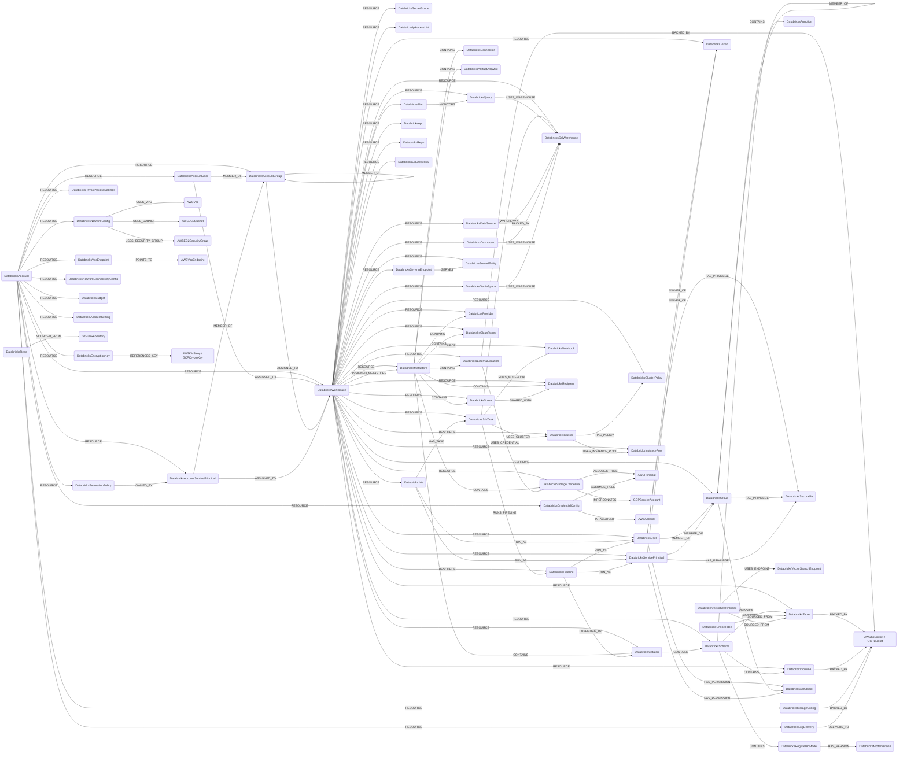

## Databricks Schema



> The account-level nodes (`DatabricksAccountUser`, `DatabricksAccountServicePrincipal`, `DatabricksAccountGroup`) carry the same ontology labels as their workspace-level counterparts (`UserAccount`, `ServiceAccount`, `UserGroup`); `DatabricksAccount` carries `Tenant`. Unity Catalog catalogs / schemas / tables carry `Database`, external locations / volumes carry `ObjectStorage`, and IP access lists carry `NetworkAccessControl`, so Databricks data plane and network controls surface in cross-provider ontology queries.

ACL-bearing workspace objects (`DatabricksCluster`, `DatabricksClusterPolicy`, `DatabricksInstancePool`, `DatabricksJob`, `DatabricksPipeline`, `DatabricksSqlWarehouse`, `DatabricksServingEndpoint`, `DatabricksApp`, `DatabricksSecretScope`) also carry the shared `DatabricksAclObject` label so a principal's object-ACL permission can point at any of them with one relationship type (`HAS_PERMISSION`, carrying a `permission_level` list).

Grantable Unity Catalog nodes (`DatabricksMetastore`, `DatabricksCatalog`,
`DatabricksSchema`, `DatabricksTable`, `DatabricksVolume`, `DatabricksFunction`,
`DatabricksConnection`, `DatabricksStorageCredential`,
`DatabricksExternalLocation`, `DatabricksRegisteredModel`) also carry the shared
`DatabricksSecurable` label so UC grants can point a principal at any grantable
object with one relationship type.

### DatabricksWorkspace

A Databricks workspace, scoped by host URL.

> **Ontology Mapping**: This node has the extra label `Tenant` to enable cross-platform queries for organizational tenants across different systems.

| Field | Description |
|-------|-------------|
| **id** | Workspace host (e.g. `dbc-xxxx.cloud.databricks.com`) |
| **host** | Full workspace URL (indexed) |
| tokens_enabled | Whether PATs are enabled in the workspace |
| max_token_lifetime_days | Max PAT lifetime in days from the workspace token management settings, or null when the workspace is on the Databricks default policy (the API encodes that as the string `"0"`) |
| firstseen | Timestamp of when a sync job first created this node |
| lastupdated | Timestamp of the last time the node was updated |

#### Relationships

- `DatabricksUser`, `DatabricksServicePrincipal`, `DatabricksGroup`, `DatabricksToken`, `DatabricksClusterPolicy`, `DatabricksInstancePool`, `DatabricksCluster`, `DatabricksSecretScope`, `DatabricksIpAccessList` belong to a `DatabricksWorkspace`.
    ```
    (:DatabricksWorkspace)-[:RESOURCE]->(
        :DatabricksUser,
        :DatabricksServicePrincipal,
        :DatabricksGroup,
        :DatabricksToken,
        :DatabricksClusterPolicy,
        :DatabricksInstancePool,
        :DatabricksCluster,
        :DatabricksSecretScope,
        :DatabricksIpAccessList
    )
    ```

### DatabricksUser

A workspace SCIM user.

> **Ontology Mapping**: This node has the extra label `UserAccount` to enable cross-platform queries for user accounts across different systems.

| Field | Description |
|-------|-------------|
| **id** | Workspace-scoped composite id `{workspace_id}/{scim_id}` (SCIM ids are not unique across workspaces) |
| **scim_id** | Raw SCIM user ID returned by Databricks (indexed) |
| **user_name** | SCIM `userName` (typically the email, indexed) |
| **email** | Primary email address (indexed) |
| display_name | SCIM display name |
| external_id | External SCIM ID (federation) |
| active | Whether the user is active |
| firstseen | Timestamp of when a sync job first created this node |
| lastupdated | Timestamp of the last time the node was updated |

#### Relationships

- A `DatabricksUser` belongs to a `DatabricksWorkspace`.
    ```
    (:DatabricksWorkspace)-[:RESOURCE]->(:DatabricksUser)
    ```
- A `DatabricksUser` is a member of one or more `DatabricksGroup`.
    ```
    (:DatabricksUser)-[:MEMBER_OF]->(:DatabricksGroup)
    ```

### DatabricksServicePrincipal

A workspace SCIM service principal.

> **Ontology Mapping**: This node has the extra label `ServiceAccount` to enable cross-platform queries for non-human accounts across different systems.

| Field | Description |
|-------|-------------|
| **id** | Workspace-scoped composite id `{workspace_id}/{scim_id}` (SCIM ids are not unique across workspaces) |
| **scim_id** | Raw SCIM service principal ID (indexed) |
| **application_id** | OAuth application ID (indexed) |
| display_name | SCIM display name |
| external_id | External SCIM ID (federation) |
| active | Whether the service principal is active |
| firstseen | Timestamp of when a sync job first created this node |
| lastupdated | Timestamp of the last time the node was updated |

#### Relationships

- A `DatabricksServicePrincipal` belongs to a `DatabricksWorkspace`.
    ```
    (:DatabricksWorkspace)-[:RESOURCE]->(:DatabricksServicePrincipal)
    ```
- A `DatabricksServicePrincipal` is a member of one or more `DatabricksGroup`.
    ```
    (:DatabricksServicePrincipal)-[:MEMBER_OF]->(:DatabricksGroup)
    ```

### DatabricksGroup

A workspace SCIM group.

> **Ontology Mapping**: This node has the extra label `UserGroup` to enable cross-platform group queries.

| Field | Description |
|-------|-------------|
| **id** | Workspace-scoped composite id `{workspace_id}/{scim_id}` (SCIM ids are not unique across workspaces) |
| **scim_id** | Raw SCIM group ID (indexed) |
| **display_name** | Group display name (indexed) |
| external_id | External SCIM ID (federation) |
| firstseen | Timestamp of when a sync job first created this node |
| lastupdated | Timestamp of the last time the node was updated |

#### Relationships

- A `DatabricksGroup` belongs to a `DatabricksWorkspace`.
    ```
    (:DatabricksWorkspace)-[:RESOURCE]->(:DatabricksGroup)
    ```
- A `DatabricksGroup` can be a member of another `DatabricksGroup` (nested groups).
    ```
    (:DatabricksGroup)-[:MEMBER_OF]->(:DatabricksGroup)
    ```

### DatabricksToken

A Databricks personal access token (PAT) returned by the token management API.

| Field | Description |
|-------|-------------|
| **id** | Workspace-scoped composite id `{workspace_id}/{token_id}` (token-management ids are workspace-local) |
| **token_id** | Raw token id returned by the token-management API (indexed) |
| comment | Token description provided at creation |
| creation_time | Native datetime when the token was created (UTC) |
| expiry_time | Native datetime when the token expires (UTC); null when the token has no expiry |
| owner_id | Workspace-scoped composite id of the token owner (matches `DatabricksUser.id` or `DatabricksServicePrincipal.id`) |
| created_by_id | Workspace-scoped composite id of the principal that created the token |
| created_by_username | Username/email of the principal that created the token (indexed) |
| firstseen | Timestamp of when a sync job first created this node |
| lastupdated | Timestamp of the last time the node was updated |

#### Relationships

- A `DatabricksToken` belongs to a `DatabricksWorkspace`.
    ```
    (:DatabricksWorkspace)-[:RESOURCE]->(:DatabricksToken)
    ```
- A `DatabricksUser` or `DatabricksServicePrincipal` owns a `DatabricksToken`.
    ```
    (:DatabricksUser)-[:OWNER_OF]->(:DatabricksToken)
    (:DatabricksServicePrincipal)-[:OWNER_OF]->(:DatabricksToken)
    ```

### DatabricksClusterPolicy

A cluster policy returned by the policies API. Cluster policies define a set of
allowed configurations a `DatabricksCluster` can be launched with.

| Field | Description |
|-------|-------------|
| **id** | Workspace-scoped composite id `{workspace_id}/{policy_id}` |
| **policy_id** | Raw policy id (indexed) |
| **name** | Policy display name (indexed) |
| description | Free-text description |
| definition | JSON-encoded policy definition (allowed fields, fixed values, …) |
| policy_family_id | Policy family id when the policy is derived from a Databricks-provided family |
| creator_user_name | User name of the policy creator (indexed) |
| created_at | Native datetime when the policy was created (UTC) |
| firstseen | Timestamp of when a sync job first created this node |
| lastupdated | Timestamp of the last time the node was updated |

#### Relationships

- A `DatabricksClusterPolicy` belongs to a `DatabricksWorkspace`.
    ```
    (:DatabricksWorkspace)-[:RESOURCE]->(:DatabricksClusterPolicy)
    ```
- A `DatabricksCluster` is launched against a `DatabricksClusterPolicy`.
    ```
    (:DatabricksCluster)-[:HAS_POLICY]->(:DatabricksClusterPolicy)
    ```

### DatabricksInstancePool

A pre-warmed instance pool that clusters can pull nodes from to reduce startup
latency.

| Field | Description |
|-------|-------------|
| **id** | Workspace-scoped composite id `{workspace_id}/{instance_pool_id}` |
| **instance_pool_id** | Raw pool id (indexed) |
| **instance_pool_name** | Pool display name (indexed) |
| node_type_id | Underlying VM instance type id |
| min_idle_instances | Minimum number of idle instances kept warm |
| max_capacity | Maximum number of instances the pool can scale to |
| idle_instance_autotermination_minutes | Idle instance reclaim window |
| enable_elastic_disk | Whether elastic disk autoscaling is enabled |
| state | Pool state (`ACTIVE`, `STOPPED`, `DELETED`) |
| firstseen | Timestamp of when a sync job first created this node |
| lastupdated | Timestamp of the last time the node was updated |

#### Relationships

- A `DatabricksInstancePool` belongs to a `DatabricksWorkspace`.
    ```
    (:DatabricksWorkspace)-[:RESOURCE]->(:DatabricksInstancePool)
    ```
- A `DatabricksCluster` allocates nodes from a `DatabricksInstancePool`.
    ```
    (:DatabricksCluster)-[:USES_INSTANCE_POOL]->(:DatabricksInstancePool)
    ```

### DatabricksCluster

A Databricks compute cluster returned by the clusters 2.1 API.

| Field | Description |
|-------|-------------|
| **id** | Workspace-scoped composite id `{workspace_id}/{cluster_id}` |
| **cluster_id** | Raw cluster id (indexed) |
| **cluster_name** | Cluster display name (indexed) |
| state | Cluster state (`PENDING`, `RUNNING`, `TERMINATED`, …) |
| spark_version | Spark / Databricks runtime version string |
| runtime_engine | Runtime engine (`STANDARD`, `PHOTON`) |
| node_type_id | Worker node VM type id |
| driver_node_type_id | Driver node VM type id |
| num_workers | Static worker count (null when autoscaling is enabled) |
| autotermination_minutes | Idle auto-termination window in minutes |
| cluster_source | What created the cluster (`UI`, `JOB`, `API`, `MODELS`, …) |
| data_security_mode | UC access mode (`NONE`, `SINGLE_USER`, `USER_ISOLATION`, `LEGACY_*`) |
| single_user_name | Owning user for single-user UC clusters (indexed) |
| creator_user_name | User name of the cluster creator (indexed) |
| instance_pool_id | Raw worker instance pool id, when the cluster targets one (indexed) |
| driver_instance_pool_id | Raw driver instance pool id, when the driver targets a distinct pool (indexed) |
| enable_local_disk_encryption | Whether local disks are encrypted |
| enable_elastic_disk | Whether elastic disk autoscaling is enabled |
| start_time | Native datetime when the cluster was first started (UTC) |
| terminated_time | Native datetime when the cluster was last terminated (UTC), if applicable |
| firstseen | Timestamp of when a sync job first created this node |
| lastupdated | Timestamp of the last time the node was updated |

#### Relationships

- A `DatabricksCluster` belongs to a `DatabricksWorkspace`.
    ```
    (:DatabricksWorkspace)-[:RESOURCE]->(:DatabricksCluster)
    ```
- A `DatabricksCluster` is governed by a `DatabricksClusterPolicy`.
    ```
    (:DatabricksCluster)-[:HAS_POLICY]->(:DatabricksClusterPolicy)
    ```
- A `DatabricksCluster` allocates nodes from one or more `DatabricksInstancePool` — the worker pool and, when set, a distinct driver pool both land here.
    ```
    (:DatabricksCluster)-[:USES_INSTANCE_POOL]->(:DatabricksInstancePool)
    ```

### DatabricksSecretScope

A Databricks secret scope. Scopes can be backed by Databricks's own store
(`DATABRICKS`) or by an Azure Key Vault (`AZURE_KEYVAULT`).

| Field | Description |
|-------|-------------|
| **id** | Workspace-scoped composite id `{workspace_id}/{name}` |
| **name** | Scope name (indexed) |
| backend_type | Backing store (`DATABRICKS`, `AZURE_KEYVAULT`) |
| keyvault_resource_id | Azure Key Vault resource id when backend is `AZURE_KEYVAULT` (indexed) |
| keyvault_dns_name | Azure Key Vault DNS name when backend is `AZURE_KEYVAULT` |
| firstseen | Timestamp of when a sync job first created this node |
| lastupdated | Timestamp of the last time the node was updated |

#### Relationships

- A `DatabricksSecretScope` belongs to a `DatabricksWorkspace`.
    ```
    (:DatabricksWorkspace)-[:RESOURCE]->(:DatabricksSecretScope)
    ```

### DatabricksIpAccessList

An IP access list applied at the workspace level. Restricts inbound access to
the workspace to ranges in the allow list, blocks ranges in the block list.

| Field | Description |
|-------|-------------|
| **id** | Workspace-scoped composite id `{workspace_id}/{list_id}` |
| **list_id** | Raw list id (indexed) |
| **label** | List label (indexed) |
| list_type | List type (`ALLOW` / `BLOCK`) |
| enabled | Whether the list is enforced |
| address_count | Number of addresses in the list |
| ip_addresses | Source CIDR / IP entries in the list |
| created_at | Native datetime when the list was created (UTC) |
| updated_at | Native datetime when the list was last updated (UTC) |
| firstseen | Timestamp of when a sync job first created this node |
| lastupdated | Timestamp of the last time the node was updated |

#### Relationships

- A `DatabricksIpAccessList` belongs to a `DatabricksWorkspace`.
    ```
    (:DatabricksWorkspace)-[:RESOURCE]->(:DatabricksIpAccessList)
    ```

### DatabricksMetastore

The Unity Catalog metastore assigned to the workspace. A metastore is account
(not workspace) scoped but is modelled per workspace via the assignment edge.

| Field | Description |
|-------|-------------|
| **id** | Metastore id (globally unique UUID) |
| metastore_id | Raw metastore id (indexed) |
| name | Metastore name (indexed) |
| global_metastore_id | Cloud-qualified id, e.g. `aws:us-west-2:<uuid>` (indexed) |
| cloud | Host cloud (`aws` / `gcp` / `azure`) |
| region | Cloud region |
| delta_sharing_scope | Delta Sharing scope (`INTERNAL`, `INTERNAL_AND_EXTERNAL`) |
| external_access_enabled | Whether external data access is enabled |
| privilege_model_version | UC privilege model version |
| owner | Metastore owner (indexed) |
| storage_root | Root storage location |
| created_at / updated_at | Native datetimes (UTC) |
| firstseen / lastupdated | Sync bookkeeping timestamps |

#### Relationships

- A `DatabricksMetastore` belongs to a `DatabricksWorkspace`, which is also assigned to it (the assignment edge carries the workspace's default catalog).
    ```
    (:DatabricksWorkspace)-[:RESOURCE]->(:DatabricksMetastore)
    (:DatabricksWorkspace)-[:ASSIGNED_METASTORE]->(:DatabricksMetastore)
    ```
- A `DatabricksMetastore` contains catalogs, storage credentials, external locations, connections and artifact allowlists.
    ```
    (:DatabricksMetastore)-[:CONTAINS]->(
        :DatabricksCatalog,
        :DatabricksStorageCredential,
        :DatabricksExternalLocation,
        :DatabricksConnection,
        :DatabricksArtifactAllowlist
    )
    ```

### DatabricksStorageCredential

A Unity Catalog storage credential: the cloud identity UC assumes to access
external storage.

| Field | Description |
|-------|-------------|
| **id** | Credential id (UUID) or name |
| credential_id | Raw credential id (indexed) |
| name | Credential name (indexed) |
| metastore_id | Owning metastore id (indexed) |
| credential_type | `AWS_IAM_ROLE`, `AZURE_MANAGED_IDENTITY`, `AZURE_SERVICE_PRINCIPAL`, `GCP_SERVICE_ACCOUNT`, `CLOUDFLARE_API_TOKEN` |
| owner | Credential owner (indexed) |
| read_only | Whether the credential is read-only |
| used_for_managed_storage | Whether it backs managed storage |
| isolation_mode | Workspace isolation mode |
| aws_iam_role_arn | AWS role ARN when AWS-backed (indexed) |
| azure_managed_identity_id / azure_access_connector_id | Azure identity ids (indexed) |
| gcp_service_account_email | GCP service account email when GCP-backed (indexed) |
| created_at / updated_at | Native datetimes (UTC) |
| firstseen / lastupdated | Sync bookkeeping timestamps |

#### Relationships

- A `DatabricksStorageCredential` belongs to a `DatabricksWorkspace` and `DatabricksMetastore`.
    ```
    (:DatabricksWorkspace)-[:RESOURCE]->(:DatabricksStorageCredential)
    (:DatabricksMetastore)-[:CONTAINS]->(:DatabricksStorageCredential)
    ```
- A `DatabricksStorageCredential` assumes the cloud identity it impersonates.
    ```
    (:DatabricksStorageCredential)-[:ASSUMES_ROLE]->(:AWSPrincipal)
    (:DatabricksStorageCredential)-[:IMPERSONATES]->(:GCPServiceAccount)
    ```

### DatabricksExternalLocation

A named external storage location governed by Unity Catalog.

| Field | Description |
|-------|-------------|
| **id** | External location id (UUID) or name |
| external_location_id | Raw id (indexed) |
| name | Location name (indexed) |
| metastore_id | Owning metastore id (indexed) |
| url | Storage URL (indexed) |
| credential_id | Storage credential id (indexed) |
| credential_name | Storage credential name |
| read_only | Whether the location is read-only |
| isolation_mode | Workspace isolation mode |
| fallback | Whether fallback mode is enabled |
| owner | Location owner (indexed) |
| created_at / updated_at | Native datetimes (UTC) |
| firstseen / lastupdated | Sync bookkeeping timestamps |

#### Relationships

- A `DatabricksExternalLocation` belongs to a `DatabricksWorkspace` and `DatabricksMetastore`, uses a storage credential, and is backed by a cloud bucket.
    ```
    (:DatabricksWorkspace)-[:RESOURCE]->(:DatabricksExternalLocation)
    (:DatabricksMetastore)-[:CONTAINS]->(:DatabricksExternalLocation)
    (:DatabricksExternalLocation)-[:USES_CREDENTIAL]->(:DatabricksStorageCredential)
    (:DatabricksExternalLocation)-[:BACKED_BY]->(:AWSS3Bucket)
    (:DatabricksExternalLocation)-[:BACKED_BY]->(:GCPBucket)
    ```

### DatabricksCatalog

A Unity Catalog catalog (top of the data hierarchy). Carries the shared
`DatabricksSecurable` label.

| Field | Description |
|-------|-------------|
| **id** | Metastore-scoped id `{metastore_id}/{full_name}` |
| catalog_id | Raw catalog UUID (indexed) |
| name / full_name | Catalog name (indexed) |
| metastore_id | Owning metastore id (indexed) |
| catalog_type | `MANAGED_CATALOG`, `DELTASHARING_CATALOG`, `FOREIGN_CATALOG`, `SYSTEM_CATALOG` |
| owner | Catalog owner (indexed) |
| isolation_mode | `OPEN` / `ISOLATED` (workspace binding signal) |
| storage_root | Managed storage root |
| connection_name | Source connection for foreign catalogs (indexed) |
| share_name / provider_name | Delta Sharing source, when applicable |
| securable_kind | UC securable kind (e.g. `CATALOG_STANDARD`, `CATALOG_DB_STORAGE`) |
| created_at / updated_at / created_by / updated_by | Provenance |
| firstseen / lastupdated | Sync bookkeeping timestamps |

#### Relationships

```
(:DatabricksWorkspace)-[:RESOURCE]->(:DatabricksCatalog)
(:DatabricksMetastore)-[:CONTAINS]->(:DatabricksCatalog)
(:DatabricksCatalog)-[:CONTAINS]->(:DatabricksSchema)
```

### DatabricksSchema

A schema within a catalog. Carries the shared `DatabricksSecurable` label.

| Field | Description |
|-------|-------------|
| **id** | Metastore-scoped id `{metastore_id}/{catalog}.{schema}` |
| schema_id | Raw schema UUID (indexed) |
| name / full_name | Schema name / `catalog.schema` (indexed) |
| catalog_name | Parent catalog name (indexed) |
| metastore_id | Owning metastore id (indexed) |
| owner | Schema owner (indexed) |
| storage_root | Managed storage root |
| created_at / updated_at / created_by / updated_by | Provenance |
| firstseen / lastupdated | Sync bookkeeping timestamps |

#### Relationships

```
(:DatabricksWorkspace)-[:RESOURCE]->(:DatabricksSchema)
(:DatabricksCatalog)-[:CONTAINS]->(:DatabricksSchema)
(:DatabricksSchema)-[:CONTAINS]->(:DatabricksTable | :DatabricksVolume | :DatabricksFunction | :DatabricksRegisteredModel)
```

### DatabricksTable

A UC table or view. Carries the shared `DatabricksSecurable` label.

| Field | Description |
|-------|-------------|
| **id** | Metastore-scoped id `{metastore_id}/{catalog}.{schema}.{table}` |
| table_id | Raw table UUID (indexed) |
| name / full_name | Table name / three-level name (indexed) |
| catalog_name / schema_name | Parents (indexed) |
| metastore_id | Owning metastore id (indexed) |
| table_type | `MANAGED`, `EXTERNAL`, `VIEW`, `MATERIALIZED_VIEW`, ... |
| data_source_format | e.g. `DELTA`, `PARQUET` |
| owner | Table owner (indexed) |
| storage_location | Backing storage location (external tables) |
| view_definition | View SQL (views only) |
| created_at / updated_at / created_by / updated_by | Provenance |
| firstseen / lastupdated | Sync bookkeeping timestamps |

#### Relationships

```
(:DatabricksWorkspace)-[:RESOURCE]->(:DatabricksTable)
(:DatabricksSchema)-[:CONTAINS]->(:DatabricksTable)
(:DatabricksTable)-[:BACKED_BY]->(:AWSS3Bucket | :GCPBucket)
```

### DatabricksVolume

A UC volume (managed or external file storage). Carries the shared
`DatabricksSecurable` label.

| Field | Description |
|-------|-------------|
| **id** | Metastore-scoped id `{metastore_id}/{catalog}.{schema}.{volume}` |
| volume_id | Raw volume UUID (indexed) |
| name / full_name | Volume name / three-level name (indexed) |
| catalog_name / schema_name | Parents (indexed) |
| metastore_id | Owning metastore id (indexed) |
| volume_type | `MANAGED` / `EXTERNAL` |
| owner | Volume owner (indexed) |
| storage_location | Backing storage location (external volumes) |
| created_at / updated_at / created_by / updated_by | Provenance |
| firstseen / lastupdated | Sync bookkeeping timestamps |

#### Relationships

```
(:DatabricksWorkspace)-[:RESOURCE]->(:DatabricksVolume)
(:DatabricksSchema)-[:CONTAINS]->(:DatabricksVolume)
(:DatabricksVolume)-[:BACKED_BY]->(:AWSS3Bucket | :GCPBucket)
```

### DatabricksFunction

A UC user-defined function. Carries the shared `DatabricksSecurable` label.

| Field | Description |
|-------|-------------|
| **id** | Metastore-scoped id `{metastore_id}/{catalog}.{schema}.{function}` |
| function_id | Raw function id (indexed) |
| name / full_name | Function name / three-level name (indexed) |
| catalog_name / schema_name | Parents (indexed) |
| metastore_id | Owning metastore id (indexed) |
| data_type | Return data type |
| routine_body | `SQL` / `EXTERNAL` |
| external_language | Language for external functions |
| security_type | `DEFINER` |
| sql_data_access | e.g. `READS_SQL_DATA`, `NO_SQL` |
| is_deterministic | Whether the function is deterministic |
| owner | Function owner (indexed) |
| created_at / updated_at / created_by / updated_by | Provenance |
| firstseen / lastupdated | Sync bookkeeping timestamps |

#### Relationships

```
(:DatabricksWorkspace)-[:RESOURCE]->(:DatabricksFunction)
(:DatabricksSchema)-[:CONTAINS]->(:DatabricksFunction)
```

### DatabricksConnection

A UC foreign connection (Lakehouse Federation). Carries the shared
`DatabricksSecurable` label.

| Field | Description |
|-------|-------------|
| **id** | Metastore-scoped id `{metastore_id}/{name}` |
| connection_id | Raw connection id (indexed) |
| name / full_name | Connection name (indexed) |
| metastore_id | Owning metastore id (indexed) |
| connection_type | `SNOWFLAKE`, `POSTGRESQL`, `REDSHIFT`, `MYSQL`, ... |
| credential_type | Auth type (e.g. `USERNAME_PASSWORD`, `OAUTH`) |
| owner | Connection owner (indexed) |
| read_only | Whether the connection is read-only |
| host / port | Remote endpoint (indexed host); secrets are not ingested |
| created_at / updated_at / created_by / updated_by | Provenance |
| firstseen / lastupdated | Sync bookkeeping timestamps |

#### Relationships

```
(:DatabricksWorkspace)-[:RESOURCE]->(:DatabricksConnection)
(:DatabricksMetastore)-[:CONTAINS]->(:DatabricksConnection)
```

### DatabricksRegisteredModel

A UC registered ML model.

| Field | Description |
|-------|-------------|
| **id** | Metastore-scoped id `{metastore_id}/{catalog}.{schema}.{model}` |
| model_id | Raw model id (indexed) |
| name / full_name | Model name / three-level name (indexed) |
| catalog_name / schema_name | Parents (indexed) |
| metastore_id | Owning metastore id (indexed) |
| owner | Model owner (indexed) |
| storage_location | Model storage location |
| created_at / updated_at / created_by / updated_by | Provenance |
| firstseen / lastupdated | Sync bookkeeping timestamps |

#### Relationships

```
(:DatabricksWorkspace)-[:RESOURCE]->(:DatabricksRegisteredModel)
(:DatabricksSchema)-[:CONTAINS]->(:DatabricksRegisteredModel)
(:DatabricksRegisteredModel)-[:HAS_VERSION]->(:DatabricksModelVersion)
```

### DatabricksModelVersion

A version of a registered model.

| Field | Description |
|-------|-------------|
| **id** | `{model_id}/{version}` |
| version | Version number |
| model_name | Parent model name (indexed) |
| metastore_id | Owning metastore id (indexed) |
| status | Version status (e.g. `READY`) |
| source | Source run / path |
| run_id | Originating MLflow run id (indexed) |
| storage_location | Version storage location |
| created_at / updated_at / created_by / updated_by | Provenance |
| firstseen / lastupdated | Sync bookkeeping timestamps |

#### Relationships

```
(:DatabricksWorkspace)-[:RESOURCE]->(:DatabricksModelVersion)
(:DatabricksRegisteredModel)-[:HAS_VERSION]->(:DatabricksModelVersion)
```

### DatabricksOnlineTable

An online (low-latency serving) table backed by a UC table.

| Field | Description |
|-------|-------------|
| **id** | Metastore-scoped id `{metastore_id}/{name}` |
| name | Three-level online table name (indexed) |
| metastore_id | Owning metastore id (indexed) |
| source_table_full_name | Backing UC table full name (indexed) |
| pipeline_id | Sync pipeline id (indexed) |
| detailed_state | Provisioning state |
| provisioning_state | UC provisioning state |
| table_serving_url | Serving endpoint URL |
| primary_key_columns | Primary key columns |
| timeseries_key | Timeseries key column |
| firstseen / lastupdated | Sync bookkeeping timestamps |

#### Relationships

```
(:DatabricksWorkspace)-[:RESOURCE]->(:DatabricksOnlineTable)
(:DatabricksOnlineTable)-[:SOURCED_FROM]->(:DatabricksTable)
```

### DatabricksVectorSearchEndpoint

A vector search endpoint.

| Field | Description |
|-------|-------------|
| **id** | Workspace-scoped id `{workspace_id}/{name}` |
| endpoint_id | Raw endpoint id (indexed) |
| name | Endpoint name (indexed) |
| endpoint_type | e.g. `STANDARD` |
| state | Endpoint state |
| num_indexes | Number of indexes on the endpoint |
| creator | Endpoint creator (indexed) |
| created_at / last_updated_at | Native datetimes (UTC) |
| firstseen / lastupdated | Sync bookkeeping timestamps |

#### Relationships

```
(:DatabricksWorkspace)-[:RESOURCE]->(:DatabricksVectorSearchEndpoint)
(:DatabricksVectorSearchIndex)-[:USES_ENDPOINT]->(:DatabricksVectorSearchEndpoint)
```

### DatabricksVectorSearchIndex

A vector search index.

| Field | Description |
|-------|-------------|
| **id** | Workspace-scoped id `{workspace_id}/{name}` |
| name | Three-level index name (indexed) |
| endpoint_name | Serving endpoint name (indexed) |
| index_type | `DELTA_SYNC` / `DIRECT_ACCESS` |
| primary_key | Primary key column |
| source_table | Backing UC table full name for delta-sync indexes (indexed) |
| creator | Index creator (indexed) |
| firstseen / lastupdated | Sync bookkeeping timestamps |

#### Relationships

```
(:DatabricksWorkspace)-[:RESOURCE]->(:DatabricksVectorSearchIndex)
(:DatabricksVectorSearchIndex)-[:USES_ENDPOINT]->(:DatabricksVectorSearchEndpoint)
(:DatabricksVectorSearchIndex)-[:SOURCED_FROM]->(:DatabricksTable)
```

### DatabricksArtifactAllowlist

The UC artifact allowlist for one artifact type (init scripts, JARs, Maven
coordinates) at the metastore level.

| Field | Description |
|-------|-------------|
| **id** | `{metastore_id}/{artifact_type}` |
| artifact_type | `INIT_SCRIPT` / `LIBRARY_JAR` / `LIBRARY_MAVEN` (indexed) |
| metastore_id | Owning metastore id (indexed) |
| artifacts | Allowed matchers as `MATCH_TYPE:artifact` strings |
| created_at / created_by | Provenance |
| firstseen / lastupdated | Sync bookkeeping timestamps |

#### Relationships

```
(:DatabricksWorkspace)-[:RESOURCE]->(:DatabricksArtifactAllowlist)
(:DatabricksMetastore)-[:CONTAINS]->(:DatabricksArtifactAllowlist)
```

### DatabricksSecurable

A shared label applied to every grantable Unity Catalog object
(`DatabricksMetastore`, `DatabricksCatalog`, `DatabricksSchema`,
`DatabricksTable`, `DatabricksVolume`, `DatabricksFunction`,
`DatabricksConnection`, `DatabricksStorageCredential`,
`DatabricksExternalLocation`, `DatabricksRegisteredModel`). It exists so a
single `HAS_PRIVILEGE` relationship type can point any principal at any
securable.

#### Relationships

- A workspace principal holds UC privileges on a securable. The granted privilege list is stored on the `privileges` relationship property.
    ```
    (:DatabricksUser)-[:HAS_PRIVILEGE {privileges}]->(:DatabricksSecurable)
    (:DatabricksGroup)-[:HAS_PRIVILEGE {privileges}]->(:DatabricksSecurable)
    (:DatabricksServicePrincipal)-[:HAS_PRIVILEGE {privileges}]->(:DatabricksSecurable)
    ```

### DatabricksSqlWarehouse

A Databricks SQL warehouse (SQL endpoint) that queries, dashboards, alerts and
data sources run against.

| Field | Description |
|-------|-------------|
| **id** | Workspace-scoped composite id `{workspace_id}/{warehouse_id}` |
| **warehouse_id** | Raw warehouse id (indexed) |
| **name** | Warehouse display name (indexed) |
| state | Warehouse state (`RUNNING`, `STOPPED`, `STARTING`, …) |
| cluster_size | T-shirt size label (`Small`, `Medium`, …) |
| size | Normalised size enum (`SMALL`, `MEDIUM`, …) |
| warehouse_type | Warehouse type (`CLASSIC`, `PRO`) |
| enable_serverless_compute | Whether the warehouse runs on serverless compute |
| enable_photon | Whether the Photon engine is enabled |
| auto_stop_mins | Idle auto-stop window in minutes (0 disables auto-stop) |
| auto_resume | Whether the warehouse auto-resumes on query |
| spot_instance_policy | Spot vs on-demand policy (`COST_OPTIMIZED`, `RELIABILITY_OPTIMIZED`) |
| channel | Release channel name (`CHANNEL_NAME_CURRENT`, `CHANNEL_NAME_PREVIEW`) |
| min_num_clusters | Minimum cluster count for autoscaling |
| max_num_clusters | Maximum cluster count for autoscaling |
| num_clusters | Currently allocated cluster count |
| creator_name | User name of the warehouse creator (indexed) |
| jdbc_url | JDBC connection URL |
| firstseen | Timestamp of when a sync job first created this node |
| lastupdated | Timestamp of the last time the node was updated |

#### Relationships

- A `DatabricksSqlWarehouse` belongs to a `DatabricksWorkspace`.
    ```
    (:DatabricksWorkspace)-[:RESOURCE]->(:DatabricksSqlWarehouse)
    ```

### DatabricksJob

A Databricks job (Workflow). Schedule fields are flattened from the job's
`schedule` block; `run_as_user_name` is the principal the job's tasks execute as.

| Field | Description |
|-------|-------------|
| **id** | Workspace-scoped composite id `{workspace_id}/{job_id}` |
| **job_id** | Raw job id (indexed) |
| **name** | Job name (indexed) |
| creator_user_name | User name of the job creator (indexed) |
| run_as_user_name | Principal the job runs as: a user name or SP application id (indexed) |
| format | Job format (`MULTI_TASK`, `SINGLE_TASK`) |
| max_concurrent_runs | Maximum concurrent runs |
| timeout_seconds | Job timeout in seconds (0 = no timeout) |
| continuous | Whether the job is configured for continuous execution |
| schedule_quartz_cron_expression | Cron expression of the schedule, if scheduled |
| schedule_timezone_id | Timezone id of the schedule |
| schedule_pause_status | Schedule pause status (`PAUSED`, `UNPAUSED`) |
| created_time | Native datetime when the job was created (UTC) |
| firstseen | Timestamp of when a sync job first created this node |
| lastupdated | Timestamp of the last time the node was updated |

#### Relationships

- A `DatabricksJob` belongs to a `DatabricksWorkspace`.
    ```
    (:DatabricksWorkspace)-[:RESOURCE]->(:DatabricksJob)
    ```
- A `DatabricksJob` runs as a workspace principal (a user or a service principal).
    ```
    (:DatabricksJob)-[:RUN_AS]->(:DatabricksUser)
    (:DatabricksJob)-[:RUN_AS]->(:DatabricksServicePrincipal)
    ```
- A `DatabricksJob` is composed of one or more `DatabricksJobTask`.
    ```
    (:DatabricksJob)-[:HAS_TASK]->(:DatabricksJobTask)
    ```

### DatabricksJobTask

A single task within a Databricks job. The task type is the name of the task's
settings block (`notebook_task`, `pipeline_task`, `sql_task`, `run_job_task`, …).

| Field | Description |
|-------|-------------|
| **id** | Composite id `{workspace_id}/{job_id}/{task_key}` |
| **task_key** | Task key, unique within its job (indexed) |
| **job_id** | Raw id of the owning job (indexed) |
| task_type | The task's settings block name (`notebook_task`, `pipeline_task`, …) |
| notebook_path | Notebook path for a notebook task (indexed) |
| existing_cluster_id | Raw id of an existing cluster the task runs on |
| job_cluster_key | Key of the job cluster the task runs on, if any |
| pipeline_id | Raw pipeline id for a pipeline task (indexed) |
| warehouse_id | Raw SQL warehouse id for a SQL task (indexed) |
| run_job_id | Raw id of the job triggered by a run-job task (indexed) |
| disabled | Whether the task is disabled |
| run_if | Condition under which the task runs (`ALL_SUCCESS`, …) |
| firstseen | Timestamp of when a sync job first created this node |
| lastupdated | Timestamp of the last time the node was updated |

#### Relationships

- A `DatabricksJobTask` belongs to a `DatabricksWorkspace`.
    ```
    (:DatabricksWorkspace)-[:RESOURCE]->(:DatabricksJobTask)
    ```
- A `DatabricksJobTask` belongs to a `DatabricksJob`.
    ```
    (:DatabricksJob)-[:HAS_TASK]->(:DatabricksJobTask)
    ```
- A `DatabricksJobTask` triggers a `DatabricksPipeline` (pipeline task).
    ```
    (:DatabricksJobTask)-[:RUNS_PIPELINE]->(:DatabricksPipeline)
    ```
- A `DatabricksJobTask` runs on a `DatabricksCluster` (when it targets an existing cluster).
    ```
    (:DatabricksJobTask)-[:USES_CLUSTER]->(:DatabricksCluster)
    ```
- A `DatabricksJobTask` uses a `DatabricksSqlWarehouse` (SQL task).
    ```
    (:DatabricksJobTask)-[:USES_WAREHOUSE]->(:DatabricksSqlWarehouse)
    ```

### DatabricksPipeline

A Delta Live Tables (Lakeflow Declarative) pipeline.

| Field | Description |
|-------|-------------|
| **id** | Workspace-scoped composite id `{workspace_id}/{pipeline_id}` |
| **pipeline_id** | Raw pipeline id (indexed) |
| **name** | Pipeline name (indexed) |
| state | Pipeline state (`IDLE`, `RUNNING`, `FAILED`, …) |
| creator_user_name | User name of the pipeline creator (indexed) |
| run_as_user_name | Principal the pipeline runs as: a user name or SP application id (indexed) |
| catalog | Target Unity Catalog catalog the pipeline publishes to (indexed) |
| target_schema | Target schema the pipeline publishes to (`spec.schema`, or legacy `spec.target`) |
| storage | DBFS/root storage location for a legacy (non-UC) pipeline |
| continuous | Whether the pipeline runs continuously |
| development | Whether the pipeline is in development mode |
| serverless | Whether the pipeline uses serverless compute |
| photon | Whether the Photon engine is enabled |
| edition | Pipeline edition (`CORE`, `PRO`, `ADVANCED`) |
| channel | Release channel (`CURRENT`, `PREVIEW`) |
| pipeline_type | Pipeline type (`WORKSPACE`, …) |
| firstseen | Timestamp of when a sync job first created this node |
| lastupdated | Timestamp of the last time the node was updated |

#### Relationships

- A `DatabricksPipeline` belongs to a `DatabricksWorkspace`.
    ```
    (:DatabricksWorkspace)-[:RESOURCE]->(:DatabricksPipeline)
    ```
- A `DatabricksPipeline` runs as a workspace principal (a user or a service principal).
    ```
    (:DatabricksPipeline)-[:RUN_AS]->(:DatabricksUser)
    (:DatabricksPipeline)-[:RUN_AS]->(:DatabricksServicePrincipal)
    ```
- A `DatabricksPipeline` publishes to a Unity Catalog `DatabricksCatalog`.
    ```
    (:DatabricksPipeline)-[:PUBLISHES_TO]->(:DatabricksCatalog)
    ```

### DatabricksQuery

A saved Databricks SQL query.

| Field | Description |
|-------|-------------|
| **id** | Workspace-scoped composite id `{workspace_id}/{query_id}` |
| **query_id** | Raw query id (indexed) |
| **display_name** | Query display name (indexed) |
| warehouse_id | Raw id of the warehouse the query runs on (indexed) |
| query_text | The SQL text of the query |
| owner_user_name | User name of the query owner (indexed) |
| last_modifier_user_name | User name of the last modifier |
| run_as_mode | Whether the query runs as its `OWNER` or the `VIEWER` |
| lifecycle_state | Lifecycle state (`ACTIVE`, `TRASHED`) |
| parent_path | Workspace folder path of the query |
| create_time | Native datetime when the query was created (UTC) |
| update_time | Native datetime when the query was last updated (UTC) |
| firstseen | Timestamp of when a sync job first created this node |
| lastupdated | Timestamp of the last time the node was updated |

#### Relationships

- A `DatabricksQuery` belongs to a `DatabricksWorkspace`.
    ```
    (:DatabricksWorkspace)-[:RESOURCE]->(:DatabricksQuery)
    ```
- A `DatabricksQuery` runs against a `DatabricksSqlWarehouse`.
    ```
    (:DatabricksQuery)-[:USES_WAREHOUSE]->(:DatabricksSqlWarehouse)
    ```

### DatabricksAlert

A Databricks SQL alert that evaluates a query result against a condition.

| Field | Description |
|-------|-------------|
| **id** | Workspace-scoped composite id `{workspace_id}/{alert_id}` |
| **alert_id** | Raw alert id (indexed) |
| **display_name** | Alert display name (indexed) |
| query_id | Raw id of the query the alert monitors (indexed) |
| owner_user_name | User name of the alert owner (indexed) |
| state | Latest evaluation state (`OK`, `TRIGGERED`, `UNKNOWN`) |
| lifecycle_state | Lifecycle state (`ACTIVE`, `TRASHED`) |
| condition_op | Comparison operator of the alert condition (`GREATER_THAN`, …) |
| parent_path | Workspace folder path of the alert |
| create_time | Native datetime when the alert was created (UTC) |
| update_time | Native datetime when the alert was last updated (UTC) |
| firstseen | Timestamp of when a sync job first created this node |
| lastupdated | Timestamp of the last time the node was updated |

#### Relationships

- A `DatabricksAlert` belongs to a `DatabricksWorkspace`.
    ```
    (:DatabricksWorkspace)-[:RESOURCE]->(:DatabricksAlert)
    ```
- A `DatabricksAlert` monitors a `DatabricksQuery`.
    ```
    (:DatabricksAlert)-[:MONITORS]->(:DatabricksQuery)
    ```

### DatabricksDataSource

A Databricks SQL data source, which maps a data-source id (referenced by legacy
queries and dashboards) to the warehouse that backs it.

| Field | Description |
|-------|-------------|
| **id** | Workspace-scoped composite id `{workspace_id}/{data_source_id}` |
| **data_source_id** | Raw data source id (indexed) |
| **name** | Data source name (indexed) |
| type | Data source type (`databricks_internal`, …) |
| warehouse_id | Raw id of the backing warehouse (indexed) |
| syntax | Query syntax (`sql`) |
| paused | Whether the data source is paused (`0` = running, `1` = paused) |
| view_only | Whether the data source is view-only |
| firstseen | Timestamp of when a sync job first created this node |
| lastupdated | Timestamp of the last time the node was updated |

#### Relationships

- A `DatabricksDataSource` belongs to a `DatabricksWorkspace`.
    ```
    (:DatabricksWorkspace)-[:RESOURCE]->(:DatabricksDataSource)
    ```
- A `DatabricksDataSource` is backed by a `DatabricksSqlWarehouse`.
    ```
    (:DatabricksDataSource)-[:BACKED_BY]->(:DatabricksSqlWarehouse)
    ```

### DatabricksDashboard

A Databricks dashboard. Both current Lakeview dashboards and legacy
(redash-based) dashboards land as this node type, discriminated by
`dashboard_type`.

| Field | Description |
|-------|-------------|
| **id** | Workspace-scoped composite id `{workspace_id}/{dashboard_id}` |
| **dashboard_id** | Raw dashboard id (indexed) |
| **display_name** | Dashboard display name (indexed) |
| dashboard_type | `LAKEVIEW` (current) or `LEGACY` (redash-based) |
| warehouse_id | Raw id of the bound warehouse (Lakeview dashboards) (indexed) |
| owner_user_name | User name of the dashboard owner (legacy dashboards) (indexed) |
| lifecycle_state | Lifecycle state (`ACTIVE`, `TRASHED`) |
| parent_path | Workspace folder path of the dashboard |
| path | Full workspace path of the dashboard asset |
| create_time | Native datetime when the dashboard was created (UTC) |
| update_time | Native datetime when the dashboard was last updated (UTC) |
| firstseen | Timestamp of when a sync job first created this node |
| lastupdated | Timestamp of the last time the node was updated |

#### Relationships

- A `DatabricksDashboard` belongs to a `DatabricksWorkspace`.
    ```
    (:DatabricksWorkspace)-[:RESOURCE]->(:DatabricksDashboard)
    ```
- A `DatabricksDashboard` uses a `DatabricksSqlWarehouse` (Lakeview dashboards).
    ```
    (:DatabricksDashboard)-[:USES_WAREHOUSE]->(:DatabricksSqlWarehouse)
    ```

### DatabricksServingEndpoint

A Mosaic AI model serving endpoint (custom model, foundation model, or external
model proxy).

| Field | Description |
|-------|-------------|
| **id** | Workspace-scoped composite id `{workspace_id}/{name}` |
| **name** | Endpoint name (indexed) |
| endpoint_type | Endpoint type (`FOUNDATION_MODEL_API`, `EXTERNAL_MODEL`, …) |
| task | Endpoint task (`llm/v1/chat`, `llm/v1/completions`, …) |
| state_ready | Readiness state (`READY`, `NOT_READY`) |
| state_config_update | Config update state (`NOT_UPDATING`, `IN_PROGRESS`, …) |
| permission_level | The caller's permission level on the endpoint |
| route_optimized | Whether the endpoint is route-optimized |
| creator | User name of the endpoint creator (indexed) |
| creation_timestamp | Native datetime the endpoint was created (UTC) |
| last_updated_timestamp | Native datetime the endpoint was last updated (UTC) |
| firstseen | Timestamp of when a sync job first created this node |
| lastupdated | Timestamp of the last time the node was updated |

#### Relationships

- A `DatabricksServingEndpoint` belongs to a `DatabricksWorkspace`.
    ```
    (:DatabricksWorkspace)-[:RESOURCE]->(:DatabricksServingEndpoint)
    ```
- A `DatabricksServingEndpoint` serves one or more `DatabricksServedEntity`.
    ```
    (:DatabricksServingEndpoint)-[:SERVES]->(:DatabricksServedEntity)
    ```

### DatabricksServedEntity

A single model served behind a serving endpoint. An endpoint can serve several
entities (traffic split); each carries the model identity.

| Field | Description |
|-------|-------------|
| **id** | Composite id `{workspace_id}/{endpoint_name}/{served_name}` |
| **served_name** | Name of the served entity within its endpoint (indexed) |
| **endpoint_name** | Name of the owning endpoint (indexed) |
| entity_name | Full name of the served entity (e.g. `catalog.schema.model` or `system.ai.*`) (indexed) |
| entity_type | Entity type (`FOUNDATION_MODEL`, `CUSTOM_MODEL`, `EXTERNAL_MODEL`, `FEATURE_SPEC`) |
| entity_version | Served model version, for custom models |
| foundation_model_name | Backing foundation-model name, for `FOUNDATION_MODEL` entities |
| external_model_provider | Third-party provider data is routed to (`openai`, `anthropic`, …), for `EXTERNAL_MODEL` entities — a data-egress signal |
| external_model_name | Third-party model name, for `EXTERNAL_MODEL` entities |
| firstseen | Timestamp of when a sync job first created this node |
| lastupdated | Timestamp of the last time the node was updated |

#### Relationships

- A `DatabricksServedEntity` belongs to a `DatabricksWorkspace`.
    ```
    (:DatabricksWorkspace)-[:RESOURCE]->(:DatabricksServedEntity)
    ```
- A `DatabricksServedEntity` is served by a `DatabricksServingEndpoint`.
    ```
    (:DatabricksServingEndpoint)-[:SERVES]->(:DatabricksServedEntity)
    ```

### DatabricksGenieSpace

An AI/BI Genie space (natural-language analytics over a warehouse).

| Field | Description |
|-------|-------------|
| **id** | Workspace-scoped composite id `{workspace_id}/{space_id}` |
| **space_id** | Raw Genie space id (indexed) |
| **title** | Space title (indexed) |
| description | Space description |
| warehouse_id | Raw id of the warehouse the space queries (indexed) |
| firstseen | Timestamp of when a sync job first created this node |
| lastupdated | Timestamp of the last time the node was updated |

#### Relationships

- A `DatabricksGenieSpace` belongs to a `DatabricksWorkspace`.
    ```
    (:DatabricksWorkspace)-[:RESOURCE]->(:DatabricksGenieSpace)
    ```
- A `DatabricksGenieSpace` uses a `DatabricksSqlWarehouse`.
    ```
    (:DatabricksGenieSpace)-[:USES_WAREHOUSE]->(:DatabricksSqlWarehouse)
    ```

### DatabricksApp

A Databricks App (a hosted web application). The app runs as an auto-provisioned
service principal whose client id is retained for principal-to-resource
resolution.

| Field | Description |
|-------|-------------|
| **id** | Workspace-scoped composite id `{workspace_id}/{name}` |
| **name** | App name (indexed) |
| description | App description |
| url | Public URL the app is served at (indexed) |
| app_state | Application status (`RUNNING`, `UNAVAILABLE`, …) |
| compute_state | Compute status (`ACTIVE`, `STOPPED`, …) |
| compute_size | Compute size (`MEDIUM`, `LARGE`) |
| creator | User name of the app creator (indexed) |
| service_principal_client_id | Application id of the service principal the app runs as (indexed) |
| service_principal_name | Display name of the app's service principal |
| oauth2_app_client_id | OAuth2 client id of the app integration |
| create_time | Native datetime the app was created (UTC) |
| update_time | Native datetime the app was last updated (UTC) |
| firstseen | Timestamp of when a sync job first created this node |
| lastupdated | Timestamp of the last time the node was updated |

#### Relationships

- A `DatabricksApp` belongs to a `DatabricksWorkspace`.
    ```
    (:DatabricksWorkspace)-[:RESOURCE]->(:DatabricksApp)
    ```

### DatabricksRepo

A Databricks repo (git folder) cloned into the workspace.

| Field | Description |
|-------|-------------|
| **id** | Workspace-scoped composite id `{workspace_id}/{repo_id}` |
| **repo_id** | Raw repo id (indexed) |
| url | Git remote URL (indexed) |
| provider | Git provider (`gitHub`, `gitLab`, `bitbucketCloud`, …) |
| branch | Checked-out branch |
| head_commit_id | Currently checked-out commit sha |
| path | Workspace path of the repo (indexed) |
| firstseen | Timestamp of when a sync job first created this node |
| lastupdated | Timestamp of the last time the node was updated |

#### Relationships

- A `DatabricksRepo` belongs to a `DatabricksWorkspace`.
    ```
    (:DatabricksWorkspace)-[:RESOURCE]->(:DatabricksRepo)
    ```

### DatabricksGitCredential

A stored Git credential used to authenticate to a Git provider for repos.

| Field | Description |
|-------|-------------|
| **id** | Workspace-scoped composite id `{workspace_id}/{credential_id}` |
| **credential_id** | Raw credential id (indexed) |
| git_provider | Git provider the credential authenticates to |
| git_username | Git username the credential is bound to (indexed) |
| firstseen | Timestamp of when a sync job first created this node |
| lastupdated | Timestamp of the last time the node was updated |

#### Relationships

- A `DatabricksGitCredential` belongs to a `DatabricksWorkspace`.
    ```
    (:DatabricksWorkspace)-[:RESOURCE]->(:DatabricksGitCredential)
    ```

### DatabricksNotebook

A workspace notebook. To avoid walking the entire workspace tree, notebooks are
materialised lazily: one lightweight, path-keyed node per distinct notebook a
job task references (no content, permissions, or recursive listing). This is
enough to carry the code-to-cloud `RUNS_NOTEBOOK` edge.

| Field | Description |
|-------|-------------|
| **id** | Workspace-scoped composite id `{workspace_id}/{path}` |
| **path** | Workspace path of the notebook (indexed) |
| firstseen | Timestamp of when a sync job first created this node |
| lastupdated | Timestamp of the last time the node was updated |

#### Relationships

- A `DatabricksNotebook` belongs to a `DatabricksWorkspace`.
    ```
    (:DatabricksWorkspace)-[:RESOURCE]->(:DatabricksNotebook)
    ```
- A `DatabricksJobTask` runs a `DatabricksNotebook`.
    ```
    (:DatabricksJobTask)-[:RUNS_NOTEBOOK]->(:DatabricksNotebook)
    ```

### DatabricksShare

A Delta Sharing share: a named, outbound collection of data a provider shares
with recipients.

| Field | Description |
|-------|-------------|
| **id** | Metastore-scoped id `{metastore_id}/{name}` |
| **share_id** | Raw share id (indexed) |
| **name** | Share name (indexed) |
| metastore_id | Owning metastore id (indexed) |
| owner | Share owner (indexed) |
| comment | Free-text comment |
| created_at | Native datetime the share was created (UTC) |
| created_by | User name that created the share |
| updated_at | Native datetime the share was last updated (UTC) |
| updated_by | User name that last updated the share |
| firstseen | Timestamp of when a sync job first created this node |
| lastupdated | Timestamp of the last time the node was updated |

#### Relationships

- A `DatabricksShare` belongs to a `DatabricksWorkspace`.
    ```
    (:DatabricksWorkspace)-[:RESOURCE]->(:DatabricksShare)
    ```
- A `DatabricksShare` is contained by a `DatabricksMetastore`.
    ```
    (:DatabricksMetastore)-[:CONTAINS]->(:DatabricksShare)
    ```
- A `DatabricksShare` is shared with a `DatabricksRecipient` (from the share's permission assignments).
    ```
    (:DatabricksShare)-[:SHARED_WITH]->(:DatabricksRecipient)
    ```

### DatabricksRecipient

A Delta Sharing recipient: an external party a share is shared with.

| Field | Description |
|-------|-------------|
| **id** | Metastore-scoped id `{metastore_id}/{name}` |
| **name** | Recipient name (indexed) |
| metastore_id | Owning metastore id (indexed) |
| authentication_type | `TOKEN` (open, bearer-token sharing to any party — external exposure) or `DATABRICKS` (sharing to another Databricks account) |
| activated | Whether the recipient's credential has been activated |
| owner | Recipient owner (indexed) |
| comment | Free-text comment |
| data_recipient_global_metastore_id | For `DATABRICKS` recipients, the target account's metastore id (indexed) |
| cloud | Recipient cloud |
| region | Recipient region |
| created_at | Native datetime the recipient was created (UTC) |
| created_by | User name that created the recipient |
| updated_at | Native datetime the recipient was last updated (UTC) |
| updated_by | User name that last updated the recipient |
| firstseen | Timestamp of when a sync job first created this node |
| lastupdated | Timestamp of the last time the node was updated |

#### Relationships

- A `DatabricksRecipient` belongs to a `DatabricksWorkspace`.
    ```
    (:DatabricksWorkspace)-[:RESOURCE]->(:DatabricksRecipient)
    ```
- A `DatabricksRecipient` is contained by a `DatabricksMetastore`.
    ```
    (:DatabricksMetastore)-[:CONTAINS]->(:DatabricksRecipient)
    ```

### DatabricksProvider

A Delta Sharing provider: an external party this metastore receives shared data
from.

| Field | Description |
|-------|-------------|
| **id** | Metastore-scoped id `{metastore_id}/{name}` |
| **name** | Provider name (indexed) |
| metastore_id | Owning metastore id (indexed) |
| authentication_type | Provider authentication type (`TOKEN`, `DATABRICKS`) |
| owner | Provider owner (indexed) |
| comment | Free-text comment |
| data_provider_global_metastore_id | The provider account's metastore id (indexed) |
| cloud | Provider cloud |
| region | Provider region |
| created_at | Native datetime the provider was created (UTC) |
| created_by | User name that created the provider |
| updated_at | Native datetime the provider was last updated (UTC) |
| updated_by | User name that last updated the provider |
| firstseen | Timestamp of when a sync job first created this node |
| lastupdated | Timestamp of the last time the node was updated |

#### Relationships

- A `DatabricksProvider` belongs to a `DatabricksWorkspace`.
    ```
    (:DatabricksWorkspace)-[:RESOURCE]->(:DatabricksProvider)
    ```
- A `DatabricksProvider` is contained by a `DatabricksMetastore`.
    ```
    (:DatabricksMetastore)-[:CONTAINS]->(:DatabricksProvider)
    ```

### DatabricksCleanRoom

A Databricks clean room for privacy-safe multi-party collaboration. Ingested
only when external OpenSharing is enabled on the metastore (the listing is
skipped otherwise).

| Field | Description |
|-------|-------------|
| **id** | Metastore-scoped id `{metastore_id}/{name}` |
| **name** | Clean room name (indexed) |
| metastore_id | Owning metastore id (indexed) |
| owner | Clean room owner (indexed) |
| comment | Free-text comment |
| access_restricted | Whether access is restricted (e.g. on misconfiguration) |
| created_at | Native datetime the clean room was created (UTC) |
| updated_at | Native datetime the clean room was last updated (UTC) |
| firstseen | Timestamp of when a sync job first created this node |
| lastupdated | Timestamp of the last time the node was updated |

#### Relationships

- A `DatabricksCleanRoom` belongs to a `DatabricksWorkspace`.
    ```
    (:DatabricksWorkspace)-[:RESOURCE]->(:DatabricksCleanRoom)
    ```
- A `DatabricksCleanRoom` is contained by a `DatabricksMetastore`.
    ```
    (:DatabricksMetastore)-[:CONTAINS]->(:DatabricksCleanRoom)
    ```

### DatabricksAccount

A Databricks account (AWS / GCP account console). Carries the `Tenant` ontology label and owns every workspace, account principal, and cloud configuration.

| Field | Description |
|-------|-------------|
| id | The account id |
| account_id | The account id |
| host | The account API host |
| lastupdated | Timestamp of the last sync |

#### Relationships
- A `DatabricksAccount` owns its `DatabricksWorkspace`s, account principals, federation policies, and cloud configurations.
    ```
    (:DatabricksAccount)-[:RESOURCE]->(:DatabricksWorkspace)
    ```

### DatabricksAccountUser

A Databricks account-level SCIM user. Extra label: `UserAccount`.

| Field | Description |
|-------|-------------|
| id | `{account_id}/{scim_id}` |
| scim_id | Account SCIM user id |
| user_name | Login (usually email) |
| email | Primary email |
| display_name | Display name |
| external_id | External IdP id |
| active | Whether the user is active |
| lastupdated | Timestamp of the last sync |

#### Relationships
```
(:DatabricksAccount)-[:RESOURCE]->(:DatabricksAccountUser)
(:DatabricksAccountUser)-[:MEMBER_OF]->(:DatabricksAccountGroup)
(:DatabricksAccountUser)-[:ASSIGNED_TO {permissions}]->(:DatabricksWorkspace)
```

### DatabricksAccountGroup

A Databricks account-level SCIM group. Extra label: `UserGroup`.

| Field | Description |
|-------|-------------|
| id | `{account_id}/{scim_id}` |
| scim_id | Account SCIM group id |
| display_name | Group name |
| external_id | External IdP id |
| lastupdated | Timestamp of the last sync |

#### Relationships
```
(:DatabricksAccount)-[:RESOURCE]->(:DatabricksAccountGroup)
(:DatabricksAccountGroup)-[:MEMBER_OF]->(:DatabricksAccountGroup)
(:DatabricksAccountGroup)-[:ASSIGNED_TO {permissions}]->(:DatabricksWorkspace)
```

### DatabricksAccountServicePrincipal

A Databricks account-level SCIM service principal. Extra label: `ServiceAccount`.

| Field | Description |
|-------|-------------|
| id | `{account_id}/{scim_id}` |
| scim_id | Account SCIM service principal id |
| application_id | OAuth application id |
| display_name | Display name |
| external_id | External IdP id |
| active | Whether the service principal is active |
| lastupdated | Timestamp of the last sync |

#### Relationships
```
(:DatabricksAccount)-[:RESOURCE]->(:DatabricksAccountServicePrincipal)
(:DatabricksAccountServicePrincipal)-[:MEMBER_OF]->(:DatabricksAccountGroup)
(:DatabricksAccountServicePrincipal)-[:ASSIGNED_TO {permissions}]->(:DatabricksWorkspace)
(:DatabricksFederationPolicy)-[:OWNED_BY]->(:DatabricksAccountServicePrincipal)
```

### DatabricksFederationPolicy

An account federation policy (account-wide or scoped to a service principal).

| Field | Description |
|-------|-------------|
| id | `{account_id}/{policy_id}` |
| name | Policy name |
| uid | Policy uid |
| issuer | OIDC issuer |
| subject_claim | OIDC subject claim |
| audiences | OIDC audiences |
| service_principal_id | SCIM id of the SP this policy is scoped to (None for account-wide) |
| lastupdated | Timestamp of the last sync |

#### Relationships
```
(:DatabricksAccount)-[:RESOURCE]->(:DatabricksFederationPolicy)
(:DatabricksFederationPolicy)-[:OWNED_BY]->(:DatabricksAccountServicePrincipal)
```

### DatabricksCredentialConfig

An account-level cross-account IAM credential configuration (AWS). Owned by the `DatabricksAccount` and, where the matching cloud node is already in the graph, linked to it.

| Field | Description |
|-------|-------------|
| id | `{account_id}/{credentials_id}` |
| credentials_id | Databricks credential configuration id |
| credentials_name | Credential configuration name |
| aws_role_arn | ARN of the cross-account IAM role |
| aws_account_id | AWS account id the role lives in |
| created_time | Creation timestamp |
| lastupdated | Timestamp of the last sync |

#### Relationships
```
(:DatabricksAccount)-[:RESOURCE]->(:DatabricksCredentialConfig)
(:DatabricksCredentialConfig)-[:ASSUMES_ROLE]->(:AWSPrincipal)
(:DatabricksCredentialConfig)-[:IN_ACCOUNT]->(:AWSAccount)
```

### DatabricksStorageConfig

An account-level workspace root storage configuration (AWS S3). Owned by the `DatabricksAccount` and, where the matching cloud node is already in the graph, linked to it.

| Field | Description |
|-------|-------------|
| id | `{account_id}/{storage_configuration_id}` |
| storage_configuration_id | Databricks storage configuration id |
| storage_configuration_name | Storage configuration name |
| root_bucket_name | Name of the workspace root S3 bucket |
| created_time | Creation timestamp |
| lastupdated | Timestamp of the last sync |

#### Relationships
```
(:DatabricksAccount)-[:RESOURCE]->(:DatabricksStorageConfig)
(:DatabricksStorageConfig)-[:BACKED_BY]->(:AWSS3Bucket)
```

### DatabricksNetworkConfig

An account-level customer-managed VPC network configuration. Owned by the `DatabricksAccount` and, where the matching cloud nodes are already in the graph, linked to them.

| Field | Description |
|-------|-------------|
| id | `{account_id}/{network_id}` |
| network_id | Databricks network configuration id |
| network_name | Network configuration name |
| vpc_id | AWS VPC id |
| subnet_ids | List of AWS subnet ids |
| security_group_ids | List of AWS security group ids |
| vpc_status | VPC validation status |
| lastupdated | Timestamp of the last sync |

#### Relationships
```
(:DatabricksAccount)-[:RESOURCE]->(:DatabricksNetworkConfig)
(:DatabricksNetworkConfig)-[:USES_VPC]->(:AWSVpc)
(:DatabricksNetworkConfig)-[:USES_SUBNET]->(:AWSEC2Subnet)
(:DatabricksNetworkConfig)-[:USES_SECURITY_GROUP]->(:AWSEC2SecurityGroup)
```

### DatabricksPrivateAccessSettings

An account-level private access (PrivateLink) settings object. Owned by the `DatabricksAccount`.

| Field | Description |
|-------|-------------|
| id | `{account_id}/{private_access_settings_id}` |
| private_access_settings_id | Databricks private access settings id |
| private_access_settings_name | Private access settings name |
| public_access_enabled | Whether public access is enabled |
| private_access_level | Private access level |
| region | AWS region |
| lastupdated | Timestamp of the last sync |

#### Relationships
```
(:DatabricksAccount)-[:RESOURCE]->(:DatabricksPrivateAccessSettings)
```

### DatabricksVpcEndpoint

An account-level registered VPC endpoint. Owned by the `DatabricksAccount` and, where the matching cloud node is already in the graph, linked to it.

| Field | Description |
|-------|-------------|
| id | `{account_id}/{vpc_endpoint_id}` |
| vpc_endpoint_id | Databricks VPC endpoint id |
| vpc_endpoint_name | VPC endpoint name |
| aws_endpoint_service_id | AWS endpoint service id |
| region | AWS region |
| aws_vpc_endpoint_id | AWS VPC endpoint id |
| lastupdated | Timestamp of the last sync |

#### Relationships
```
(:DatabricksAccount)-[:RESOURCE]->(:DatabricksVpcEndpoint)
(:DatabricksVpcEndpoint)-[:POINTS_TO]->(:AWSVpcEndpoint)
```

### DatabricksEncryptionKey

An account-level customer-managed encryption key (AWS KMS / GCP KMS). Owned by the `DatabricksAccount` and, where the matching cloud key is already in the graph, linked to it.

| Field | Description |
|-------|-------------|
| id | `{account_id}/{customer_managed_key_id}` |
| customer_managed_key_id | Databricks customer-managed key id |
| use_cases | List of use cases the key applies to |
| aws_key_arn | ARN of the AWS KMS key |
| aws_key_alias | Alias of the AWS KMS key |
| gcp_kms_key_name | Full GCP KMS key resource name |
| lastupdated | Timestamp of the last sync |

#### Relationships
```
(:DatabricksAccount)-[:RESOURCE]->(:DatabricksEncryptionKey)
(:DatabricksEncryptionKey)-[:REFERENCES_KEY]->(:AWSKMSKey)
(:DatabricksEncryptionKey)-[:REFERENCES_KEY]->(:GCPCryptoKey)
```

### DatabricksNetworkConnectivityConfig

An account-level serverless egress network connectivity configuration. Owned by the `DatabricksAccount`.

| Field | Description |
|-------|-------------|
| id | `{account_id}/{network_connectivity_config_id}` |
| network_connectivity_config_id | Databricks network connectivity configuration id |
| name | Network connectivity configuration name |
| region | AWS region |
| default_rules_target_regions | Target regions of the default egress rules |
| lastupdated | Timestamp of the last sync |

#### Relationships
```
(:DatabricksAccount)-[:RESOURCE]->(:DatabricksNetworkConnectivityConfig)
```

### DatabricksLogDelivery

An account-level log delivery configuration (billable usage / audit logs to S3). Owned by the `DatabricksAccount` and, where the matching bucket is already in the graph, linked to it.

| Field | Description |
|-------|-------------|
| id | `{account_id}/{config_id}` |
| config_id | Databricks log delivery configuration id |
| config_name | Log delivery configuration name |
| log_type | Log type (e.g. billable usage or audit) |
| output_format | Delivered log output format |
| status | Configuration status |
| s3_bucket_name | Destination S3 bucket name |
| delivery_path_prefix | Delivery path prefix within the bucket |
| lastupdated | Timestamp of the last sync |

#### Relationships
```
(:DatabricksAccount)-[:RESOURCE]->(:DatabricksLogDelivery)
(:DatabricksLogDelivery)-[:DELIVERS_TO]->(:AWSS3Bucket)
```

### DatabricksBudget

An account-level budget configuration. Owned by the `DatabricksAccount`.

| Field | Description |
|-------|-------------|
| id | `{account_id}/{budget_configuration_id}` |
| budget_configuration_id | Databricks budget configuration id |
| display_name | Budget display name |
| lastupdated | Timestamp of the last sync |

#### Relationships
```
(:DatabricksAccount)-[:RESOURCE]->(:DatabricksBudget)
```

### DatabricksAccountSetting

An account-level setting key/value (e.g. security and workspace defaults). Owned by the `DatabricksAccount`.

| Field | Description |
|-------|-------------|
| id | `{account_id}/{setting_name}` |
| setting_name | Setting name |
| value | Setting value |
| lastupdated | Timestamp of the last sync |

#### Relationships
```
(:DatabricksAccount)-[:RESOURCE]->(:DatabricksAccountSetting)
```

### DatabricksAclObject

A shared label applied to every workspace object that exposes an object-level ACL (cluster, cluster policy, instance pool, job, pipeline, SQL warehouse, serving endpoint, app, secret scope). It is the target of the `HAS_PERMISSION` edge from a `DatabricksUser`, `DatabricksGroup`, or `DatabricksServicePrincipal`, carrying the `permission_level` list. It is never a node type of its own.

```
(:DatabricksUser)-[:HAS_PERMISSION {permission_level}]->(:DatabricksAclObject)
(:DatabricksGroup)-[:HAS_PERMISSION {permission_level}]->(:DatabricksAclObject)
(:DatabricksServicePrincipal)-[:HAS_PERMISSION {permission_level}]->(:DatabricksAclObject)
```

### Code to cloud

Databricks Git-backed repos are linked to the GitHub repository that hosts their source at ingest time (the edge forms when the GitHub repo is already in the graph):

```
(:DatabricksRepo)-[:SOURCED_FROM]->(:GitHubRepository)
```
