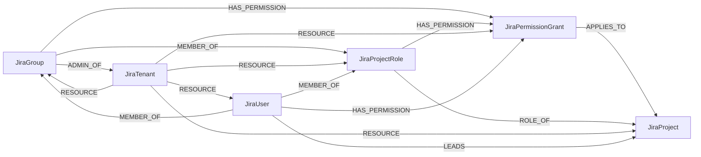

<!-- Generated from the data model. Do not edit manually. -->

## Jira Schema

### JiraGroup

A Jira group and its API-reported administrative access levels.

ADMIN_OF reflects the experimental group accessType filters, not arbitrary
global permission grants, organization admins, or effective per-user access.
Group names are never used to infer administrative privileges.

#### Properties

| Field | Index | Description |
|-------|-------|-------------|
| id | Yes | Cloud ID, group kind, and URL-escaped groupId. |
| firstseen |  | Timestamp when a sync job first created this node. |
| lastupdated | Yes | Timestamp of the last sync that observed this node. |
| admin_access_types |  | Experimental group/bulk accessType filters matching this group: admin or site-admin; not exhaustive effective privileges. |
| group_id |  | group/bulk groupId, independent of group name. |
| name |  | group/bulk name. |
| tenant_id |  | Jira Cloud ID. |

#### Relationships

- `(:JiraGroup)-[:ADMIN_OF]->(:JiraTenant)`: An admin or site-admin group reported by Jira group accessType.

- `(:JiraGroup)-[:HAS_PERMISSION]->(:JiraPermissionGrant)`: The principal is the configured holder of this permission grant.

- `(:JiraGroup)-[:MEMBER_OF]->(:JiraProjectRole)`: A group is an actor in this project role.

- `(:JiraUser)-[:MEMBER_OF]->(:JiraGroup)`: A user belongs to this group, including inactive memberships.

- `(:JiraTenant)-[:RESOURCE]->(:JiraGroup)`: The Jira Cloud tenant contains this resource.

### JiraPermissionGrant

A permission-scheme grant applied to a project.

Conditional holders such as reporter, assignee, application roles, custom
fields, and anyone remain configuration facts without inferred holder edges.
Grants referencing deleted-user tombstones are retained without user links.
Licensing, account suspension, issue security, and service-project portal
rules can further restrict access.

#### Properties

| Field | Index | Description |
|-------|-------|-------------|
| id | Yes | Cloud ID, grant kind, and URL-escaped project, scheme, and grant IDs. |
| firstseen |  | Timestamp when a sync job first created this node. |
| lastupdated | Yes | Timestamp of the last sync that observed this node. |
| grant_id |  | permissionscheme/{id} permissions[].id within the scheme. |
| holder_parameter |  | Original permissions[].holder.parameter, such as group name or role ID. |
| holder_type |  | permissions[].holder.type, including conditional or app-specific holders. |
| holder_value |  | Original permissions[].holder.value, such as group ID. |
| permission | Yes | permissions[].permission, such as BROWSE_PROJECTS or ADMINISTER_PROJECTS. |
| scheme_id |  | Assigned permissionscheme id. |
| tenant_id |  | Jira Cloud ID. |

#### Relationships

- `(:JiraPermissionGrant)-[:APPLIES_TO]->(:JiraProject)`: This configured permission grant applies to the project.

- `(:JiraGroup)-[:HAS_PERMISSION]->(:JiraPermissionGrant)`: The principal is the configured holder of this permission grant.

- `(:JiraProjectRole)-[:HAS_PERMISSION]->(:JiraPermissionGrant)`: The principal is the configured holder of this permission grant.

- `(:JiraUser)-[:HAS_PERMISSION]->(:JiraPermissionGrant)`: The principal is the configured holder of this permission grant.

- `(:JiraTenant)-[:RESOURCE]->(:JiraPermissionGrant)`: The Jira Cloud tenant contains this resource.

### JiraProject

A live Jira project; archived and deleted projects are excluded.

Team-managed projects include role actors, but their permission schemes and
project access-level policy are not exported. Permission grants describe
configuration, not effective issue access.

#### Properties

| Field | Index | Description |
|-------|-------|-------------|
| id | Yes | Cloud ID, project kind, and URL-escaped project id. |
| firstseen |  | Timestamp when a sync job first created this node. |
| lastupdated | Yes | Timestamp of the last sync that observed this node. |
| key |  | project/search key; mutable. |
| name |  | project/search name. |
| permission_scheme_id |  | project/{id}/permissionscheme id for company-managed projects. |
| permission_scheme_supported |  | Derived from style; false for next-gen projects, whose scheme grants are not exported. |
| project_id |  | project/search id. |
| project_type |  | project/search projectTypeKey. |
| style |  | project/search style: classic or next-gen (team-managed). |
| tenant_id |  | Jira Cloud ID. |

#### Relationships

- `(:JiraPermissionGrant)-[:APPLIES_TO]->(:JiraProject)`: This configured permission grant applies to the project.

- `(:JiraUser)-[:LEADS]->(:JiraProject)`: The user is the project lead; this alone does not grant permissions.

- `(:JiraTenant)-[:RESOURCE]->(:JiraProject)`: The Jira Cloud tenant contains this resource.

- `(:JiraProjectRole)-[:ROLE_OF]->(:JiraProject)`: The role assignment belongs to this project.

### JiraProjectRole

A project-scoped role with its user and group actors. Membership alone does not grant access.

#### Properties

| Field | Index | Description |
|-------|-------|-------------|
| id | Yes | Cloud ID, role kind, and URL-escaped project and role IDs. |
| firstseen |  | Timestamp when a sync job first created this node. |
| lastupdated | Yes | Timestamp of the last sync that observed this node. |
| admin |  | Project role admin flag; does not infer effective permissions. |
| description |  | Project role description. |
| name |  | Project role name. |
| role_id |  | project/{id}/role/{roleId} id; assignments are scoped to the project. |
| tenant_id |  | Jira Cloud ID. |

#### Relationships

- `(:JiraProjectRole)-[:HAS_PERMISSION]->(:JiraPermissionGrant)`: The principal is the configured holder of this permission grant.

- `(:JiraGroup)-[:MEMBER_OF]->(:JiraProjectRole)`: A group is an actor in this project role.

- `(:JiraUser)-[:MEMBER_OF]->(:JiraProjectRole)`: A user is a direct actor in this project role.

- `(:JiraTenant)-[:RESOURCE]->(:JiraProjectRole)`: The Jira Cloud tenant contains this resource.

- `(:JiraProjectRole)-[:ROLE_OF]->(:JiraProject)`: The role assignment belongs to this project.

### JiraTenant

A Jira Cloud site with the Tenant ontology label.

> **Ontology Mapping**: This node uses the ontology label [`Tenant`](#ontology-tenant).

#### Properties

Ontology-generated fields are shown in *italics*.

| Field | Index | Description |
|-------|-------|-------------|
| id | Yes | Stable Cloud UUID supplied by --jira-cloud-id. |
| firstseen |  | Timestamp when a sync job first created this node. |
| lastupdated | Yes | Timestamp of the last sync that observed this node. |
| domain |  | Hostname parsed from serverInfo.baseUrl. |
| name |  | serverInfo.serverTitle. |
| url |  | serverInfo.baseUrl. |
| *_ont_domain* | Yes | Normalized field sourced from `domain`. |
| *_ont_name* | Yes | Normalized field sourced from `name`. |
| *_ont_source* |  | Module that populated this node's ontology fields. |

#### Relationships

- `(:JiraGroup)-[:ADMIN_OF]->(:JiraTenant)`: An admin or site-admin group reported by Jira group accessType.

- `(:JiraTenant)-[:RESOURCE]->(:JiraGroup)`: The Jira Cloud tenant contains this resource.

- `(:JiraTenant)-[:RESOURCE]->(:JiraPermissionGrant)`: The Jira Cloud tenant contains this resource.

- `(:JiraTenant)-[:RESOURCE]->(:JiraProject)`: The Jira Cloud tenant contains this resource.

- `(:JiraTenant)-[:RESOURCE]->(:JiraProjectRole)`: The Jira Cloud tenant contains this resource.

- `(:JiraTenant)-[:RESOURCE]->(:JiraUser)`: The Jira Cloud tenant contains this resource.

### JiraUser

A Jira account. Only account_type=atlassian carries the UserAccount ontology label.

Visible emails can link these accounts to canonical User nodes. The complete
user listing supplies profile fields; nested profiles supply fields only for
otherwise unlisted accounts. Inactive deleted-user tombstones with accountId
unknown are omitted, and references to them remain unlinked.

> **Conditional Labels**:
>
> - [`UserAccount`](#ontology-useraccount) (ontology label) when `account_type` equals `atlassian`. An identity on a specific system or service.

#### Properties

Ontology-generated fields are shown in *italics*.

| Field | Index | Description |
|-------|-------|-------------|
| id | Yes | Cloud ID, user kind, and URL-escaped accountId. |
| firstseen |  | Timestamp when a sync job first created this node. |
| lastupdated | Yes | Timestamp of the last sync that observed this node. |
| account_id |  | Atlassian accountId from a user profile or actor/holder reference. |
| account_type |  | User profile accountType: atlassian, app, customer, or unknown; absent for reference-only accounts. |
| active | Yes | User profile active flag; absent for reference-only accounts. |
| display_name |  | User profile displayName, subject to profile visibility. |
| email |  | User profile emailAddress if visible; absent addresses are not inferred. |
| tenant_id |  | Jira Cloud ID. |
| *_ont_active* | Yes | Normalized field sourced from `active`. |
| *_ont_email* | Yes | Normalized field sourced from `email`. |
| *_ont_fullname* | Yes | Normalized field sourced from `display_name`. |
| *_ont_source* |  | Module that populated this node's ontology fields. |

#### Relationships

- `(:User)-[:HAS_ACCOUNT]->(:JiraUser)`

- `(:JiraUser)-[:HAS_PERMISSION]->(:JiraPermissionGrant)`: The principal is the configured holder of this permission grant.

- `(:JiraUser)-[:LEADS]->(:JiraProject)`: The user is the project lead; this alone does not grant permissions.

- `(:JiraUser)-[:MEMBER_OF]->(:JiraGroup)`: A user belongs to this group, including inactive memberships.

- `(:JiraUser)-[:MEMBER_OF]->(:JiraProjectRole)`: A user is a direct actor in this project role.

- `(:JiraTenant)-[:RESOURCE]->(:JiraUser)`: The Jira Cloud tenant contains this resource.
