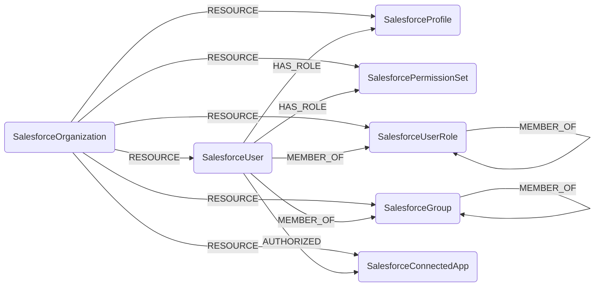

## Salesforce Schema



### SalesforceOrganization

Represents a Salesforce org (the `Organization` object). This is the tenant-like root
that every other node hangs off of.

> **Ontology Mapping**: This node has the extra label `Tenant` to enable cross-platform
> queries for organizational tenants across different systems (e.g. OktaOrganization,
> AWSAccount).

| Field | Description |
|-------|-------------|
| firstseen | Timestamp of when a sync job first created this node |
| lastupdated | Timestamp of the last time the node was updated |
| **id** | The org's 18-character Salesforce ID |
| name | The org name |
| organization_type | Edition, e.g. `Enterprise Edition` |
| instance_name | The Salesforce instance the org lives on |
| is_sandbox | Whether the org is a sandbox |
| primary_contact | Primary contact name |
| country | Org country |
| language_locale_key | Default language locale |
| namespace_prefix | Managed-package namespace prefix, if any |
| trial_expiration_date | Trial expiration date, if a trial org |
| created_date | When the org was created |

#### Relationships

- A `SalesforceOrganization` contains users, profiles, permission sets, roles, groups, and connected apps.
    ```
    (:SalesforceOrganization)-[:RESOURCE]->(:SalesforceUser)
    (:SalesforceOrganization)-[:RESOURCE]->(:SalesforceProfile)
    (:SalesforceOrganization)-[:RESOURCE]->(:SalesforcePermissionSet)
    (:SalesforceOrganization)-[:RESOURCE]->(:SalesforceUserRole)
    (:SalesforceOrganization)-[:RESOURCE]->(:SalesforceGroup)
    (:SalesforceOrganization)-[:RESOURCE]->(:SalesforceConnectedApp)
    ```

### SalesforceUser

Represents a Salesforce `User`.

> **Ontology Mapping**: This node has the extra label `UserAccount` so it can be linked
> to the canonical `User` (Human) ontology node across identity providers.

| Field | Description |
|-------|-------------|
| firstseen | Timestamp of when a sync job first created this node |
| lastupdated | Timestamp of the last time the node was updated |
| **id** | The user's 18-character Salesforce ID |
| username | The login username (indexed) |
| name | Full display name |
| first_name | First name |
| last_name | Last name |
| email | Email address (indexed) |
| alias | Salesforce alias |
| is_active | Whether the user is active |
| user_type | User type, e.g. `Standard` |
| profile_id | ID of the user's profile |
| user_role_id | ID of the user's role |
| manager_id | ID of the user's manager |
| department | Department |
| title | Job title |
| federation_identifier | SSO federation identifier |
| created_date | When the user was created |
| last_login_date | Last login timestamp |
| last_password_change_date | Last password change timestamp |

#### Relationships

- A user belongs to an org.
    ```
    (:SalesforceUser)<-[:RESOURCE]-(:SalesforceOrganization)
    ```
- A user is granted a profile and any assigned permission sets (canonical `HAS_ROLE` ontology edge).
    ```
    (:SalesforceUser)-[:HAS_ROLE]->(:SalesforceProfile)
    (:SalesforceUser)-[:HAS_ROLE]->(:SalesforcePermissionSet)
    ```
- A user is a member of a role and of public groups.
    ```
    (:SalesforceUser)-[:MEMBER_OF]->(:SalesforceUserRole)
    (:SalesforceUser)-[:MEMBER_OF]->(:SalesforceGroup)
    ```
- A user has authorized a connected app (derived from the `OAuthToken` object).
    ```
    (:SalesforceUser)-[:AUTHORIZED]->(:SalesforceConnectedApp)
    ```

### SalesforceProfile

Represents a `Profile`: the baseline permission bundle assigned to each user.

> **Ontology Mapping**: This node has the extra label `PermissionRole` to enable
> cross-platform queries over permission grants.

| Field | Description |
|-------|-------------|
| firstseen | Timestamp of when a sync job first created this node |
| lastupdated | Timestamp of the last time the node was updated |
| **id** | The profile's 18-character Salesforce ID |
| name | Profile name (indexed) |
| user_type | User type the profile applies to |
| description | Profile description |
| permissions_modify_all_data | Whether the profile grants Modify All Data |
| permissions_view_all_data | Whether the profile grants View All Data |
| permissions_api_enabled | Whether the profile grants API access |
| permissions_manage_users | Whether the profile grants Manage Users |
| created_date | When the profile was created |

#### Relationships

- A profile belongs to an org and is granted to users.
    ```
    (:SalesforceProfile)<-[:RESOURCE]-(:SalesforceOrganization)
    (:SalesforceProfile)<-[:HAS_ROLE]-(:SalesforceUser)
    ```

### SalesforcePermissionSet

Represents a `PermissionSet` (excluding profile-owned permission sets, which are
already represented by `SalesforceProfile`).

> **Ontology Mapping**: This node has the extra label `PermissionRole` to enable
> cross-platform queries over permission grants.

| Field | Description |
|-------|-------------|
| firstseen | Timestamp of when a sync job first created this node |
| lastupdated | Timestamp of the last time the node was updated |
| **id** | The permission set's 18-character Salesforce ID |
| name | API name (indexed) |
| label | Display label |
| description | Description |
| type | Permission set type |
| is_owned_by_profile | Whether it is owned by a profile |
| profile_id | Owning profile ID, if any |
| permissions_modify_all_data | Whether it grants Modify All Data |
| permissions_view_all_data | Whether it grants View All Data |
| permissions_api_enabled | Whether it grants API access |
| namespace_prefix | Managed-package namespace prefix, if any |
| created_date | When the permission set was created |

#### Relationships

- A permission set belongs to an org and is assigned to users (via `PermissionSetAssignment`).
    ```
    (:SalesforcePermissionSet)<-[:RESOURCE]-(:SalesforceOrganization)
    (:SalesforcePermissionSet)<-[:HAS_ROLE]-(:SalesforceUser)
    ```

### SalesforceUserRole

Represents a `UserRole`: a node in the Salesforce role hierarchy used for record sharing.

| Field | Description |
|-------|-------------|
| firstseen | Timestamp of when a sync job first created this node |
| lastupdated | Timestamp of the last time the node was updated |
| **id** | The role's 18-character Salesforce ID |
| name | Role name (indexed) |
| developer_name | API developer name |
| parent_role_id | ID of the parent role in the hierarchy |
| rollup_description | Rollup description |
| portal_type | Portal type |

#### Relationships

- A role belongs to an org, has member users, and reports up to a parent role.
    ```
    (:SalesforceUserRole)<-[:RESOURCE]-(:SalesforceOrganization)
    (:SalesforceUserRole)<-[:MEMBER_OF]-(:SalesforceUser)
    (:SalesforceUserRole)-[:MEMBER_OF]->(:SalesforceUserRole)
    ```

### SalesforceGroup

Represents a `Group` (public group, queue, or role group).

> **Ontology Mapping**: This node has the extra label `UserGroup` to enable
> cross-platform queries over groups.

| Field | Description |
|-------|-------------|
| firstseen | Timestamp of when a sync job first created this node |
| lastupdated | Timestamp of the last time the node was updated |
| **id** | The group's 18-character Salesforce ID |
| name | Group name |
| developer_name | API developer name (indexed) |
| type | Group type, e.g. `Regular`, `Queue`, `Role` |
| related_id | Related record ID (e.g. the role for role-based groups) |

#### Relationships

- A group belongs to an org and has member users and nested member groups (via `GroupMember`).
    ```
    (:SalesforceGroup)<-[:RESOURCE]-(:SalesforceOrganization)
    (:SalesforceGroup)<-[:MEMBER_OF]-(:SalesforceUser)
    (:SalesforceGroup)<-[:MEMBER_OF]-(:SalesforceGroup)
    ```

### SalesforceConnectedApp

Represents a `ConnectedApplication`: a third-party app integrated with the org.

> **Ontology Mapping**: This node has the extra label `ThirdPartyApp` to enable
> cross-platform queries over connected third-party applications.

| Field | Description |
|-------|-------------|
| firstseen | Timestamp of when a sync job first created this node |
| lastupdated | Timestamp of the last time the node was updated |
| **id** | The connected app's 18-character Salesforce ID |
| name | App name (indexed) |
| admin_approved_users_only | Whether only admin-approved users may use the app |
| created_date | When the app was created |
| last_modified_date | When the app was last modified |

#### Relationships

- A connected app belongs to an org and is authorized by users.
    ```
    (:SalesforceConnectedApp)<-[:RESOURCE]-(:SalesforceOrganization)
    (:SalesforceConnectedApp)<-[:AUTHORIZED]-(:SalesforceUser)
    ```

```{note}
The `AUTHORIZED` edge is derived from the `OAuthToken` object by matching its `AppName`
to the connected app's `Name`, since Salesforce does not expose a direct foreign key
between the two objects.
```
