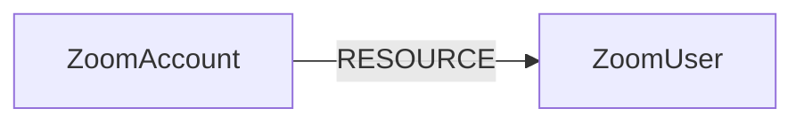

<!-- Generated from the data model. Do not edit manually. -->

## Zoom Schema

### ZoomAccount

A Zoom account containing users and pending invitations.

Ontology Mapping: The Tenant label enables cross-provider tenant queries.

> **Ontology Mapping**: This node uses the ontology label [`Tenant`](#ontology-tenant).

#### Properties

Ontology-generated fields are shown in *italics*.

| Field | Index | Description |
|-------|-------|-------------|
| id | Yes | Zoom account ID used for server-to-server OAuth. |
| firstseen |  | Timestamp when a sync job first created this node. |
| lastupdated | Yes | Timestamp of the last sync that observed this node. |
| *_ont_name* | Yes | Normalized field sourced from `id`. |
| *_ont_source* |  | Module that populated this node's ontology fields. |

#### Relationships

- `(:ZoomAccount)-[:RESOURCE]->(:ZoomUser)`: Contains a user or pending invitation in its Zoom account.

### ZoomUser

A Zoom user account or an invitation awaiting activation.

Ontology Mapping: The UserAccount label enables cross-platform user queries.
Pending invitations are inactive and are replaced by provider-ID nodes on activation.

> **Ontology Mapping**: This node uses the ontology label [`UserAccount`](#ontology-useraccount).

#### Properties

Ontology-generated fields are shown in *italics*.

| Field | Index | Description |
|-------|-------|-------------|
| id | Yes | Account-scoped Zoom ID, or account-scoped normalized email for pending invitations. |
| firstseen |  | Timestamp when a sync job first created this node. |
| lastupdated | Yes | Timestamp of the last sync that observed this node. |
| account_id |  | Zoom account containing this user or invitation. |
| created_at |  | Provider user_created_at as a native datetime, when available. |
| department |  | User's department. |
| display_name |  | User's display name. |
| email | Yes | Trimmed lowercase email used for identity correlation. |
| first_name |  | User's first name. |
| group_ids |  | IDs of groups where the user is a member. |
| last_login_time | Yes | Provider last_login_time as a native datetime with Zoom's three-day reporting buffer; not precise activity telemetry. |
| last_name |  | User's last name. |
| login_types |  | Provider login method codes; 101 denotes SSO, 100 Zoom work email. |
| plan_type |  | Readable assigned plan type; not purchased seats, billing, or complete product entitlements. |
| role_id |  | Assigned account role ID; role permissions are not ingested. |
| status |  | Account membership status: active, inactive, or pending. |
| type |  | Assigned plan type: 1 Basic, 2 Licensed, 4 Unassigned without Meetings Basic, 99 legacy None. |
| zoom_id |  | Provider user ID; absent for pending invitations. |
| *_ont_active* | Yes | Normalized field sourced from `status`. |
| *_ont_email* | Yes | Normalized field sourced from `email`. |
| *_ont_firstname* | Yes | Normalized field sourced from `first_name`. |
| *_ont_fullname* | Yes | Normalized field sourced from `display_name`. |
| *_ont_lastactivity* | Yes | Normalized field sourced from `last_login_time`. |
| *_ont_lastname* | Yes | Normalized field sourced from `last_name`. |
| *_ont_source* |  | Module that populated this node's ontology fields. |

#### Relationships

- `(:User)-[:HAS_ACCOUNT]->(:ZoomUser)`

- `(:ZoomAccount)-[:RESOURCE]->(:ZoomUser)`: Contains a user or pending invitation in its Zoom account.
