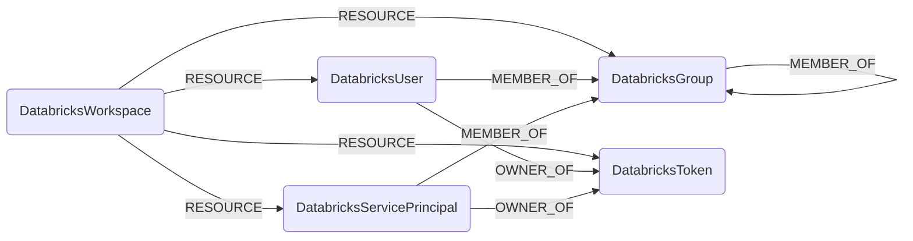

## Databricks Schema



### DatabricksWorkspace

A Databricks workspace, scoped by host URL.

> **Ontology Mapping**: This node has the extra label `Tenant` to enable cross-platform queries for organizational tenants across different systems.

| Field | Description |
|-------|-------------|
| **id** | Workspace host (e.g. `dbc-xxxx.cloud.databricks.com`) |
| **host** | Full workspace URL (indexed) |
| tokens_enabled | Whether PATs are enabled in the workspace |
| max_token_lifetime_days | Max PAT lifetime in days from the workspace token management settings, or null when the workspace is on the Databricks default policy (the API encodes that as the string `"0"`) |
| firstseen | Timestamp of when a sync job first created this node |
| lastupdated | Timestamp of the last time the node was updated |

#### Relationships

- `DatabricksUser`, `DatabricksServicePrincipal`, `DatabricksGroup`, `DatabricksToken` belong to a `DatabricksWorkspace`.
    ```
    (:DatabricksWorkspace)-[:RESOURCE]->(
        :DatabricksUser,
        :DatabricksServicePrincipal,
        :DatabricksGroup,
        :DatabricksToken
    )
    ```

### DatabricksUser

A workspace SCIM user.

> **Ontology Mapping**: This node has the extra label `UserAccount` to enable cross-platform queries for user accounts across different systems.

| Field | Description |
|-------|-------------|
| **id** | Workspace-scoped composite id `{workspace_id}/{scim_id}` (SCIM ids are not unique across workspaces) |
| **scim_id** | Raw SCIM user ID returned by Databricks (indexed) |
| **user_name** | SCIM `userName` (typically the email, indexed) |
| **email** | Primary email address (indexed) |
| display_name | SCIM display name |
| external_id | External SCIM ID (federation) |
| active | Whether the user is active |
| firstseen | Timestamp of when a sync job first created this node |
| lastupdated | Timestamp of the last time the node was updated |

#### Relationships

- A `DatabricksUser` belongs to a `DatabricksWorkspace`.
    ```
    (:DatabricksWorkspace)-[:RESOURCE]->(:DatabricksUser)
    ```
- A `DatabricksUser` is a member of one or more `DatabricksGroup`.
    ```
    (:DatabricksUser)-[:MEMBER_OF]->(:DatabricksGroup)
    ```

### DatabricksServicePrincipal

A workspace SCIM service principal.

> **Ontology Mapping**: This node has the extra label `ServiceAccount` to enable cross-platform queries for non-human accounts across different systems.

| Field | Description |
|-------|-------------|
| **id** | Workspace-scoped composite id `{workspace_id}/{scim_id}` (SCIM ids are not unique across workspaces) |
| **scim_id** | Raw SCIM service principal ID (indexed) |
| **application_id** | OAuth application ID (indexed) |
| display_name | SCIM display name |
| external_id | External SCIM ID (federation) |
| active | Whether the service principal is active |
| firstseen | Timestamp of when a sync job first created this node |
| lastupdated | Timestamp of the last time the node was updated |

#### Relationships

- A `DatabricksServicePrincipal` belongs to a `DatabricksWorkspace`.
    ```
    (:DatabricksWorkspace)-[:RESOURCE]->(:DatabricksServicePrincipal)
    ```
- A `DatabricksServicePrincipal` is a member of one or more `DatabricksGroup`.
    ```
    (:DatabricksServicePrincipal)-[:MEMBER_OF]->(:DatabricksGroup)
    ```

### DatabricksGroup

A workspace SCIM group.

> **Ontology Mapping**: This node has the extra label `UserGroup` to enable cross-platform group queries.

| Field | Description |
|-------|-------------|
| **id** | Workspace-scoped composite id `{workspace_id}/{scim_id}` (SCIM ids are not unique across workspaces) |
| **scim_id** | Raw SCIM group ID (indexed) |
| **display_name** | Group display name (indexed) |
| external_id | External SCIM ID (federation) |
| firstseen | Timestamp of when a sync job first created this node |
| lastupdated | Timestamp of the last time the node was updated |

#### Relationships

- A `DatabricksGroup` belongs to a `DatabricksWorkspace`.
    ```
    (:DatabricksWorkspace)-[:RESOURCE]->(:DatabricksGroup)
    ```
- A `DatabricksGroup` can be a member of another `DatabricksGroup` (nested groups).
    ```
    (:DatabricksGroup)-[:MEMBER_OF]->(:DatabricksGroup)
    ```

### DatabricksToken

A Databricks personal access token (PAT) returned by the token management API.

| Field | Description |
|-------|-------------|
| **id** | Workspace-scoped composite id `{workspace_id}/{token_id}` (token-management ids are workspace-local) |
| **token_id** | Raw token id returned by the token-management API (indexed) |
| comment | Token description provided at creation |
| creation_time | Native datetime when the token was created (UTC) |
| expiry_time | Native datetime when the token expires (UTC); null when the token has no expiry |
| owner_id | Workspace-scoped composite id of the token owner (matches `DatabricksUser.id` or `DatabricksServicePrincipal.id`) |
| created_by_id | Workspace-scoped composite id of the principal that created the token |
| created_by_username | Username/email of the principal that created the token (indexed) |
| firstseen | Timestamp of when a sync job first created this node |
| lastupdated | Timestamp of the last time the node was updated |

#### Relationships

- A `DatabricksToken` belongs to a `DatabricksWorkspace`.
    ```
    (:DatabricksWorkspace)-[:RESOURCE]->(:DatabricksToken)
    ```
- A `DatabricksUser` or `DatabricksServicePrincipal` owns a `DatabricksToken`.
    ```
    (:DatabricksUser)-[:OWNER_OF]->(:DatabricksToken)
    (:DatabricksServicePrincipal)-[:OWNER_OF]->(:DatabricksToken)
    ```
