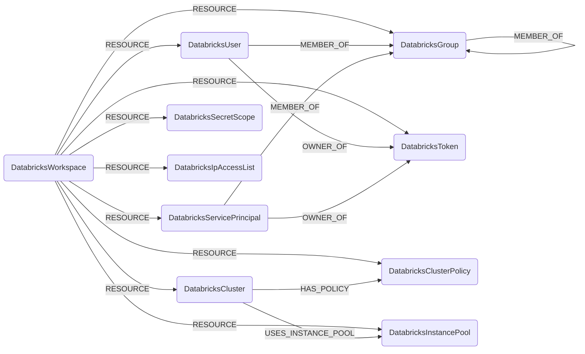

## Databricks Schema



### DatabricksWorkspace

A Databricks workspace, scoped by host URL.

> **Ontology Mapping**: This node has the extra label `Tenant` to enable cross-platform queries for organizational tenants across different systems.

| Field | Description |
|-------|-------------|
| **id** | Workspace host (e.g. `dbc-xxxx.cloud.databricks.com`) |
| **host** | Full workspace URL (indexed) |
| tokens_enabled | Whether PATs are enabled in the workspace |
| max_token_lifetime_days | Max PAT lifetime in days from the workspace token management settings, or null when the workspace is on the Databricks default policy (the API encodes that as the string `"0"`) |
| firstseen | Timestamp of when a sync job first created this node |
| lastupdated | Timestamp of the last time the node was updated |

#### Relationships

- `DatabricksUser`, `DatabricksServicePrincipal`, `DatabricksGroup`, `DatabricksToken`, `DatabricksClusterPolicy`, `DatabricksInstancePool`, `DatabricksCluster`, `DatabricksSecretScope`, `DatabricksIpAccessList` belong to a `DatabricksWorkspace`.
    ```
    (:DatabricksWorkspace)-[:RESOURCE]->(
        :DatabricksUser,
        :DatabricksServicePrincipal,
        :DatabricksGroup,
        :DatabricksToken,
        :DatabricksClusterPolicy,
        :DatabricksInstancePool,
        :DatabricksCluster,
        :DatabricksSecretScope,
        :DatabricksIpAccessList
    )
    ```

### DatabricksUser

A workspace SCIM user.

> **Ontology Mapping**: This node has the extra label `UserAccount` to enable cross-platform queries for user accounts across different systems.

| Field | Description |
|-------|-------------|
| **id** | Workspace-scoped composite id `{workspace_id}/{scim_id}` (SCIM ids are not unique across workspaces) |
| **scim_id** | Raw SCIM user ID returned by Databricks (indexed) |
| **user_name** | SCIM `userName` (typically the email, indexed) |
| **email** | Primary email address (indexed) |
| display_name | SCIM display name |
| external_id | External SCIM ID (federation) |
| active | Whether the user is active |
| firstseen | Timestamp of when a sync job first created this node |
| lastupdated | Timestamp of the last time the node was updated |

#### Relationships

- A `DatabricksUser` belongs to a `DatabricksWorkspace`.
    ```
    (:DatabricksWorkspace)-[:RESOURCE]->(:DatabricksUser)
    ```
- A `DatabricksUser` is a member of one or more `DatabricksGroup`.
    ```
    (:DatabricksUser)-[:MEMBER_OF]->(:DatabricksGroup)
    ```

### DatabricksServicePrincipal

A workspace SCIM service principal.

> **Ontology Mapping**: This node has the extra label `ServiceAccount` to enable cross-platform queries for non-human accounts across different systems.

| Field | Description |
|-------|-------------|
| **id** | Workspace-scoped composite id `{workspace_id}/{scim_id}` (SCIM ids are not unique across workspaces) |
| **scim_id** | Raw SCIM service principal ID (indexed) |
| **application_id** | OAuth application ID (indexed) |
| display_name | SCIM display name |
| external_id | External SCIM ID (federation) |
| active | Whether the service principal is active |
| firstseen | Timestamp of when a sync job first created this node |
| lastupdated | Timestamp of the last time the node was updated |

#### Relationships

- A `DatabricksServicePrincipal` belongs to a `DatabricksWorkspace`.
    ```
    (:DatabricksWorkspace)-[:RESOURCE]->(:DatabricksServicePrincipal)
    ```
- A `DatabricksServicePrincipal` is a member of one or more `DatabricksGroup`.
    ```
    (:DatabricksServicePrincipal)-[:MEMBER_OF]->(:DatabricksGroup)
    ```

### DatabricksGroup

A workspace SCIM group.

> **Ontology Mapping**: This node has the extra label `UserGroup` to enable cross-platform group queries.

| Field | Description |
|-------|-------------|
| **id** | Workspace-scoped composite id `{workspace_id}/{scim_id}` (SCIM ids are not unique across workspaces) |
| **scim_id** | Raw SCIM group ID (indexed) |
| **display_name** | Group display name (indexed) |
| external_id | External SCIM ID (federation) |
| firstseen | Timestamp of when a sync job first created this node |
| lastupdated | Timestamp of the last time the node was updated |

#### Relationships

- A `DatabricksGroup` belongs to a `DatabricksWorkspace`.
    ```
    (:DatabricksWorkspace)-[:RESOURCE]->(:DatabricksGroup)
    ```
- A `DatabricksGroup` can be a member of another `DatabricksGroup` (nested groups).
    ```
    (:DatabricksGroup)-[:MEMBER_OF]->(:DatabricksGroup)
    ```

### DatabricksToken

A Databricks personal access token (PAT) returned by the token management API.

| Field | Description |
|-------|-------------|
| **id** | Workspace-scoped composite id `{workspace_id}/{token_id}` (token-management ids are workspace-local) |
| **token_id** | Raw token id returned by the token-management API (indexed) |
| comment | Token description provided at creation |
| creation_time | Native datetime when the token was created (UTC) |
| expiry_time | Native datetime when the token expires (UTC); null when the token has no expiry |
| owner_id | Workspace-scoped composite id of the token owner (matches `DatabricksUser.id` or `DatabricksServicePrincipal.id`) |
| created_by_id | Workspace-scoped composite id of the principal that created the token |
| created_by_username | Username/email of the principal that created the token (indexed) |
| firstseen | Timestamp of when a sync job first created this node |
| lastupdated | Timestamp of the last time the node was updated |

#### Relationships

- A `DatabricksToken` belongs to a `DatabricksWorkspace`.
    ```
    (:DatabricksWorkspace)-[:RESOURCE]->(:DatabricksToken)
    ```
- A `DatabricksUser` or `DatabricksServicePrincipal` owns a `DatabricksToken`.
    ```
    (:DatabricksUser)-[:OWNER_OF]->(:DatabricksToken)
    (:DatabricksServicePrincipal)-[:OWNER_OF]->(:DatabricksToken)
    ```

### DatabricksClusterPolicy

A cluster policy returned by the policies API. Cluster policies define a set of
allowed configurations a `DatabricksCluster` can be launched with.

| Field | Description |
|-------|-------------|
| **id** | Workspace-scoped composite id `{workspace_id}/{policy_id}` |
| **policy_id** | Raw policy id (indexed) |
| **name** | Policy display name (indexed) |
| description | Free-text description |
| definition | JSON-encoded policy definition (allowed fields, fixed values, …) |
| policy_family_id | Policy family id when the policy is derived from a Databricks-provided family |
| creator_user_name | User name of the policy creator (indexed) |
| created_at | Native datetime when the policy was created (UTC) |
| firstseen | Timestamp of when a sync job first created this node |
| lastupdated | Timestamp of the last time the node was updated |

#### Relationships

- A `DatabricksClusterPolicy` belongs to a `DatabricksWorkspace`.
    ```
    (:DatabricksWorkspace)-[:RESOURCE]->(:DatabricksClusterPolicy)
    ```
- A `DatabricksCluster` is launched against a `DatabricksClusterPolicy`.
    ```
    (:DatabricksCluster)-[:HAS_POLICY]->(:DatabricksClusterPolicy)
    ```

### DatabricksInstancePool

A pre-warmed instance pool that clusters can pull nodes from to reduce startup
latency.

| Field | Description |
|-------|-------------|
| **id** | Workspace-scoped composite id `{workspace_id}/{instance_pool_id}` |
| **instance_pool_id** | Raw pool id (indexed) |
| **instance_pool_name** | Pool display name (indexed) |
| node_type_id | Underlying VM instance type id |
| min_idle_instances | Minimum number of idle instances kept warm |
| max_capacity | Maximum number of instances the pool can scale to |
| idle_instance_autotermination_minutes | Idle instance reclaim window |
| enable_elastic_disk | Whether elastic disk autoscaling is enabled |
| state | Pool state (`ACTIVE`, `STOPPED`, `DELETED`) |
| firstseen | Timestamp of when a sync job first created this node |
| lastupdated | Timestamp of the last time the node was updated |

#### Relationships

- A `DatabricksInstancePool` belongs to a `DatabricksWorkspace`.
    ```
    (:DatabricksWorkspace)-[:RESOURCE]->(:DatabricksInstancePool)
    ```
- A `DatabricksCluster` allocates nodes from a `DatabricksInstancePool`.
    ```
    (:DatabricksCluster)-[:USES_INSTANCE_POOL]->(:DatabricksInstancePool)
    ```

### DatabricksCluster

A Databricks compute cluster returned by the clusters 2.1 API.

| Field | Description |
|-------|-------------|
| **id** | Workspace-scoped composite id `{workspace_id}/{cluster_id}` |
| **cluster_id** | Raw cluster id (indexed) |
| **cluster_name** | Cluster display name (indexed) |
| state | Cluster state (`PENDING`, `RUNNING`, `TERMINATED`, …) |
| spark_version | Spark / Databricks runtime version string |
| runtime_engine | Runtime engine (`STANDARD`, `PHOTON`) |
| node_type_id | Worker node VM type id |
| driver_node_type_id | Driver node VM type id |
| num_workers | Static worker count (null when autoscaling is enabled) |
| autotermination_minutes | Idle auto-termination window in minutes |
| cluster_source | What created the cluster (`UI`, `JOB`, `API`, `MODELS`, …) |
| data_security_mode | UC access mode (`NONE`, `SINGLE_USER`, `USER_ISOLATION`, `LEGACY_*`) |
| single_user_name | Owning user for single-user UC clusters (indexed) |
| creator_user_name | User name of the cluster creator (indexed) |
| instance_pool_id | Raw worker instance pool id, when the cluster targets one (indexed) |
| driver_instance_pool_id | Raw driver instance pool id, when the driver targets a distinct pool (indexed) |
| enable_local_disk_encryption | Whether local disks are encrypted |
| enable_elastic_disk | Whether elastic disk autoscaling is enabled |
| start_time | Native datetime when the cluster was first started (UTC) |
| terminated_time | Native datetime when the cluster was last terminated (UTC), if applicable |
| firstseen | Timestamp of when a sync job first created this node |
| lastupdated | Timestamp of the last time the node was updated |

#### Relationships

- A `DatabricksCluster` belongs to a `DatabricksWorkspace`.
    ```
    (:DatabricksWorkspace)-[:RESOURCE]->(:DatabricksCluster)
    ```
- A `DatabricksCluster` is governed by a `DatabricksClusterPolicy`.
    ```
    (:DatabricksCluster)-[:HAS_POLICY]->(:DatabricksClusterPolicy)
    ```
- A `DatabricksCluster` allocates nodes from one or more `DatabricksInstancePool` — the worker pool and, when set, a distinct driver pool both land here.
    ```
    (:DatabricksCluster)-[:USES_INSTANCE_POOL]->(:DatabricksInstancePool)
    ```

### DatabricksSecretScope

A Databricks secret scope. Scopes can be backed by Databricks's own store
(`DATABRICKS`) or by an Azure Key Vault (`AZURE_KEYVAULT`).

| Field | Description |
|-------|-------------|
| **id** | Workspace-scoped composite id `{workspace_id}/{name}` |
| **name** | Scope name (indexed) |
| backend_type | Backing store (`DATABRICKS`, `AZURE_KEYVAULT`) |
| keyvault_resource_id | Azure Key Vault resource id when backend is `AZURE_KEYVAULT` (indexed) |
| keyvault_dns_name | Azure Key Vault DNS name when backend is `AZURE_KEYVAULT` |
| firstseen | Timestamp of when a sync job first created this node |
| lastupdated | Timestamp of the last time the node was updated |

#### Relationships

- A `DatabricksSecretScope` belongs to a `DatabricksWorkspace`.
    ```
    (:DatabricksWorkspace)-[:RESOURCE]->(:DatabricksSecretScope)
    ```

### DatabricksIpAccessList

An IP access list applied at the workspace level. Restricts inbound access to
the workspace to ranges in the allow list, blocks ranges in the block list.

| Field | Description |
|-------|-------------|
| **id** | Workspace-scoped composite id `{workspace_id}/{list_id}` |
| **list_id** | Raw list id (indexed) |
| **label** | List label (indexed) |
| list_type | List type (`ALLOW` / `BLOCK`) |
| enabled | Whether the list is enforced |
| address_count | Number of addresses in the list |
| ip_addresses | Source CIDR / IP entries in the list |
| created_at | Native datetime when the list was created (UTC) |
| updated_at | Native datetime when the list was last updated (UTC) |
| firstseen | Timestamp of when a sync job first created this node |
| lastupdated | Timestamp of the last time the node was updated |

#### Relationships

- A `DatabricksIpAccessList` belongs to a `DatabricksWorkspace`.
    ```
    (:DatabricksWorkspace)-[:RESOURCE]->(:DatabricksIpAccessList)
    ```
