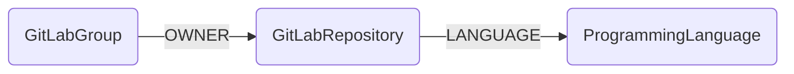

## GitLab Schema



### GitLabRepository

Representation of a GitLab repository (project). This node contains comprehensive metadata about the repository including URLs, statistics, feature flags, and access settings.

| Field | Description |
|-------|-------------|
| firstseen| Timestamp of when a sync job first created this node  |
| lastupdated |  Timestamp of the last time the node was updated |
| **id** | Unique identifier combining GitLab instance URL and project ID (e.g., `https://gitlab.com/projects/12345`). Ensures uniqueness across multiple GitLab instances |
| **numeric_id** | The numeric GitLab project ID used for API calls |
| **name** | Repository name (e.g., `awesome-project`) |
| **path** | URL path segment for the repository |
| **path_with_namespace** | Full path including namespace/group (e.g., `engineering/awesome-project`) |
| **web_url** | Web browser URL for the repository |
| **http_url_to_repo** | HTTP clone URL (e.g., `https://gitlab.com/group/repo.git`) |
| **ssh_url_to_repo** | SSH clone URL (e.g., `git@gitlab.com:group/repo.git`) |
| **readme_url** | URL to the repository's README file |
| **description** | Repository description text |
| **visibility** | Access level: `private`, `internal`, or `public` |
| **archived** | Boolean indicating if the repository is archived |
| **default_branch** | Name of the default branch (e.g., `main`, `master`) |
| **star_count** | Number of stars the repository has received |
| **forks_count** | Number of times the repository has been forked |
| **open_issues_count** | Number of currently open issues |
| **created_at** | GitLab timestamp when the repository was created |
| **last_activity_at** | GitLab timestamp of the last activity (commit, merge request, etc.) |
| **issues_enabled** | Boolean indicating if issues are enabled |
| **merge_requests_enabled** | Boolean indicating if merge requests are enabled |
| **wiki_enabled** | Boolean indicating if the wiki is enabled |
| **snippets_enabled** | Boolean indicating if snippets are enabled |
| **container_registry_enabled** | Boolean indicating if the container registry is enabled |
| **empty_repo** | Boolean indicating if the repository has no commits |

#### Relationships

- GitLabGroups own GitLabRepositories

    ```
    (GitLabGroup)-[OWNER]->(GitLabRepository)
    ```

- GitLabRepositories use ProgrammingLanguages

    ```
    (GitLabRepository)-[LANGUAGE]->(ProgrammingLanguage)
    ```

    The `LANGUAGE` relationship includes a `percentage` property indicating what percentage of the repository's code is in that language (e.g., `65.5` for 65.5% Python).

### GitLabGroup

Representation of a GitLab group (namespace). Groups are organizational containers that own repositories.

| Field | Description |
|-------|-------------|
| firstseen| Timestamp of when a sync job first created this node  |
| lastupdated |  Timestamp of the last time the node was updated |
| **id** | Unique identifier combining GitLab instance URL and group ID (e.g., `https://gitlab.com/groups/789`) |
| **numeric_id** | The numeric GitLab group ID used for API calls |
| **name** | Group name (e.g., `Engineering`) |
| **path** | URL path segment for the group (e.g., `engineering`) |
| **full_path** | Complete path including parent groups (e.g., `company/engineering`) |
| **web_url** | Web browser URL for the group |
| **visibility** | Access level: `private`, `internal`, or `public` |
| **description** | Group description text |

#### Relationships

- GitLabGroups own GitLabRepositories

    ```
    (GitLabGroup)-[OWNER]->(GitLabRepository)
    ```

### ProgrammingLanguage

Representation of a programming language used in repositories. This node is shared across GitHub and GitLab modules.

| Field | Description |
|-------|-------------|
| firstseen| Timestamp of when a sync job first created this node  |
| lastupdated |  Timestamp of the last time the node was updated |
| **id** | Language name (e.g., `Python`, `JavaScript`) |
| **name** | Language name |

#### Relationships

- GitLabRepositories (and GitHubRepositories) use ProgrammingLanguages

    ```
    (GitLabRepository)-[LANGUAGE{percentage: 65.5}]->(ProgrammingLanguage)
    ```

## Sample Cypher Queries

### Find all repositories in the security group

```cypher
MATCH (g:GitLabGroup {name: "security"})-[:OWNER]->(r:GitLabRepository)
RETURN r.name, r.visibility, r.web_url
ORDER BY r.last_activity_at DESC
```

### Find repositories primarily using Python

```cypher
MATCH (r:GitLabRepository)-[rel:LANGUAGE]->(l:ProgrammingLanguage {name: "Python"})
WHERE rel.percentage > 80
RETURN r.path_with_namespace, rel.percentage
ORDER BY rel.percentage DESC
```

### Find archived repositories that should be cleaned up

```cypher
MATCH (r:GitLabRepository)
WHERE r.archived = true
  AND r.last_activity_at < datetime() - duration({months: 6})
RETURN r.path_with_namespace, r.last_activity_at
ORDER BY r.last_activity_at ASC
```

### Count repositories by visibility level

```cypher
MATCH (r:GitLabRepository)
RETURN r.visibility, count(r) as count
ORDER BY count DESC
```

### Find groups with the most repositories

```cypher
MATCH (g:GitLabGroup)-[:OWNER]->(r:GitLabRepository)
RETURN g.name, g.full_path, count(r) as repo_count
ORDER BY repo_count DESC
LIMIT 10
```

### Find repositories with high star count

```cypher
MATCH (r:GitLabRepository)
WHERE r.star_count > 10
RETURN r.path_with_namespace, r.star_count, r.forks_count
ORDER BY r.star_count DESC
```

### Find repositories without a default branch

```cypher
MATCH (r:GitLabRepository)
WHERE r.default_branch IS NULL AND r.empty_repo = false
RETURN r.path_with_namespace, r.created_at
```

### Find the most popular programming languages

```cypher
MATCH ()-[rel:LANGUAGE]->(l:ProgrammingLanguage)
RETURN l.name, count(rel) as usage_count, round(avg(rel.percentage), 2) as avg_percentage
ORDER BY usage_count DESC
LIMIT 15
```

### Find repositories with container registry enabled

```cypher
MATCH (r:GitLabRepository)
WHERE r.container_registry_enabled = true
RETURN r.path_with_namespace, r.visibility
```

### Cross-module query: Find repos where Workday employees are owners

```cypher
// Note: This requires also syncing Workday data
MATCH (h:WorkdayHuman)
MATCH (r:GitLabRepository)
WHERE r.path_with_namespace CONTAINS toLower(split(h.email, "@")[0])
RETURN h.name, h.email, collect(r.path_with_namespace) as potential_repos
```
