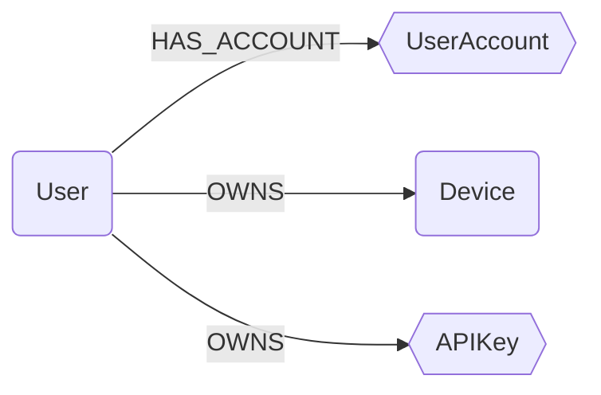

## Ontology Schema




:::{note}
In this schema, `squares` represent `Abstract Nodes` and `hexagons` represent `Semantic Labels` (on module nodes).
:::

### Ontology Properties on Nodes

Cartography's ontology system supports two distinct patterns for organizing and querying data across modules:

#### 1. Abstract Ontology Nodes

Abstract ontology nodes (e.g., `User`, `Device`) are **dedicated nodes created separately** from module-specific nodes. They serve as unified, cross-module representations of entities.

**How it works:**
- Cartography creates new ontology nodes (`:User`, `:Device`) based on mappings from multiple source modules
- These nodes aggregate and normalize data from module-specific nodes
- Relationships link ontology nodes to their source nodes (e.g., `(:User)-[:HAS_ACCOUNT]->(:EntraUser)`)

#### 2. Semantic Labels (Extra Labels)

Semantic labels (e.g., `UserAccount`, `APIKey`) are **extra labels added directly** to module-specific nodes. They enable unified querying without creating separate nodes.

**How it works:**
- Module nodes receive an additional label (e.g., `:EntraUser:UserAccount`, `:AnthropicApiKey:APIKey`)
- Ontology mappings add normalized `_ont_*` properties to these nodes
- The `_ont_source` property tracks which module provided the data
- No separate ontology nodes are created; the module node itself carries the semantic label

#### Ontology Properties (`_ont_*`)

When mappings are applied, nodes automatically receive `_ont_*` properties with normalized ontology field values:

- **Cross-module querying**: Use consistent field names across different modules
- **Data normalization**: Access standardized field values regardless of source format
- **Source tracking**: The `_ont_source` property indicates which module provided the data

### User

```{note}
User is an abstract ontology node.
```

A user is a person (or agent) who uses a computer or network service.
A user often has one or many user accounts.

```{important}
If field `active` is null, it should not be considered as `true` or `false`, only as unknown.
```{note}

| Field | Description |
|-------|-------------|
| id | The unique identifier for the user. |
| firstseen | Timestamp of when a sync job first created this node. |
| lastupdated | Timestamp of the last time the node was updated. |
| email | User's primary email. |
| username | Login of the user in the main IDP. |
| fullname | User's full name. |
| firstname | User's first name. |
| lastname | User's last name. |
| active | Boolean indicating if the user is active (e.g. disabled in the IDP). |

#### Relationships

- `User` has one or many `UserAccount` (semantic label):
    ```
    (:User)-[:HAS_ACCOUNT]->(:UserAccount)
    ```
- `User` can own one or many `Device`:
    ```
    (:User)-[:OWNS]->(:Device)
    ```
- `User` can own one or many `APIKey` (semantic label):
    ```
    (:User)-[:OWNS]->(:APIKey)
    ```

### UserAccount

```{note}
UserAccount is a semantic label.
```

A user account represents an identity on a specific system or service.
Unlike the abstract `User` node, `UserAccount` is a semantic label applied to concrete user nodes from different modules, enabling unified queries across platforms.

| Field | Description |
|-------|-------------|
| _ont_email | User's email address (often used as primary identifier). |
| _ont_username | User's login name or username. |
| _ont_fullname | User's full name. |
| _ont_firstname | User's first name. |
| _ont_lastname | User's last name. |
| _ont_has_mfa | Whether multi-factor authentication is enabled for this account. |
| _ont_inactive | Whether the account is inactive, disabled, suspended, or locked. |
| _ont_lastactivity | Timestamp of the last activity or login for this account. |
| _ont_source | Source of the data. |


### Device

```{note}
Device is an abstract ontology node.
```

A client computer is a host that accesses a service made available by a server or a third party provider.

| Field | Description |
|-------|-------------|
| id | The unique identifier for the user. |
| firstseen | Timestamp of when a sync job first created this node. |
| lastupdated | Timestamp of the last time the node was updated. |
| hostname | Hostname of the device. |
| os | OS running on the device. |
| os_version | Version of the OS running on the device. |
| model | Device model (e.g. ThinkPad Carbon X1 G11) |
| platform | CPU architecture |
| serial_number | Device serial number. |

#### Relationships

- `Device` is linked to one or many nodes that implements the notion into a module
    ```
    (:User)-[:HAS_REPRESENTATION]->(:*)
    ```
- `User` can own one or many `Device`
    ```
    (:User)-[:OWNS]->(:Device)
    ```

### APIKey

```{note}
APIKey is a semantic label.
```

An API key (or access key) is a credential used for programmatic access to services and APIs.
API keys are used across different cloud providers and SaaS platforms for authentication and authorization.

| Field | Description |
|-------|-------------|
| _ont_name | A human-readable name or description for the API key. |
| _ont_created_at | Timestamp when the API key was created. |
| _ont_updated_at | Timestamp when the API key was last updated. |
| _ont_expires_at | Timestamp when the API key expires (if applicable). |
| _ont_last_used_at | Timestamp when the API key was last used. |


#### Relationships

- `User` can own one or many `APIKey`
    ```
    (:User)-[:OWNS]->(:APIKey)
    ```
