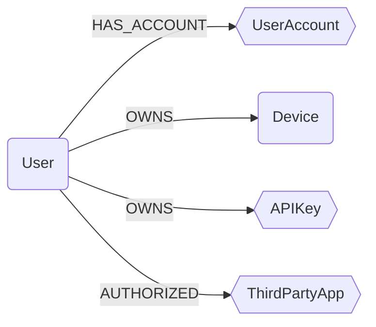

## Ontology Schema




:::{note}
In this schema, `squares` represent `Abstract Nodes` and `hexagons` represent `Semantic Labels` (on module nodes).
:::

### Ontology Properties on Nodes

Cartography's ontology system supports two distinct patterns for organizing and querying data across modules:

#### 1. Abstract Ontology Nodes

Abstract ontology nodes (e.g., `User`, `Device`) are **dedicated nodes created separately** from module-specific nodes. They serve as unified, cross-module representations of entities.

**How it works:**
- Cartography creates new ontology nodes (`:User`, `:Device`) based on mappings from multiple source modules
- These nodes aggregate and normalize data from module-specific nodes
- Relationships link ontology nodes to their source nodes (e.g., `(:User)-[:HAS_ACCOUNT]->(:EntraUser)`)

#### 2. Semantic Labels (Extra Labels)

Semantic labels (e.g., `UserAccount`, `APIKey`) are **extra labels added directly** to module-specific nodes. They enable unified querying without creating separate nodes.

**How it works:**
- Module nodes receive an additional label (e.g., `:EntraUser:UserAccount`, `:AnthropicApiKey:APIKey`)
- Ontology mappings add normalized `_ont_*` properties to these nodes
- The `_ont_source` property tracks which module provided the data
- No separate ontology nodes are created; the module node itself carries the semantic label

#### Ontology Properties (`_ont_*`)

When mappings are applied, nodes automatically receive `_ont_*` properties with normalized ontology field values:

- **Cross-module querying**: Use consistent field names across different modules
- **Data normalization**: Access standardized field values regardless of source format
- **Source tracking**: The `_ont_source` property indicates which module provided the data

### User

```{note}
User is an abstract ontology node.
```

A user is a person (or agent) who uses a computer or network service.
A user often has one or many user accounts.

```{important}
If field `active` is null, it should not be considered as `true` or `false`, only as unknown.
```{note}

| Field | Description |
|-------|-------------|
| id | The unique identifier for the user. |
| firstseen | Timestamp of when a sync job first created this node. |
| lastupdated | Timestamp of the last time the node was updated. |
| email | User's primary email. |
| username | Login of the user in the main IDP. |
| fullname | User's full name. |
| firstname | User's first name. |
| lastname | User's last name. |
| active | Boolean indicating if the user is active (e.g. disabled in the IDP). |

#### Relationships

- `User` has one or many `UserAccount` (semantic label):
    ```
    (:User)-[:HAS_ACCOUNT]->(:UserAccount)
    ```
- `User` can own one or many `Device`:
    ```
    (:User)-[:OWNS]->(:Device)
    ```
- `User` can own one or many `APIKey` (semantic label):
    ```
    (:User)-[:OWNS]->(:APIKey)
    ```

### UserAccount

```{note}
UserAccount is a semantic label.
```

A user account represents an identity on a specific system or service.
Unlike the abstract `User` node, `UserAccount` is a semantic label applied to concrete user nodes from different modules, enabling unified queries across platforms.

| Field | Description |
|-------|-------------|
| _ont_email | User's email address (often used as primary identifier). |
| _ont_username | User's login name or username. |
| _ont_fullname | User's full name. |
| _ont_firstname | User's first name. |
| _ont_lastname | User's last name. |
| _ont_has_mfa | Whether multi-factor authentication is enabled for this account. |
| _ont_inactive | Whether the account is inactive, disabled, suspended, or locked. |
| _ont_lastactivity | Timestamp of the last activity or login for this account. |
| _ont_source | Source of the data. |


### Device

```{note}
Device is an abstract ontology node.
```

A client computer is a host that accesses a service made available by a server or a third party provider.

| Field | Description |
|-------|-------------|
| id | The unique identifier for the user. |
| firstseen | Timestamp of when a sync job first created this node. |
| lastupdated | Timestamp of the last time the node was updated. |
| hostname | Hostname of the device. |
| os | OS running on the device. |
| os_version | Version of the OS running on the device. |
| model | Device model (e.g. ThinkPad Carbon X1 G11) |
| platform | CPU architecture |
| serial_number | Device serial number. |

#### Relationships

- `Device` is linked to one or many nodes that implements the notion into a module
    ```
    (:User)-[:HAS_REPRESENTATION]->(:*)
    ```
- `User` can own one or many `Device`
    ```
    (:User)-[:OWNS]->(:Device)
    ```


### APIKey

```{note}
APIKey is a semantic label.
```

An API key (or access key) is a credential used for programmatic access to services and APIs.
API keys are used across different cloud providers and SaaS platforms for authentication and authorization.

| Field | Description |
|-------|-------------|
| _ont_name | A human-readable name or description for the API key. |
| _ont_created_at | Timestamp when the API key was created. |
| _ont_updated_at | Timestamp when the API key was last updated. |
| _ont_expires_at | Timestamp when the API key expires (if applicable). |
| _ont_last_used_at | Timestamp when the API key was last used. |


#### Relationships

- `User` can own one or many `APIKey`
    ```
    (:User)-[:OWNS]->(:APIKey)
    ```


### ComputeInstance

```{note}
ComputeInstance is a semantic label.
```

A compute instance represents a virtual machine or server instance running in a cloud environment.
It generalizes concepts like EC2 Instances, DigitalOcean Droplets, and Scaleway Instances.

| Field | Description |
|-------|-------------|
| _ont_id | The unique identifier for the instance. |
| _ont_name | The name of the instance. |
| _ont_region | The region or zone where the instance is located. |
| _ont_public_ip_address | The public IP address of the instance. |
| _ont_private_ip_address | The private IP address of the instance. |
| _ont_state | The current state of the instance (e.g., running, stopped). |
| _ont_type | The type or size of the instance (e.g., t2.micro, s-1vcpu-1gb). |
| _ont_created_at | Timestamp when the instance was created. |


### Container

```{note}
Container is a semantic label.
```

A container represents a lightweight, standalone executable package that includes everything needed to run an application.
It generalizes concepts like ECS Containers, Kubernetes Containers, and Azure Container Instances.

| Field | Description |
|-------|-------------|
| _ont_id | The unique identifier for the container. |
| _ont_name | The name of the container. |
| _ont_image | The container image (e.g., nginx:latest). |
| _ont_image_digest | The digest/SHA256 of the container image. |
| _ont_state | The current state of the container (e.g., running, stopped, waiting). |
| _ont_cpu | CPU allocated to the container. |
| _ont_memory | Memory allocated to the container (in MB). |
| _ont_region | The region or zone where the container is running. |
| _ont_namespace | Namespace for logical isolation (e.g., Kubernetes namespace). |
| _ont_health_status | The health status of the container. |


### ThirdPartyApp

```{note}
ThirdPartyApp is a semantic label.
```

An OAuth application (or OAuth client) represents a third-party application that has been authorized to access user data via OAuth 2.0, OpenID Connect, or SAML protocols.
OAuth apps span across identity providers (Google Workspace, Okta, Entra, Keycloak) and represent potential security risks when users grant excessive permissions.

| Field | Description |
|-------|-------------|
| _ont_client_id | The OAuth client ID - unique identifier for the application (REQUIRED). |
| _ont_name | Human-readable display name of the OAuth application (REQUIRED). |
| _ont_enabled | Whether the OAuth application is currently enabled/active. |
| _ont_native_app | Whether this is a native/mobile application (vs web application). |
| _ont_protocol | The authentication protocol used (e.g., oauth2, openid-connect, saml). |
| _ont_source | Source module of the data (e.g., googleworkspace, keycloak, entra, okta). |


#### Relationships

- `User` can authorize `ThirdPartyApp` (for modules that track user-level OAuth authorizations):
    ```
    (:User)-[:AUTHORIZED]->(:ThirdPartyApp)
    ```


### Database

```{note}
Database is a semantic label.
```

A database represents a managed data storage system across different cloud providers and database technologies.
It generalizes concepts like AWS RDS instances/clusters, DynamoDB tables, Azure SQL databases, Azure CosmosDB databases, and GCP Bigtable instances.

| Field | Description |
|-------|-------------|
| _ont_db_name | The name/identifier of the database (REQUIRED). |
| _ont_db_type | The database engine/type (e.g., "mysql", "postgres", "dynamodb", "mongodb", "cassandra", "cosmosdb-sql", "bigtable"). |
| _ont_db_version | The database engine version. |
| _ont_db_endpoint | The connection endpoint/address for the database. |
| _ont_db_port | The port number the database listens on. |
| _ont_db_encrypted | Whether the database storage is encrypted. |
| _ont_db_location | The physical location/region of the database. |
