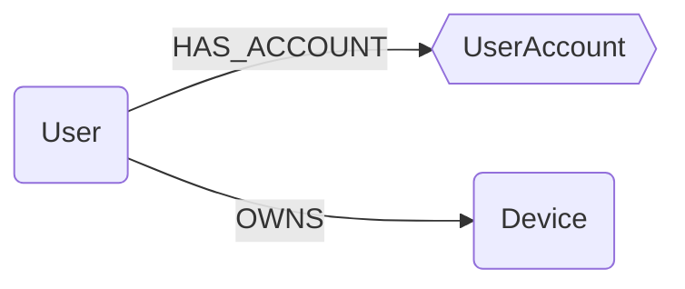

## Ontology Schema




:::{note}
In this schema, `squares` represent `Abstract Nodes` and `hexagons` represent `Semantic Labels` (on module nodes).
:::

### Semantic Labels

| **Name** | **Description** | **Ref** |
| -------- | --------------- | ------- |
| UserAccount | Represents a user account on a system or service. This label is used to unify accounts from different sources (e.g., Duo, Okta, Tailscale). | [d3f:UserAccount](https://d3fend.mitre.org/dao/artifact/d3f:UserAccount/) |

### Field Requirements

When defining ontology mappings, certain fields can be marked as **required**. This serves two important purposes:

1. **Data Quality Control**: If a source node lacks a required field, it will be excluded from ontology node creation entirely
2. **Primary Identifier Validation**: Fields used as primary identifiers (like `email` for Users or `hostname` for Devices) must be marked as required to ensure ontology nodes are always identifiable

For example, if `email` is marked as required in a user mapping and a source user node has no email address, no corresponding `User` ontology node will be created for that record.

### User

_Reference: [d3f:User](https://d3fend.mitre.org/dao/artifact/d3f:User/)_

A user is a person (or agent) who uses a computer or network service.
A user often has one or many user accounts.

| Field | Description |
|-------|-------------|
| id | The unique identifier for the user. |
| firstseen | Timestamp of when a sync job first created this node. |
| lastupdated | Timestamp of the last time the node was updated. |
| email | User's primary email. |
| username | Login of the user in the main IDP. |
| fullname | User's full name. |
| firstname | User's first name. |
| lastname | User's last name. |

#### Relationships

- `User` has one or many `UserAccount` (semantic label):
    ```
    (:User)-[:HAS_ACCOUNT]->(:UserAccount)
    ```
- `User` can own one or many `Device`:
    ```
    (:User)-[:OWNS]->(:Device)
    ```

### Device

_Reference: [d3f:ClientComputer](https://d3fend.mitre.org/dao/artifact/d3f:ClientComputer/)_

A client computer is a host that accesses a service made available by a server or a third party provider.
A client computer can be a `DesktopComputer`, `LaptopComputer`, `TableComputer`, `MobilePhone`.

| Field | Description |
|-------|-------------|
| id | The unique identifier for the user. |
| firstseen | Timestamp of when a sync job first created this node. |
| lastupdated | Timestamp of the last time the node was updated. |
| hostname | Hostname of the device. |
| os | OS running on the device. |
| os_version | Version of the OS running on the device. |
| model | Device model (e.g. ThinkPad Carbon X1 G11) |
| platform | CPU architecture |
| serial_number | Device serial number. |

#### Relationships

- `Device` is linked to one or many nodes that implements the notion into a module
    ```
    (:User)-[:HAS_REPRESENTATION]->(:*)
    ```
- `User` can own one or many `Device`
    ```
    (:User)-[:OWNS]->(:Device)
    ```
