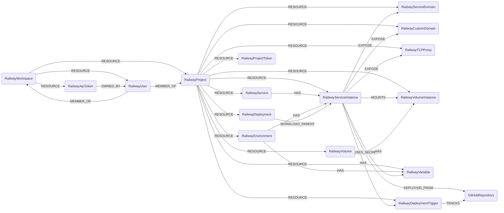

## Railway Schema



Railway has two tenancy levels. A **workspace** owns projects and members; a **project**
owns every deployable resource. Both carry the `Tenant` label, and everything inside a
project is scoped to that project for cleanup.

The distinction between `RailwayService` and `RailwayServiceInstance` matters: a service is
an environment-agnostic shell, while the instance is one service deployed into one
environment. Source image or repo, region, replica count, health check and domains all live
on the instance.

### RailwayWorkspace

Represents a Railway [workspace](https://docs.railway.com/reference/teams): the billing,
ownership and RBAC boundary. Every sync is rooted at a workspace.

> **Ontology Mapping**: This node has the extra label `Tenant` to enable cross-platform queries for tenant accounts across different systems (e.g., OktaOrganization, AWSAccount).

| Field | Description |
|-------|-------------|
| **id** | ID of the Railway workspace |
| **name** | Display name of the workspace |
| created_at | When the workspace was created |
| preferred_region | Default deployment region for new services |
| project_count | Number of projects in the workspace |
| has_2fa_enforcement | Whether the workspace requires 2FA of its members (Pro/Enterprise only; false elsewhere) |
| has_saml | Whether SAML SSO is configured (Pro/Enterprise only; false elsewhere) |
| plan | Billing plan, e.g. `HOBBY` or `PRO` |
| lastupdated | Timestamp of the last time the node was updated |

#### Relationships

- A workspace contains projects, members and API tokens.

    ```
    (:RailwayWorkspace)-[:RESOURCE]->(:RailwayProject)
    (:RailwayWorkspace)-[:RESOURCE]->(:RailwayUser)
    (:RailwayWorkspace)-[:RESOURCE]->(:RailwayApiToken)
    ```

- Users are members of a workspace, with their role on the edge.

    ```
    (:RailwayUser)-[:MEMBER_OF]->(:RailwayWorkspace)
    ```

### RailwayProject

Represents a Railway [project](https://docs.railway.com/reference/projects): the container
for environments, services and volumes.

> **Ontology Mapping**: This node has the extra label `Tenant` to enable cross-platform queries for tenant accounts across different systems (e.g., OktaOrganization, AWSAccount).

| Field | Description |
|-------|-------------|
| **id** | ID of the Railway project |
| **name** | Name of the project |
| description | Free-text project description |
| **is_public** | Whether the project's dashboard, build logs and metrics are readable by anyone |
| is_temp_project | Whether this is a temporary project |
| pr_deploys | Whether pull-request environments are enabled |
| subscription_type | Billing tier of the project |
| workspace_id | ID of the owning workspace |
| created_at | When the project was created |
| updated_at | When the project was last modified |
| deleted_at | When the project was deleted, if it has been |
| lastupdated | Timestamp of the last time the node was updated |

#### Relationships

- A project belongs to a workspace and contains every deployable resource.

    ```
    (:RailwayWorkspace)-[:RESOURCE]->(:RailwayProject)
    (:RailwayProject)-[:RESOURCE]->(:RailwayEnvironment)
    (:RailwayProject)-[:RESOURCE]->(:RailwayService)
    (:RailwayProject)-[:RESOURCE]->(:RailwayServiceInstance)
    (:RailwayProject)-[:RESOURCE]->(:RailwayDeployment)
    (:RailwayProject)-[:RESOURCE]->(:RailwayServiceDomain)
    (:RailwayProject)-[:RESOURCE]->(:RailwayCustomDomain)
    (:RailwayProject)-[:RESOURCE]->(:RailwayTCPProxy)
    (:RailwayProject)-[:RESOURCE]->(:RailwayVolume)
    (:RailwayProject)-[:RESOURCE]->(:RailwayVolumeInstance)
    (:RailwayProject)-[:RESOURCE]->(:RailwayVariable)
    (:RailwayProject)-[:RESOURCE]->(:RailwayProjectToken)
    (:RailwayProject)-[:RESOURCE]->(:RailwayDeploymentTrigger)
    ```

- Users are members of a project, with their project role on the edge. This is distinct
  from their workspace role.

    ```
    (:RailwayUser)-[:MEMBER_OF]->(:RailwayProject)
    ```

### RailwayUser

Represents a member of a Railway workspace or project.

> **Ontology Mapping**: This node has the extra label `UserAccount` to enable cross-platform queries for user accounts across different systems (e.g., OktaUser, AWSSSOUser).

It also carries `RailwayPrincipal`, the Railway IAM principal umbrella, mirroring
`AWSPrincipal` and `ScalewayPrincipal`.

| Field | Description |
|-------|-------------|
| **id** | ID of the Railway user |
| **email** | Email address of the user |
| **name** | Display name of the user |
| two_factor_auth_enabled | Whether the user has 2FA enabled. Only reported for workspace members; absent, rather than null, for someone discovered solely through a project |
| lastupdated | Timestamp of the last time the node was updated |

A Railway user can belong to several workspaces, and a project member need not be a member
of the containing workspace at all. The identity is therefore **not** owned by any one
workspace: cleaning up a workspace removes only its own edges and leaves the user node in
place, so a person shared with another workspace is never deleted.

#### Relationships

- A user is scoped to every workspace the sync found them in, and is a member of the
  workspaces and projects they actually belong to, holding a role (`ADMIN`, `MEMBER` or
  `VIEWER`) on each membership edge. A project-only member gets no workspace `MEMBER_OF`.

    ```
    (:RailwayWorkspace)-[:RESOURCE]->(:RailwayUser)
    (:RailwayUser)-[:MEMBER_OF]->(:RailwayWorkspace)
    (:RailwayUser)-[:MEMBER_OF]->(:RailwayProject)
    ```

- Account API tokens belong to a user.

    ```
    (:RailwayApiToken)-[:OWNED_BY]->(:RailwayUser)
    ```

### RailwayEnvironment

Represents a Railway [environment](https://docs.railway.com/reference/environments), for
example `production` or `staging`.

| Field | Description |
|-------|-------------|
| **id** | ID of the environment |
| **name** | Name of the environment |
| **project_id** | ID of the owning project |
| created_at | When the environment was created |
| is_ephemeral | Whether the environment is a short-lived pull-request environment |
| lastupdated | Timestamp of the last time the node was updated |

#### Relationships

- An environment belongs to a project and holds service instances and variables.

    ```
    (:RailwayProject)-[:RESOURCE]->(:RailwayEnvironment)
    (:RailwayEnvironment)-[:HAS]->(:RailwayServiceInstance)
    (:RailwayEnvironment)-[:HAS]->(:RailwayVariable)
    ```

### RailwayService

Represents a Railway [service](https://docs.railway.com/reference/services). This is the
environment-agnostic shell; the deployable configuration lives on `RailwayServiceInstance`.

| Field | Description |
|-------|-------------|
| **id** | ID of the service |
| **name** | Name of the service |
| icon | URL of the service icon |
| **project_id** | ID of the owning project |
| template_id | ID of the Railway template the service was created from, if any |
| is_restricted | Whether the service is restricted |
| created_at | When the service was created |
| updated_at | When the service was last modified |
| lastupdated | Timestamp of the last time the node was updated |

#### Relationships

- A service belongs to a project and has one instance per environment it is deployed into.

    ```
    (:RailwayProject)-[:RESOURCE]->(:RailwayService)
    (:RailwayService)-[:HAS]->(:RailwayServiceInstance)
    ```

### RailwayServiceInstance

Represents one Railway service deployed into one environment. This is the running workload,
and where all deployment configuration lives.

> **Ontology Mapping**: This node has the extra label `ComputeService` to enable cross-platform queries for logical compute workloads across different systems (e.g., AWSECSService, GCPCloudRunService, ScalewayServerlessContainer).

| Field | Description |
|-------|-------------|
| **id** | ID of the service instance |
| **service_id** | ID of the parent service |
| **service_name** | Name of the parent service |
| **environment_id** | ID of the environment the instance is deployed into |
| **source_image** | Container image the instance runs, when deployed from a registry |
| **source_repo** | Source repository in `owner/name` form, when deployed from git |
| builder | Build system used, e.g. `RAILPACK`, `NIXPACKS`, `PAKETO`, `HEROKU` |
| build_command | Custom build command, if overridden |
| start_command | Custom start command, if overridden |
| root_directory | Subdirectory of the repo the service builds from |
| dockerfile_path | Path to a custom Dockerfile, if used |
| **region** | Effective deployment region. Railway only sets this on the instance when it overrides the workspace default, so it falls back to the workspace's `preferredRegion` |
| region_is_workspace_default | True when `region` came from the workspace rather than an instance override |
| num_replicas | Number of replicas. Replicas scale the instance within its single region; Railway exposes no per-replica placement |
| sleep_application | Whether the instance sleeps when idle |
| cron_schedule | Cron expression, for scheduled workloads |
| healthcheck_path | HTTP path Railway probes for health |
| restart_policy_type | Restart policy, e.g. `ON_FAILURE` |
| restart_policy_max_retries | Maximum restart attempts |
| ipv6_egress_enabled | Whether IPv6 egress is enabled |
| latest_deployment_id | ID of the most recent deployment |
| latest_deployment_status | Status of the most recent deployment |
| is_publicly_exposed | Whether the instance is reachable from the internet through a Railway domain, a verified custom domain, or a TCP proxy that is **currently serving** (`syncStatus` `ACTIVE` or `UPDATING`) |
| created_at | When the instance was created |
| updated_at | When the instance was last modified |
| lastupdated | Timestamp of the last time the node was updated |

#### Relationships

- An instance belongs to a project and sits inside both a service and an environment.

    ```
    (:RailwayProject)-[:RESOURCE]->(:RailwayServiceInstance)
    (:RailwayService)-[:HAS]->(:RailwayServiceInstance)
    (:RailwayEnvironment)-[:HAS]->(:RailwayServiceInstance)
    ```

- An instance's public entry points, mounted disks, variables and deployment triggers.

    ```
    (:RailwayServiceInstance)-[:EXPOSE]->(:RailwayServiceDomain)
    (:RailwayServiceInstance)-[:EXPOSE]->(:RailwayCustomDomain)
    (:RailwayServiceInstance)-[:EXPOSE]->(:RailwayTCPProxy)
    (:RailwayServiceInstance)-[:MOUNTS]->(:RailwayVolumeInstance)
    (:RailwayServiceInstance)-[:USES_SECRET]->(:RailwayVariable)
    (:RailwayServiceInstance)-[:HAS]->(:RailwayDeploymentTrigger)
    ```

- When the instance deploys from a git source and the GitHub module has ingested that
  repository, they are linked.

    ```
    (:RailwayServiceInstance)-[:DEPLOYED_FROM]->(:GitHubRepository)
    ```

- Deployments are concrete revisions of the instance.

    ```
    (:RailwayDeployment)-[:WORKLOAD_PARENT]->(:RailwayServiceInstance)
    ```

### RailwayDeployment

Represents a single Railway [deployment](https://docs.railway.com/reference/deployments):
one concrete revision of a service instance.

> **Ontology Mapping**: This node has the extra label `Container` to enable cross-platform queries for running containers across different systems (e.g., AWSECSContainer, KubernetesContainer, GCPCloudRunServiceContainer).

Only the **current** revision carries `Container`. Railway keeps a row for every past deploy
attempt, including failed and crashed ones; labelling those would fill the container ontology
with workloads that are not running. Superseded revisions stay in the graph as plain
`RailwayDeployment` nodes. Deployment history is capped at the 10 most recent per
environment, so older revisions age out of the graph rather than accumulating forever.

| Field | Description |
|-------|-------------|
| **id** | ID of the deployment |
| **status** | Deployment status, e.g. `SUCCESS`, `BUILDING`, `CRASHED`, `FAILED` |
| **lifecycle** | `current` for the revision the service instance is serving, `historical` for a superseded one |
| status_updated_at | When the status last changed |
| project_id | ID of the owning project |
| **environment_id** | ID of the environment deployed into |
| **service_id** | ID of the service deployed |
| **url** | URL of the deployment |
| static_url | Static URL of the deployment |
| can_redeploy | Whether the deployment can be redeployed |
| created_at | When the deployment was created |
| lastupdated | Timestamp of the last time the node was updated |

#### Relationships

- A deployment belongs to a project and is a revision of a service instance.

    ```
    (:RailwayProject)-[:RESOURCE]->(:RailwayDeployment)
    (:RailwayDeployment)-[:WORKLOAD_PARENT]->(:RailwayServiceInstance)
    ```

### RailwayServiceDomain

Represents a Railway-generated `*.up.railway.app` domain. These are always internet-facing.

| Field | Description |
|-------|-------------|
| **id** | ID of the service domain |
| **domain** | Fully-qualified domain name |
| suffix | Railway domain suffix, e.g. `up.railway.app` |
| target_port | Port on the service the domain routes to |
| sync_status | Provisioning status of the domain |
| service_id | ID of the service the domain fronts |
| environment_id | ID of the environment the domain fronts |
| created_at | When the domain was created |
| lastupdated | Timestamp of the last time the node was updated |

#### Relationships

- A domain belongs to a project and exposes a service instance, but only while it is
  actually serving: a domain in `CREATING`, `DELETING` or `DELETED` gets no `EXPOSE` edge.

    ```
    (:RailwayProject)-[:RESOURCE]->(:RailwayServiceDomain)
    (:RailwayServiceInstance)-[:EXPOSE]->(:RailwayServiceDomain)  // serving domains only
    ```

### RailwayCustomDomain

Represents a customer-owned domain pointed at a Railway service.

A domain that has not passed DNS verification does not resolve yet, so it gets **no**
`EXPOSE` edge and is not counted as exposure. It is still ingested, and its `service_id` and
`environment_id` properties still record which instance it is intended for.

| Field | Description |
|-------|-------------|
| **id** | ID of the custom domain |
| **domain** | Fully-qualified domain name |
| target_port | Port on the service the domain routes to |
| is_railway_domain | Whether the domain is managed by Railway |
| sync_status | Provisioning status of the domain |
| verified | Whether DNS verification has succeeded |
| certificate_status | TLS certificate status, e.g. `ISSUED`, `PENDING` |
| verification_dns_host | DNS record Railway expects for verification |
| service_id | ID of the service the domain fronts |
| environment_id | ID of the environment the domain fronts |
| lastupdated | Timestamp of the last time the node was updated |

#### Relationships

- A custom domain belongs to a project. Only a verified domain exposes a service instance,
  and serving, so `EXPOSE` traversals agree with `is_publicly_exposed`.

    ```
    (:RailwayProject)-[:RESOURCE]->(:RailwayCustomDomain)
    (:RailwayServiceInstance)-[:EXPOSE]->(:RailwayCustomDomain)  // verified domains only
    ```

### RailwayTCPProxy

Represents a Railway [TCP proxy](https://docs.railway.com/guides/tcp-proxy): a raw port
published on the public internet, with no TLS termination or authentication in front of it.

| Field | Description |
|-------|-------------|
| **id** | ID of the TCP proxy |
| **domain** | Public hostname of the proxy, e.g. `sakura.proxy.rlwy.net` |
| proxy_port | Public port clients connect to |
| application_port | Port inside the service the proxy forwards to |
| sync_status | Provisioning status of the proxy |
| service_id | ID of the service behind the proxy |
| environment_id | ID of the environment the proxy serves |
| created_at | When the proxy was created |
| lastupdated | Timestamp of the last time the node was updated |

#### Relationships

- A proxy belongs to a project and exposes a service instance, gated on the same serving
  states as the domains.

    ```
    (:RailwayProject)-[:RESOURCE]->(:RailwayTCPProxy)
    (:RailwayServiceInstance)-[:EXPOSE]->(:RailwayTCPProxy)  // serving proxies only
    ```

### RailwayVolume

Represents a Railway [volume](https://docs.railway.com/reference/volumes) definition. The
actual disk is `RailwayVolumeInstance`.

| Field | Description |
|-------|-------------|
| **id** | ID of the volume |
| **name** | Name of the volume |
| **project_id** | ID of the owning project |
| created_at | When the volume was created |
| lastupdated | Timestamp of the last time the node was updated |

#### Relationships

- A volume belongs to a project and has one instance per environment.

    ```
    (:RailwayProject)-[:RESOURCE]->(:RailwayVolume)
    (:RailwayVolume)-[:HAS]->(:RailwayVolumeInstance)
    ```

### RailwayVolumeInstance

Represents the actual persistent disk backing a volume in one environment.

> **Ontology Mapping**: This node has the extra label `BlockStorage` to enable cross-platform queries for block storage volumes across different systems (e.g., AWSEBSVolume, AzureDisk, ScalewayVolume).

| Field | Description |
|-------|-------------|
| **id** | ID of the volume instance |
| **volume_id** | ID of the parent volume |
| **volume_name** | Name of the parent volume, denormalised so the disk has a real name rather than a mount path |
| **environment_id** | ID of the environment the disk lives in |
| **service_id** | ID of the service that mounts the disk |
| mount_path | Path the disk is mounted at inside the container |
| **region** | Region the disk is provisioned in |
| size_mb | Provisioned size in megabytes |
| size_gb | Provisioned size in gigabytes, derived from `size_mb` |
| current_size_mb | Currently used space in megabytes |
| **state** | Lifecycle state, e.g. `READY`, `MIGRATING`, `ERROR` |
| created_at | When the disk was created |
| lastupdated | Timestamp of the last time the node was updated |

#### Relationships

- A disk belongs to a project, to a volume, and to the workload that mounts it.

    ```
    (:RailwayProject)-[:RESOURCE]->(:RailwayVolumeInstance)
    (:RailwayVolume)-[:HAS]->(:RailwayVolumeInstance)
    (:RailwayServiceInstance)-[:MOUNTS]->(:RailwayVolumeInstance)
    ```

### RailwayVariable

Represents a Railway environment variable.

> **Note**: Only variable **names** are ingested. Cartography never requests or stores
> variable values; the GraphQL query deliberately omits the `value` field.

> **Ontology Mapping**: This node has the extra label `Secret` to enable cross-platform queries for secrets across different systems (e.g., AWSSecretsManagerSecret, GCPSecretManagerSecret, KubernetesSecret).

| Field | Description |
|-------|-------------|
| **id** | ID of the variable |
| **name** | Name of the variable |
| is_sealed | Whether the variable is write-only and cannot be read back, even in the Railway dashboard |
| service_id | ID of the service the variable is scoped to, or null for a shared variable |
| environment_id | ID of the environment the variable belongs to |
| created_at | When the variable was created |
| lastupdated | Timestamp of the last time the node was updated |

#### Relationships

- Every variable belongs to a project and an environment. Service-scoped variables also
  attach to the workload that consumes them.

    ```
    (:RailwayProject)-[:RESOURCE]->(:RailwayVariable)
    (:RailwayEnvironment)-[:HAS]->(:RailwayVariable)
    (:RailwayServiceInstance)-[:USES_SECRET]->(:RailwayVariable)
    ```

### RailwayApiToken

Represents a Railway account or workspace API token.

> **Note**: `display_token` is Railway's own redacted prefix, not the secret value.

> **Ontology Mapping**: This node has the extra label `APIKey` to enable cross-platform queries for API credentials across different systems (e.g., AWSAccountAccessKey, GCPApiKey, ScalewayApiKey).

| Field | Description |
|-------|-------------|
| **id** | ID of the token |
| name | Name given to the token |
| display_token | Redacted token prefix shown by Railway |
| workspace_id | ID of the workspace the token is scoped to, or null for an account-wide token |
| **expires_at** | When the token expires, or null if it does not |
| lastupdated | Timestamp of the last time the node was updated |

#### Relationships

- A token belongs to a workspace and to the account that created it.

    ```
    (:RailwayWorkspace)-[:RESOURCE]->(:RailwayApiToken)
    (:RailwayApiToken)-[:OWNED_BY]->(:RailwayUser)
    ```

### RailwayProjectToken

Represents a Railway project token, scoped to a single environment of a single project.

> **Note**: `display_token` is Railway's own redacted prefix, not the secret value.

> **Ontology Mapping**: This node has the extra label `APIKey` to enable cross-platform queries for API credentials across different systems (e.g., AWSAccountAccessKey, GCPApiKey, ScalewayApiKey).

| Field | Description |
|-------|-------------|
| **id** | ID of the token |
| name | Name given to the token |
| display_token | Redacted token prefix shown by Railway |
| project_id | ID of the project the token is scoped to |
| **environment_id** | ID of the single environment the token can reach |
| created_at | When the token was created |
| lastupdated | Timestamp of the last time the node was updated |

#### Relationships

- A project token belongs to a project.

    ```
    (:RailwayProject)-[:RESOURCE]->(:RailwayProjectToken)
    ```

### RailwayDeploymentTrigger

Represents a git trigger that redeploys a service when a branch changes.

| Field | Description |
|-------|-------------|
| **id** | ID of the trigger |
| **provider** | Source-control provider, e.g. `github` |
| **repository** | Repository in `owner/name` form |
| branch | Branch that triggers a deployment |
| service_id | ID of the service that is redeployed |
| environment_id | ID of the environment that is redeployed |
| lastupdated | Timestamp of the last time the node was updated |

#### Relationships

- A trigger belongs to a project and to the instance it deploys. When the GitHub module has
  ingested the tracked repository, they are linked.

    ```
    (:RailwayProject)-[:RESOURCE]->(:RailwayDeploymentTrigger)
    (:RailwayServiceInstance)-[:HAS]->(:RailwayDeploymentTrigger)
    (:RailwayDeploymentTrigger)-[:TRACKS]->(:GitHubRepository)
    ```
