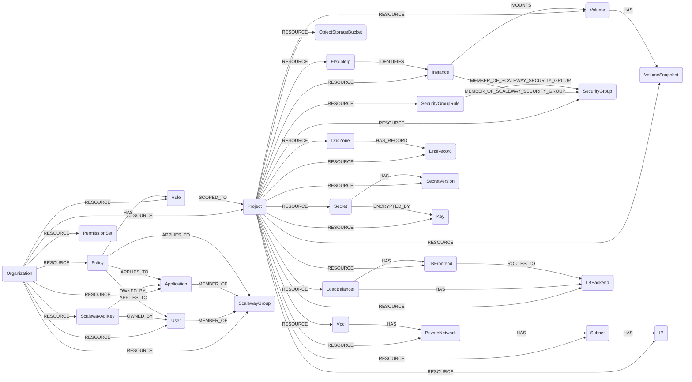

## Scaleway Schema



### ScalewayOrganization

Represents an Organization in Scaleway.

> **Ontology Mapping**: This node has the extra label `Tenant` to enable cross-platform queries for tenant accounts across different systems (e.g., OktaOrganization, AWSAccount).

| Field      | Description                                  |
|------------|----------------------------------------------|
| id         | ID of the Scaleway Organization              |
| lastupdated| Timestamp of the last update                 |

#### Relationships
- `Project`, `Application`, `User`, `ApiKey`, `Policy`, `Rule`, `PermissionSet` belong to a `ScalewayOrganization`.
    ```
    (:ScalewayOrganization)-[:RESOURCE]->(
        :ScalewayProject,
        :ScalewayApplication,
        :ScalewayUser,
        :ScalewayApiKey,
        :ScalewayPolicy,
        :ScalewayRule,
        :ScalewayPermissionSet
    )
    ```


### ScalewayProject

Represents a Project in Scaleway. Projects are groupings of Scaleway resources.

> **Ontology Mapping**: This node has the extra label `Tenant` to enable cross-platform queries for tenant accounts across different systems (e.g., OktaOrganization, AWSAccount).

| Field       | Description                                  |
|-------------|----------------------------------------------|
| id          | ID of the Scaleway Project                   |
| name        | Name of the project                          |
| created_at  | Creation timestamp                           |
| updated_at  | Last update timestamp                        |
| description | Project description                          |
| lastupdated | Timestamp of the last update                 |

#### Relationships
- A `Project` belongs to a `ScalewayOrganization`.
    ```
    (:ScalewayOrganization)-[:RESOURCE]->(:ScalewayProject)
    ```
- A `Project` has `FlexibleIp`, `ScalewayVolume`, `VolumeSnapshot` and `Instance` as resources.
    ```
    (:ScalewayProject)-[:RESOURCE]->(
        :ScalewayFlexibleIp,
        :ScalewayVolume,
        :ScalewayVolumeSnapshot,
        :ScalewayInstance,
        :ScalewaySecurityGroup,
        :ScalewaySecurityGroupRule,
        :ScalewayObjectStorageBucket,
        :ScalewayVpc,
        :ScalewayPrivateNetwork,
        :ScalewaySubnet,
        :ScalewayIP,
        :ScalewayLoadBalancer,
        :ScalewayLBFrontend,
        :ScalewayLBBackend
    )
    ```


### ScalewayUser

Represents a User in Scaleway.

> **Ontology Mapping**: This node has the extra label `UserAccount` to enable cross-platform queries for user accounts across different systems (e.g., OktaUser, AWSSSOUser).

| Field              | Description                                  |
|--------------------|----------------------------------------------|
| id                 | ID of user.                                  |
| email              | Email of user.                               |
| username           | User identifier unique to the Organization.  |
| first_name         | First name of the user.                      |
| last_name          | Last name of the user.                       |
| phone_number       | Phone number of the user.                    |
| locale             | Locale of the user.                          |
| created_at         | Date user was created.                       |
| updated_at         | Date of last user update.                    |
| deletable          | Deletion status of user. Owners cannot be deleted. |
| last_login_at      | Date of the last login.                      |
| type               | Type of user (`unknown_type`, `guest`, `owner`, `member`)    |
| status             | Status of user invitation (`unknown_status`, `invitation_pending`, `activated`) |
| mfa                | Defines whether MFA is enabled.              |
| account_root_user_id| ID of the account root user associated with the user. |
| tags               | Tags associated with the user.               |
| locked             | Defines whether the user is locked.          |
| lastupdated        | Timestamp of the last update                 |


#### Relationships
- `User` belongs to a `Organization`.
    ```
    (:ScalewayOrganization)-[:RESOURCE]->(:ScalewayUser)
    ```
- `User` is Member of `Group`.
    ```
    (:ScalewayUser)-[:MEMBER_OF]->(:ScalewayGroup)
    ```
- `User` owns `ApiKey`.
    ```
    (:ScalewayApiKey)-[:OWNED_BY]->(:ScalewayUser)
    ```


### ScalewayGroup

Represents a Group in Scaleway.

> **Ontology Mapping**: This node has the extra label `UserGroup` to enable cross-platform queries for user groups across different systems (e.g., AWSGroup, EntraGroup, GoogleWorkspaceGroup).

| Field       | Description                                  |
|-------------|----------------------------------------------|
| id          | ID of the Group                              |
| created_at  | Date and time of group creation.             |
| updated_at  | Date and time of last group update.          |
| name        | Name of the group.                           |
| description | Description of the group.                    |
| tags        | Tags associated to the group.                |
| editable    | Defines whether or not the group is editable. |
| deletable   | Defines whether or not the group is deletable. |
| managed     | Defines whether or not the group is managed. |
| lastupdated | Timestamp of the last update                 |

#### Relationships
- `Group` belongs to an `Organization`
    ```
    (:ScalewayOrganization)-[:RESOURCE]->(:ScalewayGroup)
    ```
- `Group` has members: `User` and `Application`
    ```
    (:ScalewayUser)-[:MEMBER_OF]->(:ScalewayGroup)
    (:ScalewayApplication)-[:MEMBER_OF]->(:ScalewayGroup)
    ```


### ScalewayApplication

Represents an Application (Service Account) in Scaleway

> **Ontology Mapping**: This node has the extra label `ServiceAccount` to enable cross-platform queries for service accounts across different systems (e.g., GCPServiceAccount, KubernetesServiceAccount, OpenAIServiceAccount).

| Field       | Description                                  |
|-------------|----------------------------------------------|
| id          | ID of the application.                       |
| name        | Name of the application.                     |
| description | Description of the application.              |
| created_at  | Date and time application was created.       |
| updated_at  | Date and time of last application update.    |
| editable    | Defines whether or not the application is editable. |
| deletable   | Defines whether or not the application is deletable. |
| managed     | Defines whether or not the application is managed. |
| tags        | Tags associated with the user. |
| lastupdated | Timestamp of the last update |


#### Relationships
- `Application` belongs to a `Organization`.
    ```
    (:ScalewayOrganization)-[:RESOURCE]->(:ScalewayApplication)
    ```
- `Application` is member of a `Group`
    ```
    (:ScalewayApplication)-[:MEMBER_OF]->(:ScalewayGroup)
    ```
- `Application` owns `ApiKey`
    ```
    (:ScalewayApiKey)-[:OWNED_BY]->(:ScalewayApplication)
    ```

### ScalewayApiKey

Represents an ApiKey in Scaleway.

> **Ontology Mapping**: This node has the extra label `APIKey` to enable cross-platform queries for API keys across different systems (e.g., OpenAIApiKey, AnthropicApiKey).

| Field            | Description                                  |
|------------------|----------------------------------------------|
| id               | Access key of the API key.                   |
| description      | Description of API key.                      |
| created_at       | Date and time of API key creation.           |
| updated_at       | Date and time of last API key update.        |
| expires_at       |  Date and time of API key expiration.        |
| default_project_id| Default Project ID specified for this API key. |
| editable         | Defines whether or not the API key is editable. |
| deletable        | Defines whether or not the API key is deletable. |
| managed          | Defines whether or not the API key is managed. |
| creation_ip      | IP address of the device that created the API key. |
| lastupdated      | Timestamp of the last update                 |

#### Relationships
- `ApiKey` belongs to an `Organization`.
    ```
    (:ScalewayOrganization)-[:RESOURCE]->(:ScalewayApiKey)
    ```
- `ApiKey` is owned by a `User` or an `Application`
    ```
    (:ScalewayApiKey)-[:OWNED_BY]->(:ScalewayUser)
    (:ScalewayApiKey)-[:OWNED_BY]->(:ScalewayApplication)
    ```


### ScalewayPolicy

Represents an IAM Policy in Scaleway. Policies define permissions for users, groups, or applications.

| Field             | Description                                  |
|-------------------|----------------------------------------------|
| id                | ID of the policy.                            |
| name              | Name of the policy.                          |
| description       | Description of the policy.                   |
| created_at        | Date and time of policy creation.            |
| updated_at        | Date and time of last policy update.         |
| editable          | Defines whether or not the policy is editable. |
| deletable         | Defines whether or not the policy is deletable. |
| managed           | Defines whether or not the policy is managed. |
| tags              | Tags associated with the policy.             |
| nb_rules          | Number of rules in the policy.               |
| nb_scopes         | Number of scopes in the policy.              |
| nb_permission_sets| Number of permission sets in the policy.     |
| no_principal      | True if the policy has no principal attached. |
| lastupdated       | Timestamp of the last update                 |

#### Relationships
- `Policy` belongs to an `Organization`.
    ```
    (:ScalewayOrganization)-[:RESOURCE]->(:ScalewayPolicy)
    ```
- `Policy` applies to a `User`, `Group`, or `Application`.
    ```
    (:ScalewayPolicy)-[:APPLIES_TO]->(:ScalewayUser)
    (:ScalewayPolicy)-[:APPLIES_TO]->(:ScalewayGroup)
    (:ScalewayPolicy)-[:APPLIES_TO]->(:ScalewayApplication)
    ```
- `Policy` has `Rule`s.
    ```
    (:ScalewayPolicy)-[:HAS]->(:ScalewayRule)
    ```


### ScalewayRule

Represents an IAM Rule within a Policy. Rules define which permission sets apply and to which projects.

| Field                    | Description                                  |
|--------------------------|----------------------------------------------|
| id                       | ID of the rule.                              |
| permission_sets_scope_type | Scope type of the permission sets.         |
| condition                | Condition for the rule.                      |
| permission_set_names     | Names of the permission sets granted by this rule. |
| lastupdated              | Timestamp of the last update                 |

#### Relationships
- `Rule` belongs to an `Organization`.
    ```
    (:ScalewayOrganization)-[:RESOURCE]->(:ScalewayRule)
    ```
- `Rule` belongs to a `Policy`.
    ```
    (:ScalewayPolicy)-[:HAS]->(:ScalewayRule)
    ```
- `Rule` is scoped to `Project`s.
    ```
    (:ScalewayRule)-[:SCOPED_TO]->(:ScalewayProject)
    ```


### ScalewayPermissionSet

Represents a Permission Set in Scaleway. Permission sets are predefined collections of permissions.

| Field       | Description                                  |
|-------------|----------------------------------------------|
| id          | ID of the permission set.                    |
| name        | Name of the permission set.                  |
| scope_type  | Scope type of the permission set.            |
| description | Description of the permission set.           |
| categories  | Categories of the permission set.            |
| lastupdated | Timestamp of the last update                 |

#### Relationships
- `PermissionSet` belongs to an `Organization`.
    ```
    (:ScalewayOrganization)-[:RESOURCE]->(:ScalewayPermissionSet)
    ```


### ScalewayVolume

Volumes are storage space used by your Instances. You can attach several volumes to an Instance.

> **Ontology Mapping**: This node has the extra label `BlockStorage` to enable cross-platform queries for block storage volumes across different systems (e.g., EBSVolume, AzureDisk).

| Field           | Description                                  |
|-----------------|----------------------------------------------|
| id              | Volume unique ID.                            |
| name            | Volume name.                                 |
| export_uri      | Show the volume NBD export URI.              |
| size            | Volume disk size. (in bytes)                 |
| size_gb         | Volume disk size derived in gigabytes (rounded from `size`). |
| volume_type     | Volume type (`l_ssd`, `b_ssd`, `unified`, `scratch`, `sbs_volume`, `sbs_snapshot`) |
| creation_date   | Volume creation date.                        |
| modification_date| Volume modification date.                   |
| tags            | Volume tags.                                 |
| state           | Volume state (`available`, `snapshotting`, `fetching`, `resizing`, `saving`, `hotsyncing`, `error`) |
| zone            | Zone in which the volume is located.         |
| lastupdated     | Timestamp of the last update                 |

#### Relationships
- `Volume` belongs to a `Project`.
    ```
    (:ScalewayProject)-[:RESOURCE]->(:ScalewayVolume)
    ```
- `Volume` has `VolumeSnapshot`
    ```
    (:ScalewayVolume)-[:HAS]->(:ScalewayVolumeSnapshot)
    ```


### ScalewayVolumeSnapshot

A snapshot takes a picture of a volume at one specific point in time. For a complete backup of your Instance, you can create an image.

> **Ontology Mapping**: This node has the extra label `Snapshot` and normalized `_ont_*` properties to enable cross-platform queries for volume/database snapshots across different systems (e.g., EBSSnapshot, RDSSnapshot, AzureSnapshot).

| Field           | Description                                  |
|-----------------|----------------------------------------------|
| id              | Snapshot ID.                                 |
| name            | Snapshot name.                               |
| tags            | Snapshot tags.                               |
| volume_type     | Snapshot volume type (`l_ssd`, `b_ssd`, `unified`, `scratch`, `sbs_volume`, `sbs_snapshot`) |
| size            | Snapshot size. (in bytes)                    |
| state           | Snapshot state (`available`, `snapshotting`, `error`, `invalid_data`, `importing`, `exporting`) |
| creation_date   | Snapshot creation date.                      |
| modification_date | Snapshot modification date.                |
| error_reason    | Reason for the failed snapshot import.       |
| zone            | Snapshot zone.                               |
| lastupdated     | Timestamp of the last update                 |


#### Relationships
- `VolumeSnapshot` belongs to a `Project`.
    ```
    (:ScalewayProject)-[:RESOURCE]->(:ScalewayVolumeSnapshot)
    ```
- `Volume` has `VolumeSnapshot`
    ```
    (:ScalewayVolume)-[:HAS]->(:ScalewayVolumeSnapshot)
    ```


### ScalewayFlexibleIp

Flexible IP addresses are public IP addresses that you can hold independently of any Instance. By default, a Scaleway Instance's public IP is also a flexible IP address.

| Field      | Description                                  |
|------------|----------------------------------------------|
| id         | Flexible IP ID                               |
| address    | IP address                                   |
| reverse    | Reverse DNS                                  |
| tags       | Tags for the IP                              |
| type       | Type of IP (`unknown_iptype`, `routed_ipv4`, `routed_ipv6`) |
| state      | State of the IP (`unknown_state`, `detached`, `attached`, `pending`, `error`) |
| prefix     | IP Network                                   |
| ipam_id    | IPAM ID (UUI Format)                         |
| zone       | AZ of the IP                                 |
| lastupdated| Timestamp of the last update                 |

#### Relationships
- `FlexibleIp` belongs to a `Project`.
    ```
    (:ScalewayProject)-[:RESOURCE]->(:ScalewayFlexibleIp)
    ```
- `FlexibleIp` identifies an `Instance`
    ```
    (:ScalewayFlexibleIp)-[:IDENTIFIES]->(:ScalewayInstance)
    ```

### ScalewayInstance

An Instance is a virtual computing unit that provides resources, such as processing power, memory, and network connectivity, to run your applications.

> **Ontology Mapping**: This node has the extra label `ComputeInstance` to enable cross-platform queries for compute instances across different systems (e.g., EC2Instance, DigitalOceanDroplet).

| Field      | Description                                  |
|------------|----------------------------------------------|
| id         | Instance unique ID.                          |
| name       | Instance name.                               |
| tags       | Tags associated with the Instance.           |
| commercial_type | Instance commercial type (eg. GP1-M).   |
| creation_date | Instance creation date.                   |
| dynamic_ip_required | True if a dynamic IPv4 is required. |
| routed_ip_enabled | True to configure the instance so it uses the routed IP mode. Use of routed_ip_enabled as False is deprecated. |
| enable_ipv6 | True if IPv6 is enabled (deprecated and always False when routed_ip_enabled is True). |
| hostname   | Instance host name.                          |
| private_ip | Private IP address of the Instance (deprecated and always null when routed_ip_enabled is True). |
| mac_address | The server's MAC address.                   |
| modification_date | Instance modification date.           |
| state      | Instance state (`running`, `stopped`, `stopped in place`, `starting`, `stopping`, `locked`) |
| location_cluster_id | Instance location, cluster ID       |
| location_hypervisor_id | Instance locationm, hypervisor ID |
| location_node_id | Instance location, node ID             |
| location_platform_id | Instance location, plateform ID    |
| ipv6_address | Instance IPv6 IP-Address.                  |
| ipv6_gateway | IPv6 IP-addresses gateway.                 |
| ipv6_netmask | IPv6 IP-addresses CIDR netmask.            |
| boot_type  | Instance boot type (`local`, `bootscript`, `rescue`) |
| state_detail | Detailed information about the Instance state. |
| arch       | Instance architecture (`unknown_arch`, `x86_64`, `arm`, `arm64`) |
| private_nics | Instance private NICs.                     |
| zone       | Zone in which the Instance is located.       |
| end_of_service | True if the Instance type has reached end of service. |
| lastupdated | Timestamp of the last update                 |

#### Relationships
- `Instance` belongs to a `Project`
    ```
    (:ScalewayProject)-[:RESOURCE]->(:ScalewayInstance)
    ```
- `Instance` mounts `Volume`
    ```
    (:ScalewayInstance)-[:MOUNTS]->(:ScalewayVolume)
    ```
- `Instance` is identified by `FlexibleIp`
    ```
    (:ScalewayFlexibleIp)-[:IDENTIFIES]->(:ScalewayInstance)
    ```
- `Instance` is a member of a `SecurityGroup`
    ```
    (:ScalewayInstance)-[:MEMBER_OF_SCALEWAY_SECURITY_GROUP]->(:ScalewaySecurityGroup)
    ```


### ScalewaySecurityGroup

A Security Group is a set of firewall rules that controls inbound and outbound traffic for the Instances attached to it.

> **Ontology Mapping**: This node has the extra label `NetworkAccessControl` to enable cross-platform queries for firewall constructs across different systems (e.g., EC2SecurityGroup, AzureNetworkSecurityGroup, GCPFirewall).

| Field      | Description                                  |
|------------|----------------------------------------------|
| id         | Security Group unique ID.                    |
| name       | Security Group name.                          |
| description | Security Group description.                 |
| enable_default_security | True if SMTP is blocked on IPv4 and IPv6. |
| inbound_default_policy | Default inbound policy (`accept`, `drop`). |
| outbound_default_policy | Default outbound policy (`accept`, `drop`). |
| stateful   | True if the Security Group is stateful.       |
| project_default | True if it is the default Security Group for the Project. |
| organization_default | True if it is the default Security Group for the Organization. |
| tags       | Tags associated with the Security Group.     |
| state      | Security Group state.                         |
| zone       | Zone in which the Security Group is located.  |
| creation_date | Security Group creation date.             |
| modification_date | Security Group modification date.     |
| lastupdated | Timestamp of the last update                 |

#### Relationships
- A `SecurityGroup` belongs to a `Project`
    ```
    (:ScalewayProject)-[:RESOURCE]->(:ScalewaySecurityGroup)
    ```
- An `Instance` is a member of a `SecurityGroup`
    ```
    (:ScalewayInstance)-[:MEMBER_OF_SCALEWAY_SECURITY_GROUP]->(:ScalewaySecurityGroup)
    ```
- A `SecurityGroupRule` is a member of a `SecurityGroup`
    ```
    (:ScalewaySecurityGroupRule)-[:MEMBER_OF_SCALEWAY_SECURITY_GROUP]->(:ScalewaySecurityGroup)
    ```


### ScalewaySecurityGroupRule

A Security Group Rule is a single firewall rule (inbound or outbound) belonging to a Security Group.

> **Ontology Mapping**: This node has the extra label `IpRule`, plus `IpPermissionInbound` or `IpPermissionEgress` depending on its direction, to enable cross-platform queries for firewall rules across different systems (e.g., AWSIpRule, AzureNetworkSecurityRule, GCPIpRule).

| Field      | Description                                  |
|------------|----------------------------------------------|
| id         | Rule unique ID.                              |
| protocol   | Protocol the rule applies to (`tcp`, `udp`, `icmp`, `any`). |
| direction  | Rule direction (`inbound`, `outbound`).       |
| action     | Action taken on matching traffic (`accept`, `drop`). |
| ip_range   | IP range the rule applies to (CIDR notation). |
| dest_port_from | Beginning of the destination port range.  |
| dest_port_to | End of the destination port range.         |
| position   | Rule position (evaluation order).             |
| editable   | True if the rule is editable.                 |
| zone       | Zone in which the rule is located.            |
| lastupdated | Timestamp of the last update                 |

#### Relationships
- A `SecurityGroupRule` belongs to a `Project`
    ```
    (:ScalewayProject)-[:RESOURCE]->(:ScalewaySecurityGroupRule)
    ```
- A `SecurityGroupRule` is a member of a `SecurityGroup`
    ```
    (:ScalewaySecurityGroupRule)-[:MEMBER_OF_SCALEWAY_SECURITY_GROUP]->(:ScalewaySecurityGroup)
    ```

### ScalewayObjectStorageBucket

An Object Storage bucket is an S3-compatible container for objects. Scaleway Object Storage is not exposed by the Scaleway Python SDK, so it is collected through the regional S3-compatible endpoints.

> **Ontology Mapping**: This node has the extra label `ObjectStorage` to enable cross-platform queries for object storage across different systems (e.g., S3Bucket, GCPBucket).

| Field      | Description                                  |
|------------|----------------------------------------------|
| id         | Bucket name (globally unique).               |
| name       | Bucket name.                                 |
| region     | Region the bucket lives in (`fr-par`, `nl-ams`, `pl-waw`, `it-mil`). |
| endpoint   | Public S3 endpoint URL of the bucket.        |
| creation_date | Bucket creation date.                     |
| tags       | Bucket tags (`key=value`).                   |
| versioning_status | Versioning status (`Enabled`, `Suspended`, or unset). |
| acl_public | True if the bucket ACL grants access to `AllUsers` / `AuthenticatedUsers` (null if the ACL could not be read). |
| anonymous_access | True if the bucket policy grants anonymous (internet) access (null if the policy could not be read). |
| anonymous_actions | Actions granted to anonymous principals by the bucket policy. |
| public     | Combined public-exposure signal: `acl_public` OR `anonymous_access`; null when both sources were unreadable. |
| lastupdated | Timestamp of the last update                 |

#### Relationships
- An `ObjectStorageBucket` belongs to a `Project`
    ```
    (:ScalewayProject)-[:RESOURCE]->(:ScalewayObjectStorageBucket)
    ```

### ScalewayVpc

A VPC (Virtual Private Cloud) is a regional, isolated network that groups Private Networks.

> **Ontology Mapping**: This node has the extra label `VirtualNetwork` to enable cross-platform queries for virtual networks across different systems (e.g., AWSVpc, GCPVpc, AzureVirtualNetwork).

| Field      | Description                                  |
|------------|----------------------------------------------|
| id         | VPC unique ID.                               |
| name       | VPC name.                                    |
| region     | Region the VPC lives in.                     |
| tags       | Tags associated with the VPC.                |
| is_default | True if it is the default VPC of the Project. |
| private_network_count | Number of Private Networks in the VPC. |
| routing_enabled | True if routing between Private Networks is enabled. |
| custom_routes_propagation_enabled | True if custom routes are propagated. |
| created_at | VPC creation date.                           |
| updated_at | VPC last update date.                        |
| lastupdated | Timestamp of the last update                 |

#### Relationships
- A `Vpc` belongs to a `Project`
    ```
    (:ScalewayProject)-[:RESOURCE]->(:ScalewayVpc)
    ```
- A `Vpc` has `PrivateNetwork`
    ```
    (:ScalewayVpc)-[:HAS]->(:ScalewayPrivateNetwork)
    ```

### ScalewayPrivateNetwork

A Private Network is a layer-2 network within a VPC that Instances and other resources attach to.

| Field      | Description                                  |
|------------|----------------------------------------------|
| id         | Private Network unique ID.                   |
| name       | Private Network name.                        |
| region     | Region the Private Network lives in.         |
| tags       | Tags associated with the Private Network.    |
| vpc_id     | ID of the VPC the Private Network belongs to. |
| dhcp_enabled | True if managed DHCP is enabled.           |
| default_route_propagation_enabled | True if the default route is propagated. |
| created_at | Private Network creation date.               |
| updated_at | Private Network last update date.            |
| lastupdated | Timestamp of the last update                 |

#### Relationships
- A `PrivateNetwork` belongs to a `Project`
    ```
    (:ScalewayProject)-[:RESOURCE]->(:ScalewayPrivateNetwork)
    ```
- A `Vpc` has `PrivateNetwork`
    ```
    (:ScalewayVpc)-[:HAS]->(:ScalewayPrivateNetwork)
    ```
- A `PrivateNetwork` has `Subnet`
    ```
    (:ScalewayPrivateNetwork)-[:HAS]->(:ScalewaySubnet)
    ```

### ScalewaySubnet

A Subnet is a CIDR block (IPv4 or IPv6) belonging to a Private Network.

> **Ontology Mapping**: This node has the extra label `Subnet` to enable cross-platform queries for subnets across different systems (e.g., EC2Subnet, GCPSubnet, AzureSubnet).

| Field      | Description                                  |
|------------|----------------------------------------------|
| id         | Subnet unique ID.                            |
| subnet     | CIDR block of the subnet.                    |
| private_network_id | ID of the Private Network the subnet belongs to. |
| vpc_id     | ID of the VPC the subnet belongs to.         |
| created_at | Subnet creation date.                        |
| updated_at | Subnet last update date.                     |
| lastupdated | Timestamp of the last update                 |

#### Relationships
- A `Subnet` belongs to a `Project`
    ```
    (:ScalewayProject)-[:RESOURCE]->(:ScalewaySubnet)
    ```
- A `PrivateNetwork` has `Subnet`
    ```
    (:ScalewayPrivateNetwork)-[:HAS]->(:ScalewaySubnet)
    ```

### ScalewayIP

An IP is an IPAM-managed IP address (IPv4 or IPv6) allocated within a Private Network and optionally attached to a resource.

| Field      | Description                                  |
|------------|----------------------------------------------|
| id         | IP unique ID.                                |
| address    | The IP address (CIDR notation).              |
| is_ipv6    | True if the address is IPv6.                 |
| tags       | Tags associated with the IP.                 |
| region     | Region the IP lives in.                      |
| zone       | Zone the IP lives in (when zonal).           |
| source_private_network_id | ID of the Private Network the IP was booked in. |
| source_subnet_id | ID of the subnet the IP was booked in.  |
| source_vpc_id | ID of the VPC the IP was booked in.       |
| resource_type | Type of resource the IP is attached to (e.g. `instance_private_nic`). |
| resource_id | ID of the resource the IP is attached to.   |
| resource_name | Name of the resource the IP is attached to. |
| resource_mac_address | MAC address of the resource the IP is attached to. |
| created_at | IP creation date.                            |
| updated_at | IP last update date.                         |
| lastupdated | Timestamp of the last update                 |

#### Relationships
- An `IP` belongs to a `Project`
    ```
    (:ScalewayProject)-[:RESOURCE]->(:ScalewayIP)
    ```
- A `Subnet` has `IP`
    ```
    (:ScalewaySubnet)-[:HAS]->(:ScalewayIP)
    ```

### ScalewayLoadBalancer

A Load Balancer distributes incoming traffic across backend servers. Its public IP(s) make it an internet-facing entry point.

> **Ontology Mapping**: This node has the extra label `LoadBalancer` to enable cross-platform queries for load balancers across different systems (e.g., AWSLoadBalancerV2, GCPForwardingRule, AzureLoadBalancer).

| Field      | Description                                  |
|------------|----------------------------------------------|
| id         | Load Balancer unique ID.                     |
| name       | Load Balancer name.                          |
| description | Load Balancer description.                  |
| status     | Load Balancer status (e.g. `ready`).          |
| type       | Load Balancer commercial type (e.g. `LB-S`). |
| tags       | Tags associated with the Load Balancer.       |
| frontend_count | Number of frontends.                      |
| backend_count | Number of backends.                        |
| private_network_count | Number of attached Private Networks. |
| route_count | Number of routes.                            |
| ssl_compatibility_level | SSL compatibility level.          |
| ip_address | Primary public IP address (first entry of `ip_addresses`). |
| ip_addresses | All public IP addresses of the Load Balancer. |
| zone       | Zone the Load Balancer lives in.              |
| region     | Region the Load Balancer lives in.            |
| created_at | Load Balancer creation date.                  |
| updated_at | Load Balancer last update date.               |
| lastupdated | Timestamp of the last update                 |

#### Relationships
- A `LoadBalancer` belongs to a `Project`
    ```
    (:ScalewayProject)-[:RESOURCE]->(:ScalewayLoadBalancer)
    ```
- A `LoadBalancer` has `LBFrontend` and `LBBackend`
    ```
    (:ScalewayLoadBalancer)-[:HAS]->(:ScalewayLBFrontend)
    (:ScalewayLoadBalancer)-[:HAS]->(:ScalewayLBBackend)
    ```

### ScalewayLBFrontend

A Frontend defines an inbound listener (port) on a Load Balancer and the backend it routes to.

| Field      | Description                                  |
|------------|----------------------------------------------|
| id         | Frontend unique ID.                          |
| name       | Frontend name.                               |
| inbound_port | Port the frontend listens on.              |
| certificate_ids | IDs of the TLS certificates attached.    |
| enable_http3 | True if HTTP/3 is enabled.                  |
| enable_access_logs | True if access logs are enabled.      |
| timeout_client | Client inactivity timeout.                |
| connection_rate_limit | Per-source connection rate limit.   |
| created_at | Frontend creation date.                      |
| updated_at | Frontend last update date.                   |
| lastupdated | Timestamp of the last update                 |

#### Relationships
- A `LBFrontend` belongs to a `Project`
    ```
    (:ScalewayProject)-[:RESOURCE]->(:ScalewayLBFrontend)
    ```
- A `LoadBalancer` has `LBFrontend`
    ```
    (:ScalewayLoadBalancer)-[:HAS]->(:ScalewayLBFrontend)
    ```
- A `LBFrontend` routes to a `LBBackend`
    ```
    (:ScalewayLBFrontend)-[:ROUTES_TO]->(:ScalewayLBBackend)
    ```

### ScalewayLBBackend

A Backend defines a pool of servers and the forwarding / health-check configuration a Load Balancer uses to reach them.

| Field      | Description                                  |
|------------|----------------------------------------------|
| id         | Backend unique ID.                           |
| name       | Backend name.                                |
| forward_protocol | Protocol used to forward traffic (`tcp`, `http`). |
| forward_port | Port traffic is forwarded to.              |
| forward_port_algorithm | Load-balancing algorithm (e.g. `roundrobin`). |
| sticky_sessions | Sticky-session mode.                     |
| on_marked_down_action | Action when a server is marked down. |
| proxy_protocol | Proxy protocol mode.                      |
| pool       | List of backend server IP addresses.          |
| health_check_port | Port used for health checks.           |
| health_check_delay | Delay between health checks.          |
| health_check_max_retries | Max health-check retries before marking down. |
| timeout_server | Server inactivity timeout.                |
| timeout_connect | Connection timeout.                      |
| ssl_bridging | True if SSL bridging to the backend is enabled. |
| created_at | Backend creation date.                       |
| updated_at | Backend last update date.                    |
| lastupdated | Timestamp of the last update                 |

#### Relationships
- A `LBBackend` belongs to a `Project`
    ```
    (:ScalewayProject)-[:RESOURCE]->(:ScalewayLBBackend)
    ```
- A `LoadBalancer` has `LBBackend`
    ```
    (:ScalewayLoadBalancer)-[:HAS]->(:ScalewayLBBackend)
    ```
- A `LBFrontend` routes to a `LBBackend`
    ```
    (:ScalewayLBFrontend)-[:ROUTES_TO]->(:ScalewayLBBackend)
    ```


### ScalewayDnsZone

Represents a DNS zone managed by Scaleway Domains & DNS. The zone's ID is composed from `{subdomain}.{domain}` (or just `{domain}` for apex zones), which is the value the Scaleway API itself uses as the zone path parameter.

> **Ontology Mapping**: This node has the extra label `DNSZone` to enable cross-platform queries for DNS zones across different systems (e.g., AWSDNSZone, GCPDNSZone).

| Field      | Description                                  |
|------------|----------------------------------------------|
| id         | Full zone name (`subdomain.domain` or `domain`). |
| domain     | Apex domain of the zone.                     |
| subdomain  | Subdomain within the apex (empty for the apex zone itself). |
| status     | Zone status (`active`, `pending`, `error`, ...). |
| message    | Status message returned by the API.          |
| ns         | Authoritative name servers currently configured for the zone. |
| ns_default | Default Scaleway name servers.               |
| ns_master  | Master name servers.                         |
| linked_products | Scaleway products linked to this zone.  |
| updated_at | Zone last update date.                       |
| lastupdated | Timestamp of the last update                 |

#### Relationships
- A `DnsZone` belongs to a `Project`
    ```
    (:ScalewayProject)-[:RESOURCE]->(:ScalewayDnsZone)
    ```


### ScalewayDnsRecord

Represents an individual DNS record within a `ScalewayDnsZone`.

> **Ontology Mapping**: This node has the extra label `DNSRecord` to enable cross-platform queries for DNS records across different systems.

| Field      | Description                                  |
|------------|----------------------------------------------|
| id         | Record unique ID.                            |
| name       | Record name (relative to its zone).          |
| type       | Record type (`a`, `aaaa`, `cname`, `mx`, ...). |
| data       | Record data (target IP, hostname, value, ...). |
| ttl        | Record TTL in seconds.                       |
| priority   | Record priority (relevant for MX/SRV).       |
| comment    | Free-form record comment.                    |
| updated_at | Record last update date.                     |
| lastupdated | Timestamp of the last update                 |

#### Relationships
- A `DnsRecord` belongs to a `Project`
    ```
    (:ScalewayProject)-[:RESOURCE]->(:ScalewayDnsRecord)
    ```
- A `DnsZone` has `DnsRecord`s
    ```
    (:ScalewayDnsZone)-[:HAS_RECORD]->(:ScalewayDnsRecord)
    ```


### ScalewaySecret

Represents a secret managed by Scaleway Secret Manager.

> **Ontology Mapping**: This node has the extra label `Secret` to enable cross-platform queries for secrets across different systems (e.g., AWSSecret, GCPSecretManagerSecret).

| Field      | Description                                  |
|------------|----------------------------------------------|
| id         | Secret unique ID.                            |
| name       | Secret name.                                 |
| status     | Secret status (`ready`, `locked`, ...).      |
| type       | Secret type (`opaque`, `basic_credentials`, `ssh_key`, ...). |
| path       | Folder path of the secret.                   |
| tags       | Secret tags.                                 |
| version_count | Number of versions on this secret.        |
| managed    | True if the secret is managed by another Scaleway product. |
| protected  | True if the secret is protected against deletion. |
| description | Secret description.                         |
| region     | Region the secret lives in.                  |
| key_id     | ID of the Key Manager key encrypting this secret (if any). |
| used_by    | Scaleway products using this secret.         |
| deletion_requested_at | Timestamp when deletion was requested. |
| created_at | Secret creation date.                        |
| updated_at | Secret last update date.                     |
| lastupdated | Timestamp of the last update                 |

#### Relationships
- A `Secret` belongs to a `Project`
    ```
    (:ScalewayProject)-[:RESOURCE]->(:ScalewaySecret)
    ```
- A `Secret` may be encrypted by a `Key`
    ```
    (:ScalewaySecret)-[:ENCRYPTED_BY]->(:ScalewayKey)
    ```


### ScalewaySecretVersion

Represents a version of a `ScalewaySecret`. The version's ID is composed as `{secret_id}/{revision}` since Scaleway does not expose a provider-side version ID.

| Field      | Description                                  |
|------------|----------------------------------------------|
| id         | `{secret_id}/{revision}`.                    |
| revision   | Monotonic revision number.                   |
| status     | Version status (`enabled`, `disabled`, `destroyed`, ...). |
| latest     | True if this version is the latest for its secret. |
| description | Version description.                        |
| region     | Region the version lives in.                 |
| deletion_requested_at | Timestamp when deletion was requested. |
| deleted_at | Deletion date (when the version is destroyed). |
| created_at | Version creation date.                       |
| updated_at | Version last update date.                    |
| lastupdated | Timestamp of the last update                 |

#### Relationships
- A `SecretVersion` belongs to a `Project`
    ```
    (:ScalewayProject)-[:RESOURCE]->(:ScalewaySecretVersion)
    ```
- A `Secret` has `SecretVersion`s
    ```
    (:ScalewaySecret)-[:HAS]->(:ScalewaySecretVersion)
    ```


### ScalewayKey

Represents a Scaleway Key Manager key.

> **Ontology Mapping**: This node has the extra label `EncryptionKey` to enable cross-platform queries for encryption keys across different systems (e.g., AWSKMSKey, GCPCryptoKey).

| Field      | Description                                  |
|------------|----------------------------------------------|
| id         | Key unique ID.                               |
| name       | Key name.                                    |
| description | Key description.                            |
| state      | Key state (`enabled`, `disabled`, `pending_deletion`, ...). |
| usage_type | Active key usage category (`symmetric_encryption`, `asymmetric_encryption`, `asymmetric_signing`). |
| usage_algorithm | Algorithm corresponding to `usage_type` (e.g. `aes_256_gcm`). |
| origin     | Key material origin (`scaleway_kms`, `external`).  |
| region     | Region the key lives in.                     |
| tags       | Key tags.                                    |
| rotation_count | Number of times the key has been rotated. |
| protected  | True if the key is protected against deletion. |
| locked     | True if the key is locked.                   |
| rotation_period | Automatic rotation period (ISO 8601 duration). |
| rotation_next_at | Next scheduled rotation timestamp.      |
| rotated_at | Last rotation date.                          |
| deletion_requested_at | Timestamp when deletion was requested. |
| created_at | Key creation date.                           |
| updated_at | Key last update date.                        |
| lastupdated | Timestamp of the last update                 |

#### Relationships
- A `Key` belongs to a `Project`
    ```
    (:ScalewayProject)-[:RESOURCE]->(:ScalewayKey)
    ```
- A `Secret` may be encrypted by a `Key`
    ```
    (:ScalewaySecret)-[:ENCRYPTED_BY]->(:ScalewayKey)
    ```
