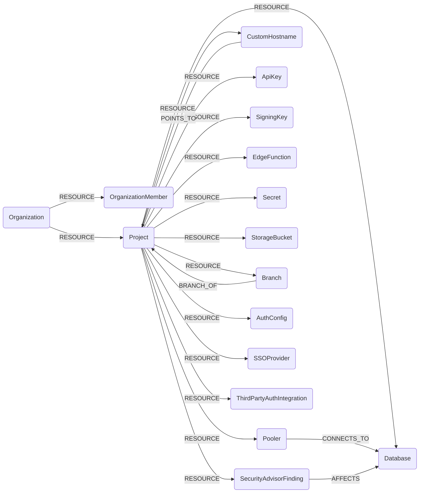

## Supabase Schema



### SupabaseOrganization

Represents a Supabase organization: the billing and membership boundary that owns projects.

> **Ontology Mapping**: This node has the extra label `Tenant` to enable cross-platform queries for organizational tenants across different systems (e.g., OktaOrganization, AzureTenant, GCPOrganization).

| Field | Description |
|-------|-------------|
| **id** | The organization slug, which is how every organization-scoped API path addresses it |
| firstseen| Timestamp of when a sync job first created this node |
| lastupdated | Timestamp of the last time the node was updated |
| **slug** | The organization slug |
| organization_id | The opaque organization identifier returned by the API |
| name | Display name of the organization |
| plan | The organization's subscription plan |
| opt_in_tags | Feature opt-in tags set on the organization |
| allowed_release_channels | Release channels this organization may deploy projects on |

#### Relationships
- `OrganizationMember` and `Project` belong to an `Organization`.
    ```
    (:SupabaseOrganization)-[:RESOURCE]->(:SupabaseOrganizationMember)
    (:SupabaseOrganization)-[:RESOURCE]->(:SupabaseProject)
    ```

### SupabaseOrganizationMember

Represents a user who is a member of a Supabase organization.

> **Ontology Mapping**: This node has the extra label `UserAccount` to enable cross-platform queries for user accounts across different systems (e.g., OktaUser, EntraUser, GSuiteUser).

| Field | Description |
|-------|-------------|
| **id** | Synthesised as `<org slug>/<user id>`. This node is a membership, not a person: `role_name` is per-organization, so a user belonging to several organizations gets one node per organization, the same way `AWSUser` is scoped per account |
| firstseen| Timestamp of when a sync job first created this node |
| lastupdated | Timestamp of the last time the node was updated |
| **user_id** | The member's Supabase user id, shared across their memberships |
| **email** | The member's email address |
| user_name | The member's username |
| role_name | The member's role in the organization (Owner, Administrator, Developer, ...) |
| mfa_enabled | Whether the member has multi-factor authentication enabled on their Supabase account |

#### Relationships
- An `OrganizationMember` belongs to an `Organization`.
    ```
    (:SupabaseOrganization)-[:RESOURCE]->(:SupabaseOrganizationMember)
    ```

### SupabaseProject

Represents a Supabase project: the isolation boundary containing a Postgres database, an auth service, storage buckets and edge functions.

> **Ontology Mapping**: This node has the extra label `Tenant` to enable cross-platform queries for organizational tenants across different systems (e.g., OktaOrganization, AzureTenant, GCPOrganization).

| Field | Description |
|-------|-------------|
| **id** | The project ref, the 20-character identifier used in every project-scoped API path |
| firstseen| Timestamp of when a sync job first created this node |
| lastupdated | Timestamp of the last time the node was updated |
| **ref** | The project ref |
| name | Display name of the project |
| region | The region hosting the project |
| status | Project lifecycle status (`ACTIVE_HEALTHY`, `INACTIVE`, `PAUSING`, ...) |
| created_at | When the project was created |
| organization_slug | Slug of the owning organization |
| legacy_api_keys_enabled | Whether the legacy JWT-based `anon` and `service_role` keys are still accepted |
| postgrest_db_schema | The Postgres schemas exposed over the public REST API |
| postgrest_max_rows | Maximum rows a single REST request may return |
| postgrest_db_extra_search_path | Extra schemas added to the REST search path |
| storage_file_size_limit | Maximum upload size for storage objects, in bytes |
| storage_s3_protocol_enabled | Whether the S3-compatible storage protocol is enabled |
| realtime_private_only | Whether realtime channels require authorization |
| realtime_presence_enabled | Whether realtime presence is enabled |
| vanity_subdomain | The project's vanity subdomain, when configured |
| vanity_subdomain_status | Status of the vanity subdomain configuration |

#### Relationships
- A `Project` belongs to an `Organization`.
    ```
    (:SupabaseOrganization)-[:RESOURCE]->(:SupabaseProject)
    ```
- `Database`, `Pooler`, `CustomHostname`, `ApiKey`, `SigningKey`, `EdgeFunction`, `Secret`, `StorageBucket`, `Branch`, `AuthConfig`, `SSOProvider`, `ThirdPartyAuthIntegration` and `SecurityAdvisorFinding` belong to a `Project`.
    ```
    (:SupabaseProject)-[:RESOURCE]->(:SupabaseDatabase)
    ```
- A `CustomHostname` points to the `Project` it fronts.
    ```
    (:SupabaseCustomHostname)-[:POINTS_TO]->(:SupabaseProject)
    ```
- A `Branch` is a branch of its parent `Project`.
    ```
    (:SupabaseBranch)-[:BRANCH_OF]->(:SupabaseProject)
    ```

### SupabaseDatabase

Represents the Postgres database backing a Supabase project, together with its network, TLS and backup posture.

> **Ontology Mapping**: This node has the extra label `Database` to enable cross-platform queries for databases across different systems (e.g., AWSRDSInstance, AWSDynamoDBTable, BigQueryDataset).

| Field | Description |
|-------|-------------|
| **id** | Synthesised as `<project ref>/postgres` |
| firstseen| Timestamp of when a sync job first created this node |
| lastupdated | Timestamp of the last time the node was updated |
| name | Display name, derived from the project name |
| **host** | The database hostname |
| version | The Postgres version |
| postgres_engine | The major Postgres engine version |
| release_channel | The release channel the database runs on |
| region | The region hosting the database |
| ssl_enforced | Whether TLS is required for database connections |
| network_restrictions_status | Status of the project's network restriction configuration |
| db_allowed_cidrs | IPv4 CIDRs allowed to reach the database. An empty or absent value means unrestricted |
| db_allowed_cidrs_v6 | IPv6 CIDRs allowed to reach the database |
| pitr_enabled | Whether point-in-time recovery is enabled |
| walg_enabled | Whether WAL-G physical backups are enabled |
| latest_backup_at | Timestamp of the most recent backup |

#### Relationships
- A `Database` belongs to a `Project`.
    ```
    (:SupabaseProject)-[:RESOURCE]->(:SupabaseDatabase)
    ```
- A `Pooler` connects to a `Database`.
    ```
    (:SupabasePooler)-[:CONNECTS_TO]->(:SupabaseDatabase)
    ```
- A `SecurityAdvisorFinding` affects a `Database`.
    ```
    (:SupabaseSecurityAdvisorFinding)-[:AFFECTS]->(:SupabaseDatabase)
    ```

### SupabasePooler

Represents a Supavisor connection pooler: a second network endpoint onto the project's Postgres database.

| Field | Description |
|-------|-------------|
| **id** | Synthesised as `<project ref>/<identifier>` |
| firstseen| Timestamp of when a sync job first created this node |
| lastupdated | Timestamp of the last time the node was updated |
| identifier | The pooler identifier |
| database_type | Whether the pooler fronts the primary or a read replica |
| **db_host** | Hostname clients connect to |
| db_port | Port clients connect to |
| db_name | The database name behind the pooler |
| db_user | The database user the pooler authenticates as |
| pool_mode | Pooling mode (`transaction` or `session`) |
| is_using_scram_auth | Whether SCRAM authentication is in use |
| default_pool_size | Default server-side pool size |
| max_client_conn | Maximum client connections |

#### Relationships
- A `Pooler` belongs to a `Project` and connects to a `Database`.
    ```
    (:SupabaseProject)-[:RESOURCE]->(:SupabasePooler)
    (:SupabasePooler)-[:CONNECTS_TO]->(:SupabaseDatabase)
    ```

### SupabaseCustomHostname

Represents a custom domain fronting a Supabase project's API endpoint.

> **Ontology Mapping**: This node has the extra label `DNSRecord` to enable cross-platform queries for DNS records across different systems (e.g., AWSDNSRecord, GCPRecordSet, CloudflareDNSRecord).

| Field | Description |
|-------|-------------|
| **id** | Synthesised as `<project ref>/<hostname>` |
| firstseen| Timestamp of when a sync job first created this node |
| lastupdated | Timestamp of the last time the node was updated |
| **hostname** | The custom hostname |
| type | Always `CNAME`: a custom hostname always fronts the project's own endpoint |
| status | Status of the custom hostname configuration |
| ssl_status | Status of the hostname's TLS certificate |
| verification_errors | Any outstanding domain verification errors |
| custom_origin_server | The custom origin server, when one is configured |

#### Relationships
- A `CustomHostname` belongs to and points to a `Project`.
    ```
    (:SupabaseProject)-[:RESOURCE]->(:SupabaseCustomHostname)
    (:SupabaseCustomHostname)-[:POINTS_TO]->(:SupabaseProject)
    ```

### SupabaseApiKey

Represents a project API key. The key material is never stored. Cartography lists keys without the `reveal` parameter, though note the endpoint returns the value regardless; it is dropped during transformation and this node has no property to hold it.

> **Ontology Mapping**: This node has the extra label `APIKey` to enable cross-platform queries for API keys across different systems (e.g., AnthropicApiKey, GitHubPersonalAccessToken, AWSAccessKey).

| Field | Description |
|-------|-------------|
| **id** | Synthesised as `<project ref>/<key id>`. The prefix is required because the API returns `anon` and `service_role` as the ids of the legacy keys, which are identical in every project; without it two projects would share one node. When the API returns no id at all, the key type is used in its place |
| firstseen| Timestamp of when a sync job first created this node |
| lastupdated | Timestamp of the last time the node was updated |
| **name** | Name of the key |
| type | `legacy`, `publishable` or `secret` |
| prefix | Non-secret identifying prefix of the key |
| hash | Server-side hash of the key |
| description | Description of the key |
| inserted_at | When the key was created |
| updated_at | When the key was last changed |

#### Relationships
- An `ApiKey` belongs to a `Project`.
    ```
    (:SupabaseProject)-[:RESOURCE]->(:SupabaseApiKey)
    ```

### SupabaseSigningKey

Represents a JWT signing key used to mint the project's access tokens. Only public metadata is stored.

| Field | Description |
|-------|-------------|
| **id** | The signing key id |
| firstseen| Timestamp of when a sync job first created this node |
| lastupdated | Timestamp of the last time the node was updated |
| algorithm | Signing algorithm (`ES256`, `RS256`, `HS256`, ...) |
| status | Rotation status of the key (`in_use`, `standby`, `revoked`, ...) |
| created_at | When the key was created |
| updated_at | When the key was last changed |

#### Relationships
- A `SigningKey` belongs to a `Project`.
    ```
    (:SupabaseProject)-[:RESOURCE]->(:SupabaseSigningKey)
    ```

### SupabaseEdgeFunction

Represents a Supabase edge function: a Deno function deployed at the project's edge.

> **Ontology Mapping**: This node has the extra label `Function` to enable cross-platform queries for serverless functions across different systems (e.g., AWSLambda, GCPFunction, ScalewayServerlessFunction).

| Field | Description |
|-------|-------------|
| **id** | The function id |
| firstseen| Timestamp of when a sync job first created this node |
| lastupdated | Timestamp of the last time the node was updated |
| **slug** | The function slug, which forms its invocation URL |
| name | Display name of the function |
| status | `ACTIVE`, `REMOVED` or `THROTTLED` |
| version | Deployment version counter |
| verify_jwt | Whether a valid project JWT is required to invoke the function. `false` means it is publicly invokable |
| import_map | Whether the deployment uses an import map |
| entrypoint_path | Path to the function entrypoint |
| import_map_path | Path to the import map |
| created_at | When the function was created |
| updated_at | When the function was last deployed |

#### Relationships
- An `EdgeFunction` belongs to a `Project`.
    ```
    (:SupabaseProject)-[:RESOURCE]->(:SupabaseEdgeFunction)
    ```

### SupabaseSecret

Represents an edge function secret. Only the name and last-updated timestamp are stored; the value returned by the API is dropped before ingestion.

> **Ontology Mapping**: This node has the extra label `Secret` to enable cross-platform queries for secrets across different systems (e.g., AWSSecretsManagerSecret, GCPSecret, KubernetesSecret).

| Field | Description |
|-------|-------------|
| **id** | Synthesised as `<project ref>/<name>` |
| firstseen| Timestamp of when a sync job first created this node |
| lastupdated | Timestamp of the last time the node was updated |
| **name** | Name of the secret |
| updated_at | When the secret was last changed |

#### Relationships
- A `Secret` belongs to a `Project`.
    ```
    (:SupabaseProject)-[:RESOURCE]->(:SupabaseSecret)
    ```

### SupabaseStorageBucket

Represents a Supabase Storage bucket.

> **Ontology Mapping**: This node has the extra label `ObjectStorage` to enable cross-platform queries for object storage across different systems (e.g., AWSS3Bucket, GCPBucket, AzureStorageBlobContainer).

| Field | Description |
|-------|-------------|
| **id** | Synthesised as `<project ref>/<bucket id>` |
| firstseen| Timestamp of when a sync job first created this node |
| lastupdated | Timestamp of the last time the node was updated |
| **bucket_id** | The bucket id, unique within the project |
| **name** | Name of the bucket |
| public | Whether every object in the bucket is readable without authentication |
| owner | Owner of the bucket |
| created_at | When the bucket was created |
| updated_at | When the bucket was last changed |

#### Relationships
- A `StorageBucket` belongs to a `Project`.
    ```
    (:SupabaseProject)-[:RESOURCE]->(:SupabaseStorageBucket)
    ```

### SupabaseBranch

Represents a database preview branch. Branching is a paid feature tied to the GitHub integration; on projects without it this node type is simply absent.

| Field | Description |
|-------|-------------|
| **id** | The branch id |
| firstseen| Timestamp of when a sync job first created this node |
| lastupdated | Timestamp of the last time the node was updated |
| **name** | Name of the branch |
| **project_ref** | Ref of the ephemeral project holding the branch's data |
| parent_project_ref | Ref of the project the branch was created from |
| is_default | Whether this is the project's default branch |
| persistent | Whether the branch survives after its pull request closes |
| with_data | Whether the branch was seeded with production data |
| status | Status of the branch |
| preview_project_status | Status of the branch's preview project |
| git_branch | The Git branch this preview tracks |
| pr_number | The pull request number this preview tracks |
| created_at | When the branch was created |
| updated_at | When the branch was last changed |
| review_requested_at | When review was requested |
| deletion_scheduled_at | When the branch is scheduled for deletion |

#### Relationships
- A `Branch` belongs to a `Project` and is a branch of its parent `Project`.
    ```
    (:SupabaseProject)-[:RESOURCE]->(:SupabaseBranch)
    (:SupabaseBranch)-[:BRANCH_OF]->(:SupabaseProject)
    ```

### SupabaseAuthConfig

Represents the authentication configuration of a Supabase project. The API returns 237 fields for this resource; Cartography ingests a curated non-secret subset. SMTP credentials, the captcha secret, webhook hook secrets and test OTPs are never stored.

| Field | Description |
|-------|-------------|
| **id** | Synthesised as `<project ref>/auth` |
| firstseen| Timestamp of when a sync job first created this node |
| lastupdated | Timestamp of the last time the node was updated |
| mfa_totp_enroll_enabled | Whether users may enrol a TOTP factor |
| mfa_totp_verify_enabled | Whether TOTP factors may be used to verify |
| mfa_phone_enroll_enabled | Whether users may enrol a phone factor |
| mfa_phone_verify_enabled | Whether phone factors may be used to verify |
| mfa_web_authn_enroll_enabled | Whether users may enrol a WebAuthn factor |
| mfa_web_authn_verify_enabled | Whether WebAuthn factors may be used to verify |
| mfa_max_enrolled_factors | Maximum factors a user may enrol |
| password_min_length | Minimum password length |
| password_required_characters | Character classes required in passwords |
| password_hibp_enabled | Whether passwords are checked against Have I Been Pwned |
| security_update_password_require_reauthentication | Whether changing a password requires reauthentication |
| security_captcha_enabled | Whether captcha protection is enabled |
| security_captcha_provider | The captcha provider in use |
| security_manual_linking_enabled | Whether users may manually link identities |
| rate_limit_otp | OTP send rate limit |
| rate_limit_anonymous_users | Anonymous sign-in rate limit |
| rate_limit_token_refresh | Token refresh rate limit |
| jwt_exp | Access token lifetime in seconds |
| refresh_token_rotation_enabled | Whether refresh tokens rotate on use |
| security_refresh_token_reuse_interval | Grace period for reusing a rotated refresh token |
| sessions_timebox | Maximum absolute session lifetime |
| sessions_inactivity_timeout | Session idle timeout |
| sessions_single_per_user | Whether a user may hold only one session |
| disable_signup | Whether self-service sign-up is disabled |
| external_anonymous_users_enabled | Whether anonymous sign-ins are allowed |
| external_email_enabled | Whether email sign-in is enabled |
| external_phone_enabled | Whether phone sign-in is enabled |
| enabled_external_providers | Names of the enabled federated identity providers, derived from the `external_*_enabled` flags |
| mailer_secure_email_change_enabled | Whether email changes require confirmation on both addresses |
| mailer_otp_exp | Email OTP lifetime |
| mailer_otp_length | Email OTP length |
| sms_otp_exp | SMS OTP lifetime |
| site_url | The project's primary site URL |
| uri_allow_list | Allowed post-authentication redirect URIs |

#### Relationships
- An `AuthConfig` belongs to a `Project`.
    ```
    (:SupabaseProject)-[:RESOURCE]->(:SupabaseAuthConfig)
    ```

### SupabaseSSOProvider

Represents a SAML identity provider configured for a project's auth service.

> **Ontology Mapping**: This node has the extra label `IdentityProvider` to enable cross-platform queries for identity providers across different systems (e.g., AWSIdentityProvider, GCPWorkloadIdentityPoolProvider, KeycloakIdentityProvider).

| Field | Description |
|-------|-------------|
| **id** | The provider id |
| firstseen| Timestamp of when a sync job first created this node |
| lastupdated | Timestamp of the last time the node was updated |
| **entity_id** | The SAML entity id, which is also the trust identifier |
| metadata_url | URL of the provider's SAML metadata |
| name_id_format | The requested SAML NameID format |
| domains | Email domains routed to this provider |
| created_at | When the provider was configured |
| updated_at | When the provider was last changed |

#### Relationships
- An `SSOProvider` belongs to a `Project`.
    ```
    (:SupabaseProject)-[:RESOURCE]->(:SupabaseSSOProvider)
    ```

### SupabaseThirdPartyAuthIntegration

Represents an external OIDC issuer whose JWTs the project's auth service accepts, which is a trust edge into the project.

> **Ontology Mapping**: This node has the extra label `IdentityProvider` to enable cross-platform queries for identity providers across different systems (e.g., AWSIdentityProvider, GCPWorkloadIdentityPoolProvider, KeycloakIdentityProvider).

| Field | Description |
|-------|-------------|
| **id** | The integration id |
| firstseen| Timestamp of when a sync job first created this node |
| lastupdated | Timestamp of the last time the node was updated |
| type | The integration type (`firebase`, `auth0`, `awsCognito`, ...) |
| **oidc_issuer_url** | The trusted OIDC issuer URL |
| jwks_url | URL of the issuer's JWKS |
| inserted_at | When the integration was created |
| updated_at | When the integration was last changed |
| resolved_at | When the issuer's JWKS was last resolved |

#### Relationships
- A `ThirdPartyAuthIntegration` belongs to a `Project`.
    ```
    (:SupabaseProject)-[:RESOURCE]->(:SupabaseThirdPartyAuthIntegration)
    ```

### SupabaseSecurityAdvisorFinding

Represents a finding from Supabase's own security advisor, for example a public table with row level security disabled, or a security-definer view.

> **Ontology Mapping**: This node has the extra label `SecurityIssue` to enable cross-platform queries for security findings across different systems (e.g., AWSInspectorFinding, AzureSecurityAssessment, SemgrepSastFinding).

| Field | Description |
|-------|-------------|
| **id** | Synthesised as `<project ref>/<cache key>` |
| firstseen| Timestamp of when a sync job first created this node |
| lastupdated | Timestamp of the last time the node was updated |
| **name** | The lint identifier (e.g. `rls_disabled_in_public`) |
| title | Human-readable title of the finding |
| level | Advisor severity (`ERROR`, `WARN`, `INFO`) |
| facing | Exposure of the affected object. `EXTERNAL` means it is reachable from outside the project |
| categories | Advisor categories the lint belongs to |
| description | What the lint checks |
| detail | Details of this particular occurrence |
| remediation | Link to remediation guidance |
| entity | Fully-qualified name of the affected database object |
| entity_schema | Schema of the affected object |
| entity_name | Name of the affected object |
| entity_type | Type of the affected object (table, view, function, ...) |

#### Relationships
- A `SecurityAdvisorFinding` belongs to a `Project` and affects a `Database`.
    ```
    (:SupabaseProject)-[:RESOURCE]->(:SupabaseSecurityAdvisorFinding)
    (:SupabaseSecurityAdvisorFinding)-[:AFFECTS]->(:SupabaseDatabase)
    ```
