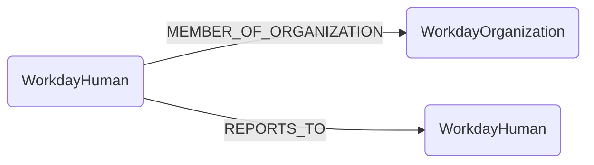

## Workday Schema



### WorkdayHuman

Representation of a person in Workday. WorkdayHuman nodes include the `Human` label for cross-module identity integration.

| Field | Description |
|-------|-------------|
| firstseen| Timestamp of when a sync job first created this node  |
| lastupdated |  Timestamp of the last time the node was updated |
| **id** | Employee ID from Workday |
| **employee_id** | Employee ID (indexed for lookups) |
| **name** | Employee's full name |
| **email** | Work email address (indexed for cross-module relationships) |
| **title** | Job title/business title |
| **worker_type** | Type of worker (Employee, Contractor, etc.) |
| **location** | Office or work location |
| **country** | Country from work address |
| **cost_center** | Cost center code |
| **function** | Functional area |
| **sub_function** | Sub-functional area |
| **team** | Team name |
| **sub_team** | Sub-team name |
| **company** | Company or legal entity name |
| **source** | Always `"WORKDAY"` to identify data source |

#### Relationships

- WorkdayHumans are members of WorkdayOrganizations

    ```
    (WorkdayHuman)-[MEMBER_OF_ORGANIZATION]->(WorkdayOrganization)
    ```

- WorkdayHumans report to other WorkdayHumans (manager hierarchy)

    ```
    (WorkdayHuman)-[REPORTS_TO]->(WorkdayHuman)
    ```

#### Human Label Integration

WorkdayHuman nodes include the `Human` label, enabling cross-module identity queries with Duo, Okta, and other identity sources.

### WorkdayOrganization

Representation of a supervisory organization or department in Workday.

| Field | Description |
|-------|-------------|
| firstseen| Timestamp of when a sync job first created this node  |
| lastupdated |  Timestamp of the last time the node was updated |
| **id** | Organization name |
| **name** | Organization name |

#### Relationships

```
(WorkdayHuman)-[MEMBER_OF_ORGANIZATION]->(WorkdayOrganization)
```

## Sample Cypher Queries

### Find all employees in an organization

```cypher
MATCH (h:WorkdayHuman)-[:MEMBER_OF_ORGANIZATION]->(o:WorkdayOrganization {name: "Engineering Department"})
RETURN h.name, h.email, h.title
ORDER BY h.name
```

### Find an employee's manager chain

```cypher
MATCH path = (h:WorkdayHuman {email: "alice@example.com"})-[:REPORTS_TO*]->(manager:WorkdayHuman)
RETURN [node in nodes(path) | node.name] as reporting_chain
```

### Find direct reports for a manager

```cypher
MATCH (report:WorkdayHuman)-[:REPORTS_TO]->(manager:WorkdayHuman {email: "manager@example.com"})
RETURN report.name, report.email, report.title
ORDER BY report.name
```

### Count employees by organization

```cypher
MATCH (h:WorkdayHuman)-[:MEMBER_OF_ORGANIZATION]->(o:WorkdayOrganization)
RETURN o.name, count(h) as employee_count
ORDER BY employee_count DESC
```

### Find employees by function or team

```cypher
MATCH (h:WorkdayHuman)
WHERE h.function = "Product Development" OR h.team = "Engineering"
RETURN h.name, h.function, h.team, h.title
ORDER BY h.team, h.name
```

### Find managers with most direct reports

```cypher
MATCH (h:WorkdayHuman)<-[:REPORTS_TO]-(report:WorkdayHuman)
WITH h, count(report) as report_count
RETURN h.name, h.title, report_count
ORDER BY report_count DESC
LIMIT 10
```

### Cross-module: Find Workday employees with Duo accounts

```cypher
MATCH (h:WorkdayHuman)
MATCH (duo:DuoUser {email: h.email})
MATCH (h2:Human)-[:IDENTITY_DUO]->(duo)
RETURN h.name, h.email, duo.is_enrolled as duo_enrolled
```

### Cross-module: Find all identities for a person

```cypher
MATCH (h:Human {email: "alice@example.com"})
OPTIONAL MATCH (h:WorkdayHuman)
OPTIONAL MATCH (h)-[:IDENTITY_DUO]->(duo:DuoUser)
RETURN h.name, h.email, h.title, duo.username as duo_account
```
